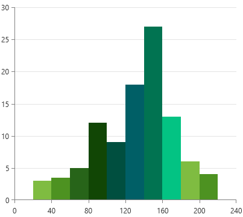
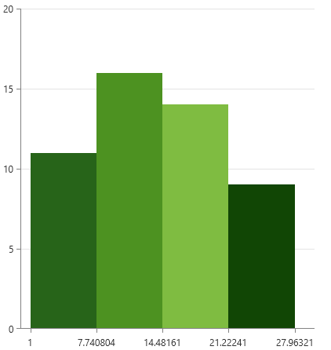
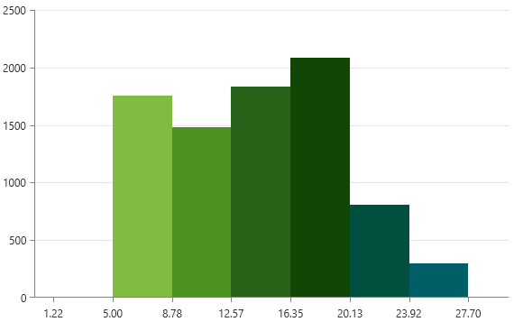
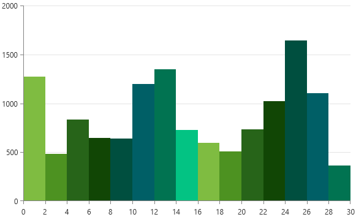
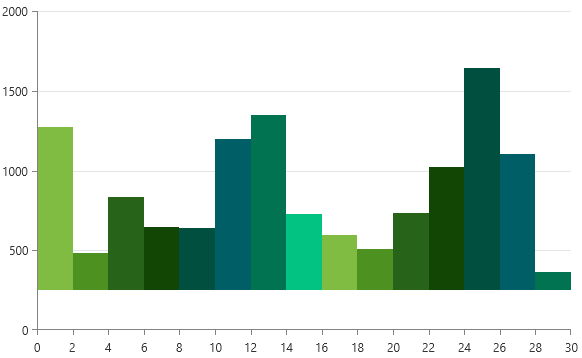
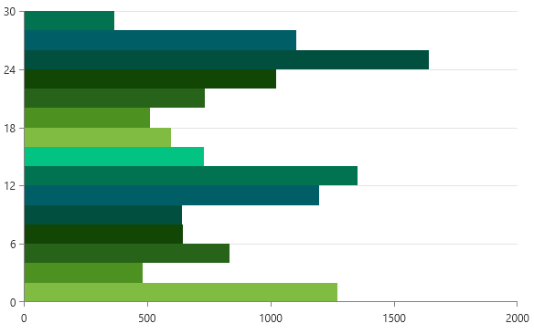
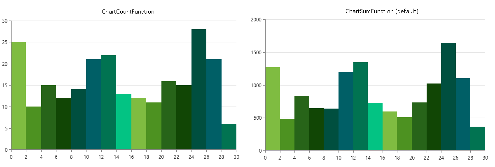

# Histogram

The histogram visualization can be created with the ScatterRangeBarSeries.

The ability of the `ScatterRangeBarSeries` to render bars sized on both axis directions - horizontal and vertical - allows you to adjust a histogram visualization. The following example shows how to define a basic histogram chart. 

__Creating histogram with ScatterRangeBarSeries__
```XAML
	<telerik:RadCartesianChart Palette="Green">
		<telerik:RadCartesianChart.HorizontalAxis>
			<telerik:LinearAxis MajorStep="40" Maximum="240" />
		</telerik:RadCartesianChart.HorizontalAxis>
		<telerik:RadCartesianChart.VerticalAxis>
			<telerik:LinearAxis />
		</telerik:RadCartesianChart.VerticalAxis>
		<telerik:RadCartesianChart.Grid>
			<telerik:CartesianChartGrid MajorLinesVisibility="Y" />
		</telerik:RadCartesianChart.Grid>
		<telerik:ScatterRangeBarSeries>		
			<telerik:ScatterRangeBarSeries.DataPoints>
				<telerik:ScatterRangeDataPoint HorizontalLow="20" HorizontalHigh="40" VerticalLow="0" VerticalHigh="3"/>
				<telerik:ScatterRangeDataPoint HorizontalLow="40" HorizontalHigh="60" VerticalLow="0" VerticalHigh="3.5"/>
				<telerik:ScatterRangeDataPoint HorizontalLow="60" HorizontalHigh="80" VerticalLow="0" VerticalHigh="5"/>
				<telerik:ScatterRangeDataPoint HorizontalLow="80" HorizontalHigh="100" VerticalLow="0" VerticalHigh="12"/>
				<telerik:ScatterRangeDataPoint HorizontalLow="100" HorizontalHigh="120" VerticalLow="0" VerticalHigh="9"/>
				<telerik:ScatterRangeDataPoint HorizontalLow="120" HorizontalHigh="140" VerticalLow="0" VerticalHigh="18"/>
				<telerik:ScatterRangeDataPoint HorizontalLow="140" HorizontalHigh="160" VerticalLow="0" VerticalHigh="27"/>
				<telerik:ScatterRangeDataPoint HorizontalLow="160" HorizontalHigh="180" VerticalLow="0" VerticalHigh="13"/>
				<telerik:ScatterRangeDataPoint HorizontalLow="180" HorizontalHigh="200" VerticalLow="0" VerticalHigh="6"/>
				<telerik:ScatterRangeDataPoint HorizontalLow="200" HorizontalHigh="220" VerticalLow="0" VerticalHigh="4"/>
			</telerik:ScatterRangeBarSeries.DataPoints>
		</telerik:ScatterRangeBarSeries>
	</telerik:RadCartesianChart>
```

__Histogram with ScatterRangeBarSeries manually adjusted data__



## Using ChartHistogramSource

The `ChartHistogramSource` is a special collection element that allows you to provide one or two dimensional data collection and based on it automatically generates the `ScatterRangeDataPoints` for the associated series. This source is supported only by the `ScatterRangeBarSeries`. 

By default, the source automatically selects the best interval between the bars, using the formula for __Scott's normal reference rule__. Then, it applies an aggregate function over the values for the set of data items that falls in the corresponding interval.

### Using Collection of Numbers

The `ChartHistogramSource` can work with one directional data (a list of `double` values), where you can assign it to the `ItemsSource` property of the `ChartHistogramSource`. The following example shows how to prepare the data and setup the chart.

__Preparing a collection of numbers__
```C#
	public MyUserControl()
	{
		InitializeComponent();
		
		var r = new Random(0);
		var source = new ObservableCollection<double>();
		for (int i = 0; i < 50; i++)
		{
			source.Add(r.Next(1, 25));
		}
		this.histogramSource.ItemsSource = source;
	}
```

__Creating histogram with ScatterRangeBarSeries and ChartHistogramSource using collection of numbers__
```XAML
	<Grid>
		<telerik:ChartHistogramSource x:Name="histogramSource"/>

		<telerik:RadCartesianChart Palette="Green">
			<telerik:RadCartesianChart.HorizontalAxis>
				<telerik:LinearAxis MajorStep="{Binding ElementName=histogramSource, Path=ActualInterval}" TickOrigin="1" Maximum="30"/>
			</telerik:RadCartesianChart.HorizontalAxis>
			<telerik:RadCartesianChart.VerticalAxis>
				<telerik:LinearAxis />
			</telerik:RadCartesianChart.VerticalAxis>
			<telerik:RadCartesianChart.Grid>
				<telerik:CartesianChartGrid MajorLinesVisibility="Y" />
			</telerik:RadCartesianChart.Grid>
			
			<telerik:ScatterRangeBarSeries ItemsSource="{Binding ElementName=histogramSource}"/>
		</telerik:RadCartesianChart>
	</Grid>
```

The aggregate function used for the bars in this scenario is `Count`. This is the only supported function for this scenario.

__Histogram with ChartHistogramSource and one dimensional data__



### Using Collection of Custom Objects

The `ChartHistogramSource` can work with two dimensional data, where you can provide a collection of complex objects to the `ItemsSource`. In that case, the `IntervalValueBinding` and `ValueBinding` properties should be set as well. This is needed in order to map the properties of the data item that should be used in the calculations of the data. The `IntervalValueBinding` points to the property that will be used to determine in which interval the data item will fall. Additionally, the values coming from this binding are used to auto-calculate the interval of the bars. The `ValueBinding` points to the property used to get the values of the data item that determine the bar's height.

__Creating the data model__
```C#
	public class HistogramPlotInfo
    	{
        	public double Interval { get; set; }
        	public double Value { get; set; }
    	}
```

__Preparing a collection of custom objects__
```C#
	public MyUserControl()
	{
		InitializeComponent();
		
		var r = new Random(123456789);
		var source = new ObservableCollection<HistogramPlotInfo>();
		for (int i = 5; i < 25; i++)
		{
			double itemsCount = r.Next(1, 15);
			for (int k = 0; k < itemsCount; k++)
			{
				source.Add(new HistogramPlotInfo() { Interval = i, Value = r.Next(10, 100) });
			}                
		}
		this.histogramSource.ItemsSource = source;
	}
```

__Creating histogram with ScatterRangeBarSeries and ChartHistogramSource using custom objects__
```XAML
	<Grid>
        <telerik:ChartHistogramSource x:Name="histogramSource" ValueBinding="Value" IntervalValueBinding="Interval"/>
        
        <telerik:RadCartesianChart Palette="Green">
            <telerik:RadCartesianChart.HorizontalAxis>
                <telerik:LinearAxis MajorStep="{Binding ElementName=histogramSource, Path=ActualInterval}"
                                    TickOrigin="5" LabelFormat="F2"/>
            </telerik:RadCartesianChart.HorizontalAxis>
            <telerik:RadCartesianChart.VerticalAxis>
                <telerik:LinearAxis />
            </telerik:RadCartesianChart.VerticalAxis>
            <telerik:RadCartesianChart.Grid>
                <telerik:CartesianChartGrid MajorLinesVisibility="Y" />
            </telerik:RadCartesianChart.Grid>
            <telerik:ScatterRangeBarSeries ItemsSource="{Binding ElementName=histogramSource}"/>
        </telerik:RadCartesianChart>
	</Grid>
```

The default [aggregаte function](#changing-the-aggregate-function) when using a collection of custom objects is `Sum`. 

__Histogram with ChartHistogramSource and collection of custom objects__



### Setting the Interval

The interval between the bars is calculated automatically. To set an explicit interval, use the `Interval` property of `ChartHistogramSource`.

__Setting custom interval__
```XAML	
	<telerik:ChartHistogramSource x:Name="histogramSource" 
				      ValueBinding="Value" 
				      IntervalValueBinding="Interval"
				      ItemsSource="{Binding Items}"
				      Interval="2"/>
```

__Histogram with manually defined interval__



### Setting the Bars Origin Value

By default the bars start drawing from the value of 0. To change this, set the `OriginValue` property of `ChartHistogramSource`.

__Setting custom origin value__
```XAML	
	<telerik:ChartHistogramSource x:Name="histogramSource" 
				      ValueBinding="Value" 
				      IntervalValueBinding="Interval"
				      ItemsSource="{Binding Items}"
				      OriginValue="250"/>
```

__Histogram with custom origin value__



### Setting the Histogram Orientation

By default, the bars will be arranged on the horizontal axis of the chart. This can be changed by setting the `Orientation` property of `ChartHistogramSource` to `Vertical`. This will arrange the bars on the vertical axis.

__Setting the histogram data orientation__
```XAML	
	<telerik:ChartHistogramSource x:Name="histogramSource" 
			     	      ValueBinding="Value" 
				      IntervalValueBinding="Interval"
				      ItemsSource="{Binding Items}"
				      Orientation="Vertical"/>
```

__Histogram with vertical orientation__



### Changing the Aggregate Function

The `ChartHistogramSource` uses `Count` or `Sum` functions to aggregate the bar values. The `Count` function is used if the `ItemsSource` of the [source is set to a colleciton of numbers](#using-collection-of-numbers). `Sum` is used when the [source is assigned a collection of complex objects](#using-collection-of-custom-objects). 

The aggregate function can be changed by overridding the `GetValueAggregateFunction` method of `CustomChartHistogramSource`. The method should return an object of type `ChartAggregateFunction`. 

__Replacing the aggregate function__
```C#	
	public class CustomChartHistogramSource : ChartHistogramSource
	{
        	protected override ChartAggregateFunction GetValueAggregateFunction()
        	{
            		return new ChartCountFunction();
        	}
    }
```

__Using the custom histogram source__
```XAML	
	<local:CustomChartHistogramSource x:Name="histogramSource" 
					  ValueBinding="Value" 
					  IntervalValueBinding="Interval"
					  ItemsSource="{Binding Items}"/>
```

__Histogram with count aggregate function__



The chart provides the following functions:

* `ChartAverageFunction`
* `ChartCountFunction`
* `ChartMaxFunction`
* `ChartMinFunction`
* `ChartSumFunction`
* `KeepExtremesFunction`
* `MemberFirstFunction`
* `MemberLastFunction`

## See Also
 * [Getting Started]()
 * [Chart Series Overview]()
 * [Create Data-Bound Chart]()
