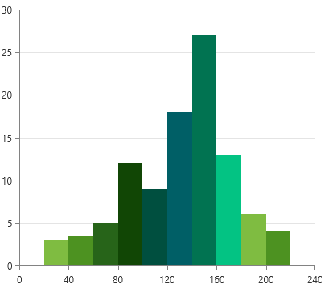
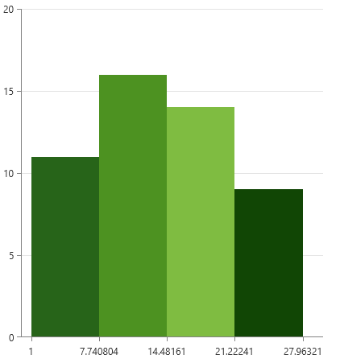
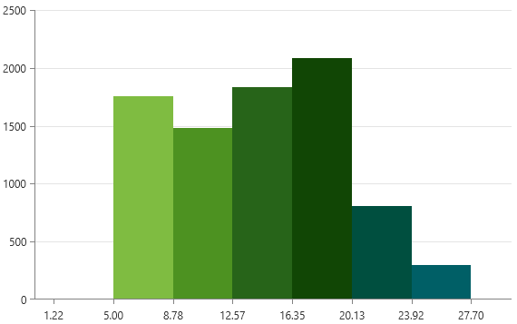
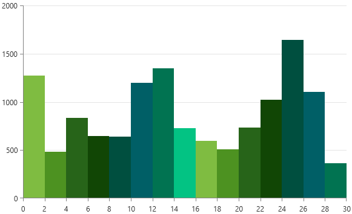
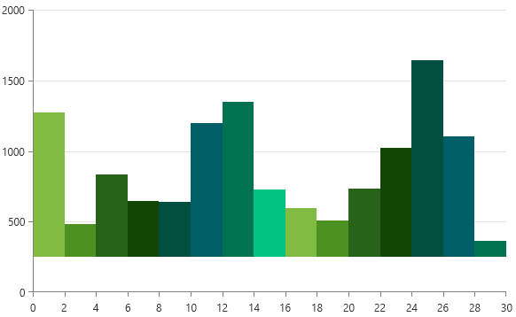
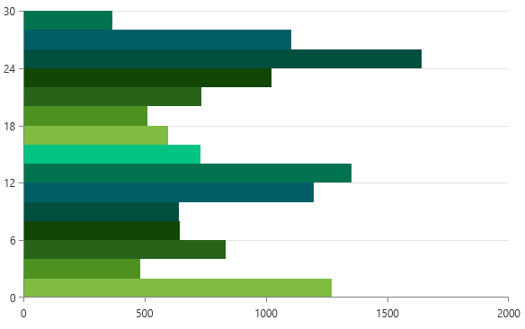
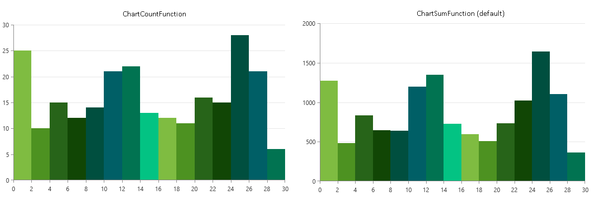

# Histogram

The histogram visualization can be created with the ScatterRangeBarSeries.

The ability of the `ScatterRangeBarSeries` to render bars sized on both axis directions - horizontal and vertical - allows you to adjust a histogram visualization. The following example shows how to define a basic histogram chart. 

__Creating histogram with ScatterRangeBarSeries__
<snippet id='radchartview-series-cartesianchart-series-bar-series-histogram-creating_histogram_with_scatterrangebarseries-xaml' />

__Histogram with ScatterRangeBarSeries manually adjusted data__

## Using ChartHistogramSource

The `ChartHistogramSource` is a special collection element that allows you to provide one or two dimensional data collection and based on it automatically generates the `ScatterRangeDataPoints` for the associated series. This source is supported only by the `ScatterRangeBarSeries`. 

By default, the source automatically selects the best interval between the bars, using the formula for __Scott's normal reference rule__. Then, it applies an aggregate function over the values for the set of data items that falls in the corresponding interval.

### Using Collection of Numbers

The `ChartHistogramSource` can work with one directional data (a list of `double` values), where you can assign it to the `ItemsSource` property of the `ChartHistogramSource`. The following example shows how to prepare the data and setup the chart.

__Preparing a collection of numbers__
<snippet id='radchartview-series-cartesianchart-series-bar-series-histogram-preparing_a_collection_of_numbers-cs' />

__Creating histogram with ScatterRangeBarSeries and ChartHistogramSource using collection of numbers__
<snippet id='radchartview-series-cartesianchart-series-bar-series-histogram-creating_histogram_with_scatterrangebarseries_and_charthistogramsource_using_collection_of_numbers-xaml' />

The aggregate function used for the bars in this scenario is `Count`. This is the only supported function for this scenario.

__Histogram with ChartHistogramSource and one dimensional data__

### Using Collection of Custom Objects

The `ChartHistogramSource` can work with two dimensional data, where you can provide a collection of complex objects to the `ItemsSource`. In that case, the `IntervalValueBinding` and `ValueBinding` properties should be set as well. This is needed in order to map the properties of the data item that should be used in the calculations of the data. The `IntervalValueBinding` points to the property that will be used to determine in which interval the data item will fall. Additionally, the values coming from this binding are used to auto-calculate the interval of the bars. The `ValueBinding` points to the property used to get the values of the data item that determine the bar's height.

__Creating the data model__
<snippet id='radchartview-series-cartesianchart-series-bar-series-histogram-creating_the_data_model-cs' />

__Preparing a collection of custom objects__
<snippet id='radchartview-series-cartesianchart-series-bar-series-histogram-preparing_a_collection_of_custom_objects-cs' />

__Creating histogram with ScatterRangeBarSeries and ChartHistogramSource using custom objects__
<snippet id='radchartview-series-cartesianchart-series-bar-series-histogram-creating_histogram_with_scatterrangebarseries_and_charthistogramsource_using_custom_objects-xaml' />

The default [aggregаte function](#changing-the-aggregate-function) when using a collection of custom objects is `Sum`. 

__Histogram with ChartHistogramSource and collection of custom objects__

### Setting the Interval

The interval between the bars is calculated automatically. To set an explicit interval, use the `Interval` property of `ChartHistogramSource`.

__Setting custom interval__
<snippet id='radchartview-series-cartesianchart-series-bar-series-histogram-setting_custom_interval-xaml' />

__Histogram with manually defined interval__

### Setting the Bars Origin Value

By default the bars start drawing from the value of 0. To change this, set the `OriginValue` property of `ChartHistogramSource`.

__Setting custom origin value__
<snippet id='radchartview-series-cartesianchart-series-bar-series-histogram-setting_custom_origin_value-xaml' />

__Histogram with custom origin value__

### Setting the Histogram Orientation

By default, the bars will be arranged on the horizontal axis of the chart. This can be changed by setting the `Orientation` property of `ChartHistogramSource` to `Vertical`. This will arrange the bars on the vertical axis.

__Setting the histogram data orientation__
<snippet id='radchartview-series-cartesianchart-series-bar-series-histogram-setting_the_histogram_data_orientation-xaml' />

__Histogram with vertical orientation__

### Changing the Aggregate Function

The `ChartHistogramSource` uses `Count` or `Sum` functions to aggregate the bar values. The `Count` function is used if the `ItemsSource` of the [source is set to a colleciton of numbers](#using-collection-of-numbers). `Sum` is used when the [source is assigned a collection of complex objects](#using-collection-of-custom-objects). 

The aggregate function can be changed by overridding the `GetValueAggregateFunction` method of `CustomChartHistogramSource`. The method should return an object of type `ChartAggregateFunction`. 

__Replacing the aggregate function__
<snippet id='radchartview-series-cartesianchart-series-bar-series-histogram-replacing_the_aggregate_function-cs' />

__Using the custom histogram source__
<snippet id='radchartview-series-cartesianchart-series-bar-series-histogram-using_the_custom_histogram_source-xaml' />

__Histogram with count aggregate function__

The chart provides the following functions:

* `ChartAverageFunction`
* `ChartCountFunction`
* `ChartMaxFunction`
* `ChartMinFunction`
* `ChartSumFunction`
* `KeepExtremesFunction`
* `MemberFirstFunction`
* `MemberLastFunction`

## See Also
 * [Getting Started]()
 * [Chart Series Overview]()
 * [Create Data-Bound Chart]()
