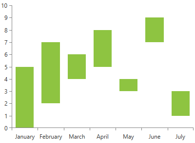

# RangeBarSeries

This series is visualized on the screen as separate rectangles representing each of the data points. The main difference of the BarSeries is that you are allowed to define range with each data point.      

* [Declaratively Defined Series](#declaratively-defined-series)
* [Properties](#properties)
* [Data Binding](#data-binding)
* [Styling the Series](#styling-the-series)

## Declaratively defined series

You can use the definition from __Example 1__ to display a RangeBarSeries.

__Example 1: Declaring a RangeBarSeries in XAML__
```XAML
	<telerik:RadCartesianChart Palette="Windows8">
	<telerik:RadCartesianChart.HorizontalAxis>
		<telerik:CategoricalAxis/>
	</telerik:RadCartesianChart.HorizontalAxis>
	<telerik:RadCartesianChart.VerticalAxis>
		<telerik:LinearAxis />
	</telerik:RadCartesianChart.VerticalAxis>
	<telerik:RadCartesianChart.Series>
		<telerik:RangeBarSeries>
			<telerik:RangeBarSeries.DataPoints>
				<telerik:RangeDataPoint Category="January"  High="5" Low="0"/>
				<telerik:RangeDataPoint Category="February" High="7" Low="2"/>
				<telerik:RangeDataPoint Category="March" High="6" Low="4"/>
				<telerik:RangeDataPoint Category="April" High="8" Low="5"/>
				<telerik:RangeDataPoint Category="May" High="4" Low="3"/>
				<telerik:RangeDataPoint Category="June" High="9" Low="7"/>
				<telerik:RangeDataPoint Category="July" High="3" Low="1"/>
			</telerik:RangeBarSeries.DataPoints>
		</telerik:RangeBarSeries>
	</telerik:RadCartesianChart.Series>
	</telerik:RadCartesianChart>
```

#### __Figure 1: RangeBarSeries visual appearance__  


## Properties

* __CategoryBinding__: A property of type __DataPointBinding__ that gets or sets the property path that determines the category value of the data point.
* __HighBinding__: A property of type __DataPointBinding__ that gets or sets the property path that determines the high value of the data point.
* __LowBinding__: A property of type __DataPointBinding__ that gets or sets the property path that determines the low value of the data point.
* __LegendSettings__: A property of type ChartLegendSettings that gets or sets the legend setting.
* [CombineMode](): A property of type ChartSeriesCombineMode that gets or sets the combination mode to be used when data points are plotted. The combine mode is an enumeration and it allows the following values:
	* __None__: No combining. Each series is plotted independently.
	* __Cluster__: When set all series are combined next to each other.
	* __Stack__: When set all series form stacks.
	* __Stack100__: When set all series form stacks that occupy 100% of the plot area.
	
## Data Binding

You can use the __HighBinding__, __LowBinding__ and __CategoryBinding__ properties of the RangeBarSeries to bind the DataPoints’ properties to the properties from your view models.

__Example 2: Defining the view model__

```C#
	public class PlotInfo
    {
        public string Category { get; set; }
        public double HighValue { get; set; }
        public double LowValue { get; set; }
    }

	//.......
	this.DataContext = new ObservableCollection<PlotInfo>
	{
		new PlotInfo() { Category = "January", HighValue = 5, LowValue = 0},
		//....
	};
```		

__Example 3: Specify a RangeBarSeries in XAML__
```XAML
	<telerik:RangeBarSeries ItemsSource="{Binding}" HighBinding="HighValue" LowBinding="LowValue" CategoryBinding="Category"/>
```
	
>See the [Create Data-Bound Chart]() for more information on data binding in the RadChartView suite.

## Styling the Series

You can see how to style area series using different properties in the [RangeBarSeries section]() of the Customizing CartesianChart Series help article.

Additionally, you can use the Palette property of the chart to change the colors of the RangeBarSeries on a global scale. You can find more information about this feature in the [Palettes]() section in our help documentation.

## See Also
 * [Getting Started]()
 * [Chart Series Overview]()
 * [Create Data-Bound Chart]()
