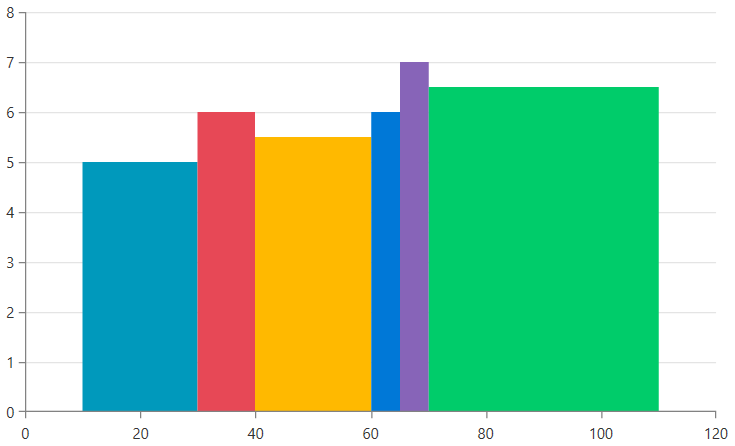
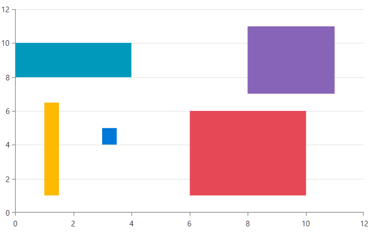

# ScatterRangeBarSeries

This series visualizes a set of rectangles (bars) representing each of the data points. The bars have numeric meaning in both directions - horizontal and vertical - and each bar is defined by horizontal and vertical start, and end values.

This series can be used to create histogram visualization. This can be done by using the properties of the data points or via the [ChartHistogramSource](#using-charthistogramsource).

## Declaratively Defined Series

The following example shows how to define `ScatterRangeBarSeries` and populate its `DataPoints` collection.

__Declaring a RangeBarSeries in XAML__
<snippet id='radchartview-series-cartesianchart-series-bar-series-scatterrangebarseries-declaring_a_rangebarseries_in_xaml-xaml' />

__ScatterRangeBarSeries visual appearance__  

	
## Data Binding

To bind the series to a collection of business objects, use its `ItemsSource` property. The series will create a new `ScatterRangeDataPoint` for each data item in the collection. To map the data item properties to the data point, use the `HorizontalLowBinding`, `HorizontalHighBinding`, `VerticalLowBinding` and `VerticalHighBinding` properties of the series.

__Defining the data item model__  
<snippet id='radchartview-series-cartesianchart-series-bar-series-scatterrangebarseries-defining_the_data_item_model-cs' />

__Populating with data__
<snippet id='radchartview-series-cartesianchart-series-bar-series-scatterrangebarseries-populating_with_data-cs' />

__Specifying ScatterRangeBarSeries in XAML and setting its binding properties__
<snippet id='radchartview-series-cartesianchart-series-bar-series-scatterrangebarseries-specifying_scatterrangebarseries_in_xaml_and_setting_its_binding_properties-xaml' />

	
>See the [Create Data-Bound Chart]() for more information on data binding in the RadChartView suite.

__ScatterRangeBarSeries populated with data binding__  

## Palette Coloring

The chart provides a built-in palette support that allows you to automatically color each series or data points in a different color. То enable this, set the `Palette` property of the chart control. You can find more information about this feature in the [Palettes]() section in the help documentation.

To change the palette mode of `ScatterRangeBarSeries`, set its `PaletteMode` property. The available options are `Series` and `DataPoint` (default value). This determines if each data point in the same series should use a different color from the palette, or the entire series (all data points) should have the same color.

## Styling the Series

You can see how to style area series using different properties in the [RangeBarSeries section]() of the Customizing CartesianChart Series help article.

## See Also
 * [Getting Started]()
 * [Chart Series Overview]()
 * [Create Data-Bound Chart]()
