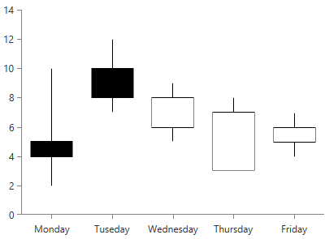

# CandlestickSeries

This is a typical financial series that can be used to visualize the state of a market for a period of time. The series operates with a special kind of data in the form of four parameters defining the stock market - open, high, low, and close. The high and low values show the price range (the highest and lowest prices) over one unit of time. The open and close values indicate the opening and closing price of the stock for the corresponding period. Candlestick series have body, which has a different color depending on the value of open and close prices of the financial data point. This kind of series require one CategoricalAxis and one LinearAxis.

* [Declaratively Defined Series](#declaratively-defined-series)
* [Properties](#properties)
* [Data Binding](#data-binding)
* [Styling the Series](#styling-the-series)

## Declaratively defined series

You can use the following definition to display a simple CandlestickSeries

__Example 1: Declaring a CandlestickSeries in XAML__
<snippet id='radchartview-series-cartesianchart-series-financial-series-candlestickseries-example_1_declaring_a_candlestickseries_in_xaml-xaml' />

#### __Figure 1: CandlestickSeries visual appearance__

## Properties

* __CategoryBinding__: A property of type __DataPointBinding__ that gets or sets the property path that determines the category value of the data point.
* __OpenBinding__: A property of type __DataPointBinding__ that gets or sets the property path that determines the open value of the ohlc data point.
* __CloseBinding__: A property of type __DataPointBinding__ that gets or sets the property path that determines the close value of the ohlc data point.
* __LowBinding__: A property of type __DataPointBinding__ that gets or sets the property path that determines the low value of the ohlc data point.
* __HighBinding__: A property of type __DataPointBinding__ that gets or sets the property path that determines the high value of the ohlc data point.

## Data Binding

You can use the CategoryBinding, OpenBinding, CloseBinding, LowBinding, HighBinding properties of the CandlestickSeries to bind the DataPoints’ properties to the properties from your view models.

__Example 2: Defining the view model__

<snippet id='radchartview-series-cartesianchart-series-financial-series-candlestickseries-example_2_defining_the_view_model-cs' />

__Example 3: Specify a CandlestickSeries in XAML__
<snippet id='radchartview-series-cartesianchart-series-financial-series-candlestickseries-example_3_specify_a_candlestickseries_in_xaml-xaml' />

>See the [Create Data-Bound Chart]() for more information on data binding in the RadChartView suite.

## Styling the Series

You can see how to style the candlestick series using different properties, in the [CandlestickSeries section]() of the Customizing CartesianChart Series help article.

Additionally, you can use the Palette property of the chart to change the colors of the CandlestickSeries on a global scale. You can find more information about this feature in the [Palettes]() section in our help documentation.

## See Also
 * [Getting Started]()
 * [Chart Series Overview]()
 * [Create Data-Bound Chart]()
