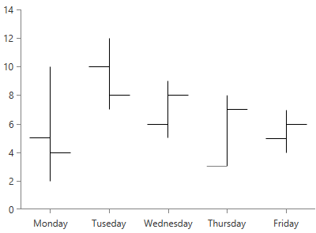

# OhlcSeries

This is a typical financial series that can be used to visualize the state of a market for a period of time. The series operates with a special kind of data in the form of four parameters defining the stock market - open, high, low, and close. The high and low values show the price range (the highest and lowest prices) over one unit of time. The open and close values indicate the opening and closing price of the stock for the corresponding period. This kind of series require one CategoricalAxis and one LinearAxis.

* [Declaratively Defined Series](#declaratively-defined-series)
* [Properties](#properties)
* [Data Binding](#data-binding)
* [Styling the Series](#styling-the-series)

## Declaratively defined series

You can use the following definition to display a simple OhlcSeries

__Example 1: Declaring a OhlcSeries in XAML__
```XAML
	<telerik:RadCartesianChart Palette="Windows8">
	<telerik:RadCartesianChart.HorizontalAxis>
		<telerik:CategoricalAxis/>
	</telerik:RadCartesianChart.HorizontalAxis>
	<telerik:RadCartesianChart.VerticalAxis>
		<telerik:LinearAxis />
	</telerik:RadCartesianChart.VerticalAxis>
	<telerik:RadCartesianChart.Series>
		<telerik:OhlcSeries>
			<telerik:OhlcSeries.DataPoints>
				<telerik:OhlcDataPoint Category="Monday" Open="5" Close="4" Low="2" High="10" />
				<telerik:OhlcDataPoint Category="Tuseday" Open="10" Close="8" Low="7" High="12"/>
				<telerik:OhlcDataPoint Category="Wednesday" Open="6" Close="8" Low="5" High="9"/>
				<telerik:OhlcDataPoint Category="Thursday" Open="3" Close="7" Low="3" High="8"/>
				<telerik:OhlcDataPoint Category="Friday" Open="5" Close="6" Low="4" High="7"/>
			</telerik:OhlcSeries.DataPoints>
		</telerik:OhlcSeries>
	</telerik:RadCartesianChart.Series>
	</telerik:RadCartesianChart>
```

#### __Figure 1: OhlcSeries visual appearance__


## Properties

* __CategoryBinding__: A property of type __DataPointBinding__ that gets or sets the property path that determines the category value of the data point.
* __OpenBinding__: A property of type __DataPointBinding__ that gets or sets the property path that determines the open value of the ohlc data point.
* __CloseBinding__: A property of type __DataPointBinding__ that gets or sets the property path that determines the close value of the ohlc data point.
* __LowBinding__: A property of type __DataPointBinding__ that gets or sets the property path that determines the low value of the ohlc data point.
* __HighBinding__: A property of type __DataPointBinding__ that gets or sets the property path that determines the high value of the ohlc data point.

## Data Binding

You can use the CategoryBinding, OpenBinding, CloseBinding, LowBinding, HighBinding properties of the OhlcSeries to bind the DataPoints’ properties to the properties from your view models.

__Example 2: Defining the view model__

```C#
	public class PlotInfo
    {	
        public string Category { get; set; }
        public double Open { get; set; }
		public double Close { get; set; }
		public double Low { get; set; }
		public double High { get; set; }		
    }

	//.......
	this.DataContext = new ObservableCollection<PlotInfo>
	{
		new PlotInfo() { Category = "January", Open = 5, Close = 4, Low = 2, High = 10},
		//....
	};
```	

__Example 3: Specify a OhlcSeries in XAML__
```XAML	
	<telerik:OhlcSeries ItemsSource="{Binding}" CategoryBinding="Category" OpenBinding="Open" CloseBinding="Close" LowBinding="Low" HighBinding="High" />
```

>See the [Create Data-Bound Chart]() for more information on data binding in the RadChartView suite.

## Styling the Series

You can see how to style the ohlc series using different properties, in the [OhlcSeries section]() of the Customizing CartesianChart Series help article.

Additionally, you can use the Palette property of the chart to change the colors of the OhlcSeries on a global scale. You can find more information about this feature in the [Palettes]() section in our help documentation.

## See Also
 * [Getting Started]()
 * [Chart Series Overview]()
 * [Create Data-Bound Chart]()
