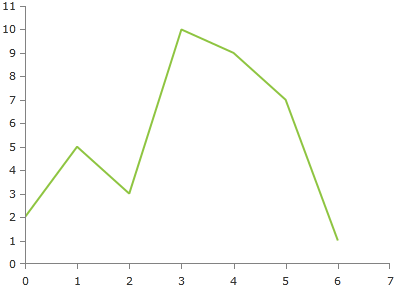

# ScatterLineSeries

This series is visualized on the screen as a straight line connecting all data points. As all scatter series, this one also requires the RadCartesianChart to define two LinearAxis as vertical and horizontal axis.
  
* [Declaratively Defined Series](#declaratively-defined-series)
* [Properties](#properties)
* [Data Binding](#data-binding)
* [Styling the Series](#styling-the-series)  

## Declaratively defined series

You can use the following definition to display a simple ScatterLineSeries

__Example 1: Declaring a ScatterLineSeries in XAML__
<snippet id='radchartview-series-cartesianchart-series-line-series-scatterlineseries-example_1_declaring_a_scatterlineseries_in_xaml-xaml' />

#### __Figure 1: ScatterLineSeries visual appearance__

## Properties

* __YValueBinding__: A property of type __DataPointBinding__ that gets or sets the property path that determines the Y value of the data point.
* __XValueBinding__: A property of type __DataPointBinding__ that gets or sets the property path that determines the X value of the data point.
* __DashArray__: A property of type __DoubleCollection__ that gets or sets the dash pattern applied to the scatter line series itself.
* __Stroke__: A property of type __Brush__ that gets or sets the stroke of the scatter line series.
* __StrokeShapeStyle__: A property of type __Style__ that gets or sets the style of the stroke of the scatter line series. The property accepts a style that targets an object of type Path.

## Data Binding

You can use the __YValueBinding__ and __XValueBinding__ properties of the ScatterLineSeries to bind the DataPoints’ properties to the properties from your view models.

__Example 2: Defining the view model__

<snippet id='radchartview-series-cartesianchart-series-line-series-scatterlineseries-example_2_defining_the_view_model-cs' />

__Example 3: Specify a ScatterLineSeries in XAML__
<snippet id='radchartview-series-cartesianchart-series-line-series-scatterlineseries-example_3_specify_a_scatterlineseries_in_xaml-xaml' />

>See the [Create Data-Bound Chart]() for more information on data binding in the RadChartView suite.
	
## Styling the Series

You can see how to style the scatter line series using different properties in the [ScatterLineSeries section]() of the Customizing CartesianChart Series help article.

Additionally, you can use the Palette property of the chart to change the colors of the ScatterLineSeries on a global scale. You can find more information about this feature in the [Palettes]() section in our help documentation.

## See Also
 * [Getting Started]()
 * [Chart Series Overview]()
 * [Create Data-Bound Chart]()
