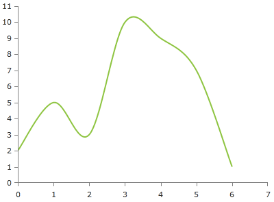
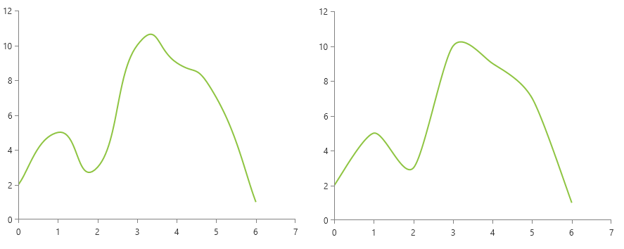
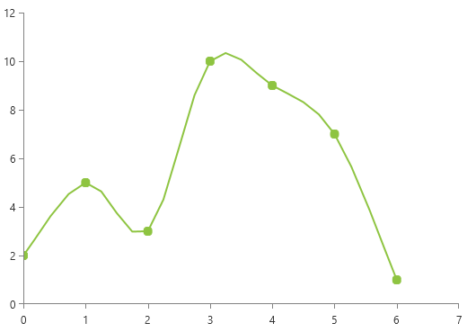

# ScatterSplineSeries

This series is visualized on the screen as a smooth line connecting all data points. As all scatter series, this one also requires the RadCartesianChart to define two LinearAxis as vertical and horizontal axis.
      
* [Declaratively Defined Series](#declaratively-defined-series)
* [Properties](#properties)
* [Data Binding](#data-binding)
* [Styling the Series](#styling-the-series)
	  
## Declaratively defined series

You can use the following definition to display a simple ScatterSplineSeries

__Example 1: Declaring a ScatterSplineSeries in XAML__
```XAML
	<telerik:RadCartesianChart Palette="Windows8">
	<telerik:RadCartesianChart.HorizontalAxis>
		<telerik:LinearAxis/>
	</telerik:RadCartesianChart.HorizontalAxis>
	<telerik:RadCartesianChart.VerticalAxis>
		<telerik:LinearAxis />
	</telerik:RadCartesianChart.VerticalAxis>
	<telerik:RadCartesianChart.Series>
		<telerik:ScatterSplineSeries>
			<telerik:ScatterSplineSeries.DataPoints>
				<telerik:ScatterDataPoint XValue="0" YValue="2" />
				<telerik:ScatterDataPoint XValue="1" YValue="5" />
				<telerik:ScatterDataPoint XValue="2" YValue="3" />
				<telerik:ScatterDataPoint XValue="3" YValue="10" />
				<telerik:ScatterDataPoint XValue="4" YValue="9" />
				<telerik:ScatterDataPoint XValue="5" YValue="7" />
				<telerik:ScatterDataPoint XValue="6" YValue="1" />
			</telerik:ScatterSplineSeries.DataPoints>
		</telerik:ScatterSplineSeries>
	</telerik:RadCartesianChart.Series>
	</telerik:RadCartesianChart>
```

#### __Figure 1: ScatterSplineSeries visual appearance__


## Properties

* __YValueBinding__: A property of type __DataPointBinding__ that gets or sets the property path that determines the Y value of the data point.
* __XValueBinding__: A property of type __DataPointBinding__ that gets or sets the property path that determines the X value of the data point.
* __DashArray__: A property of type __DoubleCollection__ that gets or sets the dash pattern applied to the scatter spline series itself.
* __Stroke__: A property of type __Brush__ that gets or sets the stroke of the scatter spline series.
* __StrokeShapeStyle__: A property of type __Style__ that gets or sets the style of the stroke of the scatter spline series. The property accepts a style that targets an object of type Path.

## Data Binding

You can use the __YValueBinding__ and __XValueBinding__ properties of the ScatterSplineSeries to bind the DataPoints’ properties to the properties from your view models.

__Example 2: Defining the view model__

```C#
	public class PlotInfo
    {
        public double XValue { get; set; }
        public double YValue { get; set; }
    }

	//.......
	this.DataContext = new ObservableCollection<PlotInfo>
	{
		new PlotInfo() { XValue = 0, YValue = 2},
		//....
	};
```		

__Example 3: Specify a ScatterSplineSeries in XAML__
```XAML
	<telerik:ScatterSplineSeries ItemsSource="{Binding}" YValueBinding="YValue" XValueBinding="XValue"/>
```

## Spline Tension

The spline-type series provide two properties allowing to control the additional points calculated for the spline of the line. The tension is controlled via the `SplineTension` property. The tension works with relative values between 0 and 1. The defualt tension is set to `0.5d`.

__Example 4: Setting SplineTension__
```XAML	
	 <telerik:ScatterSplineSeries SplineTension="0.4" />
```

__Spline tension 0.8 (left) and 0.4 (right)__



Additionally, you can control the smoothness of the spline using the `SplinePointsDistanceFactor` property. The property controls the distance between the additionally calcuated spline points. The bigger the factor is the less points will be created, thus the line will become less smooth. The property works with values between 0 and 0.35. The default value is `0.03d`.

__Example 5: Setting SplinePointsDistanceFactor__
```XAML	
	 <telerik:ScatterSplineSeries SplinePointsDistanceFactor="0.18" />
```

__SplinePointsDistanceFactor set to 0.18__



## Styling the Series

You can see how to style the scatter spline series using different properties in the [ScatterSplineSeries section]() of the Customizing CartesianChart Series help article.

Additionally, you can use the Palette property of the chart to change the colors of the ScatterSplineSeries on a global scale. You can find more information about this feature in the [Palettes]() section in our help documentation.

## See Also
 * [Getting Started]()
 * [Chart Series Overview]()
 * [Create Data-Bound Chart]()
