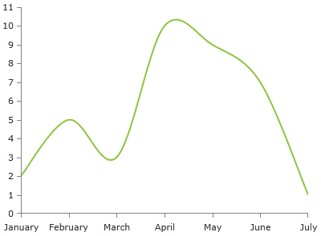

# SplineSeries

This series is visualized on the screen as a smooth line connecting all __DataPoints__.        

## Declaratively defined series

You can use the following definition to display a simple SplineSeries
#### XAML
{{region radchartview-series-splineseries}}
	<telerik:RadCartesianChart Palette="Windows8">
	<telerik:RadCartesianChart.HorizontalAxis>
		<telerik:CategoricalAxis/>
	</telerik:RadCartesianChart.HorizontalAxis>
	<telerik:RadCartesianChart.VerticalAxis>
		<telerik:LinearAxis />
	</telerik:RadCartesianChart.VerticalAxis>
	<telerik:RadCartesianChart.Series>
		<telerik:SplineSeries>
			<telerik:SplineSeries.DataPoints>
				<telerik:CategoricalDataPoint Category="January" Value="2" />
				<telerik:CategoricalDataPoint Category="February" Value="5" />
				<telerik:CategoricalDataPoint Category="March" Value="3" />
				<telerik:CategoricalDataPoint Category="April" Value="10" />
				<telerik:CategoricalDataPoint Category="May" Value="9" />
				<telerik:CategoricalDataPoint Category="June" Value="7" />
				<telerik:CategoricalDataPoint Category="July" Value="1" />
			</telerik:SplineSeries.DataPoints>
		</telerik:SplineSeries>
	</telerik:RadCartesianChart.Series>
	</telerik:RadCartesianChart>
{{endregion}}

# See Also
 * [Chart Series Overview]()
