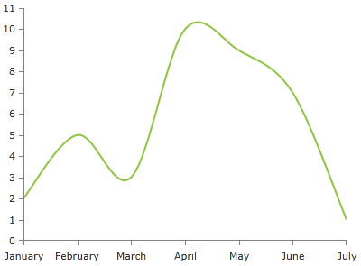

# SplineSeries

This series is visualized on the screen as a smooth line connecting all data points.        

* [Declaratively Defined Series](#declaratively-defined-series)
* [Properties](#properties)
* [Data Binding](#data-binding)
* [Styling the Series](#styling-the-series)

## Declaratively defined series

You can use the following definition to display a simple SplineSeries

__Example 1: Declaring a SplineSeries in XAML__
<snippet id='radchartview-series-cartesianchart-series-line-series-splineseries-example_1_declaring_a_splineseries_in_xaml-xaml' />

#### __Figure 1: SplineSeries visual appearance__

## Properties

* __CategoryBinding__: A property of type __DataPointBinding__ that gets or sets the property path that determines the category value of the data point.
* __ValueBinding__: A property of type __DataPointBinding__ that gets or sets the property path that determines the value of the data point.
* __DashArray__: A property of type __DoubleCollection__ that gets or sets the dash pattern applied to the spline series itself.
* __Stroke__: A property of type __Brush__ that gets or sets the stroke of the spline series.
* __StrokeShapeStyle__: A property of type __Style__ that gets or sets the style of the stroke of the spline series. The property accepts a style that targets an object of type Path.

## Data Binding

You can use the ValueBinding and CategoryBinding properties of the LineSeries to bind the DataPoints’ properties to the properties from your view models.

__Example 2: Defining the view model__

<snippet id='radchartview-series-cartesianchart-series-line-series-splineseries-example_2_defining_the_view_model-cs' />

__Example 3: Specify a SplineSeries in XAML__
<snippet id='radchartview-series-cartesianchart-series-line-series-splineseries-example_3_specify_a_splineseries_in_xaml-xaml' />

>See the [Create Data-Bound Chart]() for more information on data binding in the RadChartView suite.

## Spline Tension

The spline-type series provide two properties allowing to control the additional points calculated for the spline of the line. The tension is controlled via the `SplineTension` property. The tension works with relative values between 0 and 1. The default tension is set to `0.5d`.

__Example 4: Setting SplineTension__
<snippet id='radchartview-series-cartesianchart-series-line-series-splineseries-example_4_setting_splinetension-xaml' />

__Spline tension 0.8 (left) and 0.4 (right)__

Additionally, you can control the smoothness of the spline using the `SplinePointsDistanceFactor` property. The property controls the distance between the additionally calculated spline points. The bigger the factor is the less points will be created, thus the line will become less smooth. The property works with values between 0 and 0.35. The default value is `0.03d`.

__Example 5: Setting SplinePointsDistanceFactor__
<snippet id='radchartview-series-cartesianchart-series-line-series-splineseries-example_5_setting_splinepointsdistancefactor-xaml' />

__SplinePointsDistanceFactor set to 0.18__

## Styling the Series

You can see how to style area series using different properties in the [SplineSeries section]() of the Customizing CartesianChart Series help article.

Additionally, you can use the Palette property of the chart to change the colors of the SplineSeries on a global scale. You can find more information about this feature in the [Palettes]() section in our help documentation.

## See Also
 * [Getting Started]()
 * [Chart Series Overview]()
 * [Create Data-Bound Chart]()
