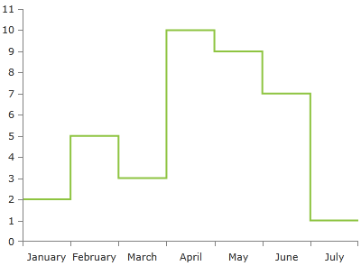
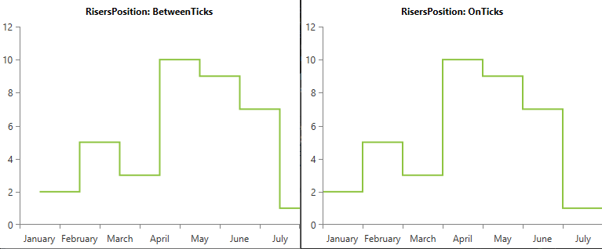

# StepLineSeries

This series is visualized on the screen as a horizontal and vertical line instead of straight line which connects all data points. This series changes its value with a step.

## Declaratively defined series

You can use the following definition to display a simple StepLineSeries

__Example 1: Declaring a StepLineSeries in XAML__
```XAML
	<telerik:RadCartesianChart Palette="Windows8">
	<telerik:RadCartesianChart.HorizontalAxis>
		<telerik:CategoricalAxis/>
	</telerik:RadCartesianChart.HorizontalAxis>
	<telerik:RadCartesianChart.VerticalAxis>
		<telerik:LinearAxis />
	</telerik:RadCartesianChart.VerticalAxis>
	<telerik:RadCartesianChart.Series>
		<telerik:StepLineSeries>
			<telerik:StepLineSeries.DataPoints>
				<telerik:CategoricalDataPoint Category="January" Value="2" />
				<telerik:CategoricalDataPoint Category="February" Value="5" />
				<telerik:CategoricalDataPoint Category="March" Value="3" />
				<telerik:CategoricalDataPoint Category="April" Value="10" />
				<telerik:CategoricalDataPoint Category="May" Value="9" />
				<telerik:CategoricalDataPoint Category="June" Value="7" />
				<telerik:CategoricalDataPoint Category="July" Value="1" />
			</telerik:StepLineSeries.DataPoints>
		</telerik:StepLineSeries>
	</telerik:RadCartesianChart.Series>
	</telerik:RadCartesianChart>
```

#### __Figure 1: StepLineSeries visual appearance__


## Properties

* __CategoryBinding__: A property of type __DataPointBinding__ that gets or sets the property path that determines the category value of the data point.
* __ValueBinding__: A property of type __DataPointBinding__ that gets or sets the property path that determines the value of the data point.
* __DashArray__: A property of type __DoubleCollection__ that gets or sets the dash pattern applied to the line series itself.
* __Stroke__: A property of type __Brush__ that gets or sets the stroke of the line series.
* __StrokeShapeStyle__: A property of type __Style__ that gets or sets the style of the stroke of the line series. The property accepts a style that targets an object of type Path.
* __RisersPosition__: A property of type __StepSeriesRisersPosition__ that gets or sets the mode that determines where the risers of the step line series should be positioned. The risers position is an enumeration and it allows the following values:  
	* __Default__: The risers position depends on the plot mode of the axes.
	* __OnTicks__: The risers will be plotted over each tick.
	* __BetweenTicks__: The risers are plotted in the middle of the range, defined between each two ticks.

#### __Figure 2: BetweenTicks and OnTicks RisersPosition values based on Example 1__


## Data Binding

You can use the ValueBinding and CategoryBinding properties of the StepLineSeries to bind the DataPoints’ properties to the properties from your view models.

__Example 2: Defining the view model__

```C#
	public class PlotInfo
    {
        public string Category { get; set; }
        public double Value { get; set; }
    }

	//.......
	this.DataContext = new ObservableCollection<PlotInfo>
	{
		new PlotInfo() { Category = "January", Value = 2},
		//....
	};
```	

__Example 3: Specify a StepLineSeries in XAML__
```XAML	
	<telerik:StepLineSeries ItemsSource="{Binding}" CategoryBinding="Category" ValueBinding="Value" />
```

>See the [Create Data-Bound Chart]() for more information on data binding in the RadChartView suite.

## Styling the Series

You can see how to style the series using different properties in the [StepLineSeries section]() of the Customizing CartesianChart Series help article.

Additionally, you can use the Palette property of the chart to change the colors of the StepLineSeries on a global scale. You can find more information about this feature in the [Palettes]() section in our help documentation.

## See Also
 * [Getting Started]()
 * [Chart Series Overview]()
 * [Create Data-Bound Chart]()
