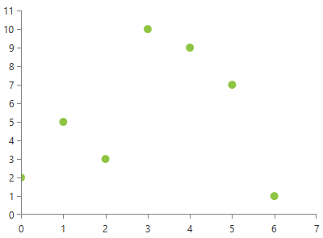

# ScatterPointSeries

This series is visualized on the screen as separate points representing each of the data points. As all scatter series, this one also requires the RadCartesianChart to define two LinearAxis as a vertical and horizontal axis.

* [Declaratively Defined Series](#declaratively-defined-series)
* [Properties](#properties)
* [Data Binding](#data-binding)
* [Styling the Series](#styling-the-series)

## Declaratively defined series

You can use the following definition to display a simple ScatterPointSeries

__Example 1: Declaring an ScatterPointSeries in XAML__
```XAML
	<telerik:RadCartesianChart Palette="Windows8">
	<telerik:RadCartesianChart.HorizontalAxis>
		<telerik:LinearAxis/>
	</telerik:RadCartesianChart.HorizontalAxis>
	<telerik:RadCartesianChart.VerticalAxis>
		<telerik:LinearAxis />
	</telerik:RadCartesianChart.VerticalAxis>
	<telerik:RadCartesianChart.Series>
		<telerik:ScatterPointSeries>
			<telerik:ScatterPointSeries.DataPoints>
				<telerik:ScatterDataPoint XValue="0" YValue="2" />
				<telerik:ScatterDataPoint XValue="1" YValue="5" />
				<telerik:ScatterDataPoint XValue="2" YValue="3" />
				<telerik:ScatterDataPoint XValue="3" YValue="10" />
				<telerik:ScatterDataPoint XValue="4" YValue="9" />
				<telerik:ScatterDataPoint XValue="5" YValue="7" />
				<telerik:ScatterDataPoint XValue="6" YValue="1" />
			</telerik:ScatterPointSeries.DataPoints>
		</telerik:ScatterPointSeries>
	</telerik:RadCartesianChart.Series>
	</telerik:RadCartesianChart>
```

#### __Figure 1: ScatterPointSeries visual appearance__


## Properties
* __CategoryBinding__: A property of type __DataPointBinding__ that gets or sets the property path that determines the category value of the data point.
* __ValueBinding__: A property of type __DataPointBinding__ that gets or sets the property path that determines the value of the data point.
* __PointSize__: A property of type __Size__ that get or sets the size of the points. This property will be ignored if __PointTemplate__ property is set. 

## Data Binding

You can use the __YValueBinding__ and __XValueBinding__ properties of the ScatterPointSeries to bind the DataPoints’ properties to the properties from your view models.

__Example 2: Defining the view model__

```C#
	public class PlotInfo
    {
        public double XValue { get; set; }
        public double YValue { get; set; }
    }

	//.......
	this.DataContext = new ObservableCollection<PlotInfo>
	{
		new PlotInfo() { XValue = 0, YValue = 2},
		//....
	};
```		

__Example 3: Specify a ScatterPointSeries in XAML__
```XAML
	<telerik:ScatterPointSeries ItemsSource="{Binding}" YValueBinding="YValue" XValueBinding="XValue"/>
```	

>See the [Create Data-Bound Chart]() for more information on data binding in the RadChartView suite.

## Styling the Series

You can see how to style the series using different properties in the [ScatterPointSeries section]() of the Customizing CartesianChart Series help article.

Additionally, you can use the Palette property of the chart to change the colors of the ScatterPointSeries on a global scale. You can find more information about this feature in the [Palettes]() section in our help documentation.

## See Also
 * [Chart Series Overview]()
 * [Line Series Overview]()
 * [Create Data-Bound Chart]()
