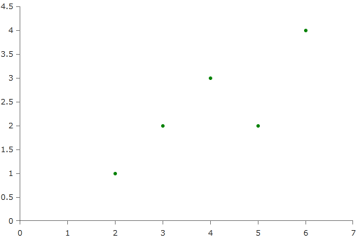

# Scatter Series

RadChartView provides a group of scatter series that can be plotted on two linear axes unlike the other series which are always plotted on a categorical and a linear or another categorical axis. The scatter series are populated with scatter data points that have an XValue and a YValue for the horizontal and vertical axes respectively, just like a point on a cartesian coordinate system. There are __ScatterPointSeries__, __ScatterLineSeries__ and __ScatterAreaSeries__ with the latter two being plotted in the exact same way as the point series but draw lines and a filled polygon over the points respectively. Note that since every point can have arbitrary X and Y values the line that connects the points in the line series can theoretically cross itself which may or may not be the desired behavior. Here is an example of how to create a chart with scatter point series, the line and area series are declared in exactly the same way.        


```XAML
	<telerik:RadCartesianChart>
	   <telerik:RadCartesianChart.HorizontalAxis>
	      <telerik:LinearAxis/>
	   </telerik:RadCartesianChart.HorizontalAxis>
	
	   <telerik:RadCartesianChart.VerticalAxis>
	      <telerik:LinearAxis/>
	   </telerik:RadCartesianChart.VerticalAxis>
	
	   <telerik:ScatterPointSeries>
	      <telerik:ScatterPointSeries.PointTemplate>
	         <DataTemplate>
	            <Ellipse Width="5" Height="5" Fill="Green"/>
	         </DataTemplate>
	      </telerik:ScatterPointSeries.PointTemplate>
	
	      <telerik:ScatterPointSeries.DataPoints>
		      <telerik:ScatterDataPoint XValue="2" YValue="1"/>
		      <telerik:ScatterDataPoint XValue="5" YValue="2"/>
		      <telerik:ScatterDataPoint XValue="6" YValue="4"/>
		      <telerik:ScatterDataPoint XValue="3" YValue="2"/>
		      <telerik:ScatterDataPoint XValue="4" YValue="3"/>
	      </telerik:ScatterPointSeries.DataPoints>
	   </telerik:ScatterPointSeries>
	</telerik:RadCartesianChart>
```

All scatter series have __XValueBinding__ and __YValueBinding__  properties which work in the same way as the [CategoryBinding and ValueBinding]() properties of the CategoricalAxis.
        

