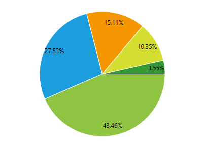
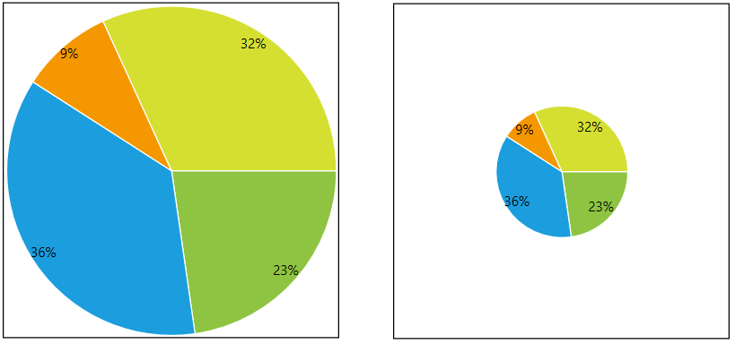
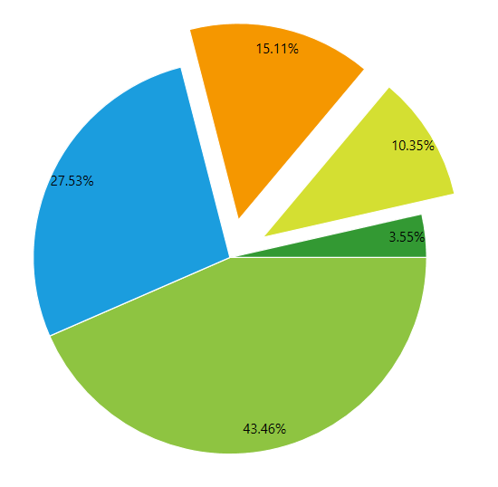
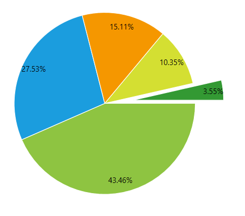

# PieSeries

This series is visualized on the screen as a circle constructed with separate pie slices representing each of the data points.

* [Declaratively Defined Series](#declaratively-defined-series)
* [Properties](#properties)
* [Data Binding](#data-binding)
* [Setting the Pie Radius](#setting-the-pie-radius)
* [Offset Pie Slice from Center](#offset-pie-slice-from-center)
* [Styling the Series](#styling-the-series)

## Declaratively defined series

You can use the following definition to display a simple PieSeries:

__Example 1: Declaring an PieSeries in XAML__
<snippet id='radchartview-series-piechart-series-pieseries-example_1_declaring_an_pieseries_in_xaml-xaml' />

#### __Figure 1: PieSeries visual appearance__

## Properties

* __ValueBinding__: A property of type __DataPointBinding__ that gets or sets the property path that determines the value of the data point.
* __AngleRange__: A property of type __DataPointBinding__ that gets or sets the property path that determines the category value of the data point.
* __RadiusFactor__: A property of type __double__ that gets or sets the radius factor used to calculate the radius of the visual series.
* __SelectedPointOffset__: A property of type __double__ that gets or sets the offset applied to a __Telerik.Charting.PieDataPoint__ which is currently selected. This value is applied only if the point's OffsetFromCenter property is 0.
* __DefaultSliceStyle__: A property of type __Style__ that gets the style applied to every segment in the series.

## Data Binding

You can use the __ValueBinding__ property of the PieSeries to bind the DataPoints’ properties to the properties from your view models.

__Example 2: Defining the view model__

<snippet id='radchartview-series-piechart-series-pieseries-example_2_defining_the_view_model-cs' />

__Example 3: Specify a PieSeries in XAML__
<snippet id='radchartview-series-piechart-series-pieseries-example_3_specify_a_pieseries_in_xaml-xaml' />

>See the [Create Data-Bound Chart]() for more information on data binding in the RadChartView suite.

## Setting the Pie Radius

The radius of the pie can be set via the __RadiusFactor__ property of the series. The property works in relative units between 0 and 1. Value of 0.3 means that the pie visual will take 30% of the chart's available space.

Setting the property to 1 means that the circle (pie) will take all the available space given from the chart control. 

Setting the property to 0.5 means that the circle (pie) will take half of the available space given from the chart control. 

Setting the property to a value bigger than 1 (ex: 1.4) will make the pie bigger than the available size.

The default value of the property is 0.85

__Example 4: Setting RadiusFactor__
<snippet id='radchartview-series-piechart-series-pieseries-example_4_setting_radiusfactor-xaml' />

#### __Figure 2: RadiusFactor of 1 (left) and 0.4 (right)__

## Offset Pie Slice from Center

The PieSeries allows you to offset each pie slice from the center of the pie. To do this set the __OffsetFromCenter__ property of the corresponding PieDataPoint.

__Example 5: Offsetting pie slices__
<snippet id='radchartview-series-piechart-series-pieseries-example_5_offsetting_pie_slices-xaml' />

#### __Figure 3: Exploding pie slices__

Additionally, you can define the offset for the selected PieDataPoint objects, via the __SelectedPointOffset__ property of PieSeries. In this case when you select a data point, the correspondign pie slice will *explode* from the center of the pie.

__Example 6: Setting SelectedPointOffset__
<snippet id='radchartview-series-piechart-series-pieseries-example_6_setting_selectedpointoffset-xaml' />

#### __Figure 4: Selected exploding pie slices__

> The OffsetFromCenter and SelectedPointOffset works in relative units between 0 and 1. 

## Styling the Series

You can see how to style the series using different properties in the [PieSeries section]() of the Customizing PieChart Series help article.

Additionally, you can use the Palette property of the chart to change the colors of the PieSeries on a global scale. You can find more information about this feature in the [Palettes]() section in our help documentation.

## See Also
 * [Chart Series Overview]()
 * [Create Data-Bound Chart]()
