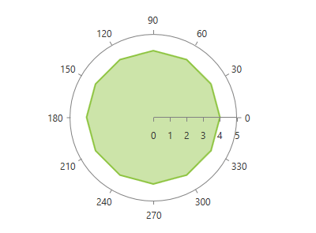

# PolarAreaSeries

This series is visualized on the screen as a straight line connecting each of the __DataPoints__. As an addition this series also allows the area surrounded by the line to be colored in an arbitrary way.      

## Declaratively defined series

You can use the following definition to display a simple PolarAreaSeries

#### __XAML__	
```XAML
	<telerik:RadPolarChart Palette="Windows8">
		<telerik:RadPolarChart.PolarAxis>
			<telerik:PolarAxis />
		</telerik:RadPolarChart.PolarAxis>
		<telerik:RadPolarChart.RadialAxis>
			<telerik:NumericRadialAxis />
		</telerik:RadPolarChart.RadialAxis>
		<telerik:RadPolarChart.Series>
			<telerik:PolarAreaSeries>
				<telerik:PolarAreaSeries.DataPoints>
					<telerik:PolarDataPoint Angle="30" Value="4"/>
					<telerik:PolarDataPoint Angle="60" Value="4"/>
					<telerik:PolarDataPoint Angle="90" Value="4"/>
					<telerik:PolarDataPoint Angle="120" Value="4"/>
					<telerik:PolarDataPoint Angle="150" Value="4"/>
					<telerik:PolarDataPoint Angle="180" Value="4"/>
					<telerik:PolarDataPoint Angle="210" Value="4"/>
					<telerik:PolarDataPoint Angle="240" Value="4"/>
					<telerik:PolarDataPoint Angle="270" Value="4"/>
					<telerik:PolarDataPoint Angle="300" Value="4"/>
					<telerik:PolarDataPoint Angle="330" Value="4"/>
					<telerik:PolarDataPoint Angle="360" Value="4"/>
				</telerik:PolarAreaSeries.DataPoints>
			</telerik:PolarAreaSeries>
		</telerik:RadPolarChart.Series>
	</telerik:RadPolarChart>
```



## See Also
 * [Chart Series Overview]()
