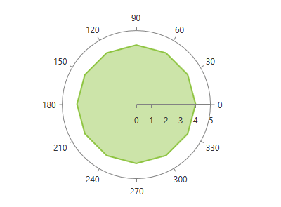

# PolarAreaSeries

This series is visualized on the screen as a straight line connecting each of the __DataPoints__. As an addition this series also allows the area surrounded by the line to be colored in an arbitrary way.      

## Declaratively defined series

You can use the following definition to display a simple PolarAreaSeries

	
<snippet id='radchartview-series-polarchart-series-area-series-polarareaseries-block_1-xaml' />

## See Also
 * [Chart Series Overview]()
