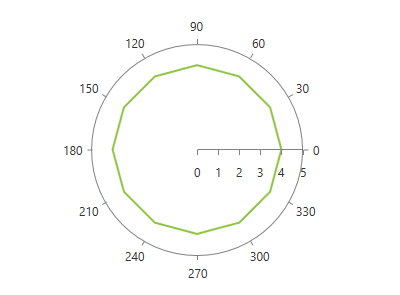

# PolarLineSeries

This series is visualized on the screen as a straight line connecting each of the __DataPoints__.   

## Declaratively defined series

You can use the following definition to display a simple PolarLineSeries

<snippet id='radchartview-series-polarchart-series-line-series-polarlineseries-block_1-xaml' />

## See Also
 * [Chart Series Overview]()
