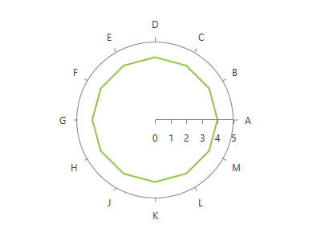

# RadarLineSeries

This series is visualized on the screen as a straight line connecting each of the __DataPoints__.      

## Declaratively defined series

You can use the following definition to display a simple RadarLineSeries

#### __XAML__
{{region radchartview-series-radarlineseries-0}}
	<telerik:RadPolarChart Palette="Windows8">
		<telerik:RadPolarChart.PolarAxis>
			<telerik:PolarAxis />
		</telerik:RadPolarChart.PolarAxis>
		<telerik:RadPolarChart.RadialAxis>
			<telerik:CategoricalRadialAxis />
		</telerik:RadPolarChart.RadialAxis>
		<telerik:RadPolarChart.Series>
			<telerik:RadarLineSeries>
				<telerik:RadarLineSeries.DataPoints>
					<telerik:CategoricalDataPoint Category="A" Value="4" />
					<telerik:CategoricalDataPoint Category="B" Value="4" />
					<telerik:CategoricalDataPoint Category="C" Value="4" />
					<telerik:CategoricalDataPoint Category="D" Value="4" />
					<telerik:CategoricalDataPoint Category="E" Value="4" />
					<telerik:CategoricalDataPoint Category="F" Value="4" />
					<telerik:CategoricalDataPoint Category="G" Value="4" />
					<telerik:CategoricalDataPoint Category="H" Value="4" />
					<telerik:CategoricalDataPoint Category="J" Value="4" />
					<telerik:CategoricalDataPoint Category="K" Value="4" />
					<telerik:CategoricalDataPoint Category="L" Value="4" />
					<telerik:CategoricalDataPoint Category="M" Value="4" />
				</telerik:RadarLineSeries.DataPoints>
			</telerik:RadarLineSeries>
		</telerik:RadPolarChart.Series>
	</telerik:RadPolarChart>
{{endregion}}

## See Also
 * [Chart Series Overview]()