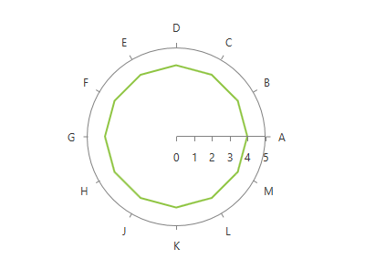

# RadarLineSeries

This series is visualized on the screen as a straight line connecting each of the __DataPoints__.      

## Declaratively defined series

You can use the following definition to display a simple RadarLineSeries

__Example 1: Declaring an RadarLineSeries in XAML__
<snippet id='radchartview-series-polarchart-series-line-series-radarlineseries-example_1_declaring_an_radarlineseries_in_xaml-xaml' />

## Properties
* __CategoryBinding__: A property of type __DataPointBinding__ that gets or sets the property path that determines the category value of the data point.
* __ValueBinding__: A property of type __DataPointBinding__ that gets or sets the property path that determines the value of the data point.
* __PointSize__: A property of type __Size__ that get or sets the size of the points. This property will be ignored if __PointTemplate__ property is set.
* __IsClosed__: A bolean property that gets or sets a value indicating whether the line curve will be closed. In other words, last point will be connected to the first one. The default value is __True__.

## Data Binding

You can use the ValueBinding and CategoryBinding properties of the PointSeries to bind the DataPoints’ properties to the properties from your view models.

__Example 2: Defining the view model__

<snippet id='radchartview-series-polarchart-series-line-series-radarlineseries-example_2_defining_the_view_model-cs' />

__Example 3: Specify a PointSeries in XAML__
<snippet id='radchartview-series-polarchart-series-line-series-radarlineseries-example_3_specify_a_pointseries_in_xaml-xaml' />

>See the [Create Data-Bound Chart]() for more information on data binding in the RadChartView suite.

## See Also
 * [Chart Series Overview]()