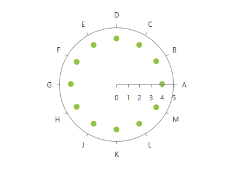

# RadarPointSeries

This series is visualized on the screen as separate points representing each of the __DataPoints__.      

## Declaratively defined series

You can use the following definition to display a simple RadarPointSeries

<snippet id='radchartview-series-polarchart-series-point-series-radarpointseries-block_1-xaml' />

## See Also
 * [Chart Series Overview]()