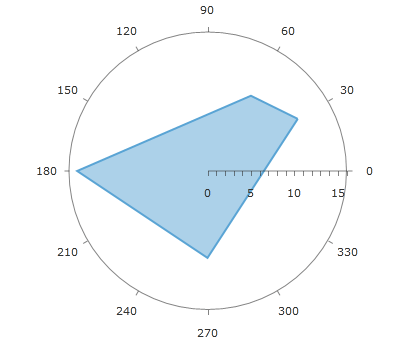

# Polar Series

The polar series____ consists of a group of classes that plot data in radial plot area in polar coordinates. The polar series are special because they are valid only in the context of the __RadPolarChart__ control. RadPolarChart supports __PolarLineSeries__, __PolarAreaSeries__ and __PolarPointSeries__ out of the box. They are only different in the graphical primitives that are drawn. The primitives are a poly line, polygon and point respectively. All polar series have __ValueBinding__ and __AngleBinding__ properties which can be bound to properties of the data source. The ValueBinding property determines the radial coordinate(the radius) and AngleBinding the angular coordinate.

When working in unbound mode, the polar series are filled with PolarDataPoint objects which define __Angle__ and __Value__ properties which unambiguously determine a point's location in the polar coordinate system defined by the polar and numeric radial axes.

Below is an example of RadPolarChart with PolarAreaSeries:


```XAML
	<telerikChart:RadPolarChart>
	    <telerikChart:RadPolarChart.PolarAxis>
	        <telerikChart:PolarAxis LabelInterval="5"/>
	    </telerikChart:RadPolarChart.PolarAxis>
	
	    <telerikChart:RadPolarChart.RadialAxis>
	        <telerikChart:NumericRadialAxis/>
	    </telerikChart:RadPolarChart.RadialAxis>
	
	    <telerikChart:PolarAreaSeries>
	        <telerikChartEngine:PolarDataPoint Angle="30"
	                                           Value="12"/>
	        <telerikChartEngine:PolarDataPoint Angle="60"
	                                           Value="10"/>
	        <telerikChartEngine:PolarDataPoint Angle="180"
	                                           Value="15"/>
	        <telerikChartEngine:PolarDataPoint Angle="270"
	                                           Value="10"/>
	    </telerikChart:PolarAreaSeries>
	</telerikChart:RadPolarChart>
```

