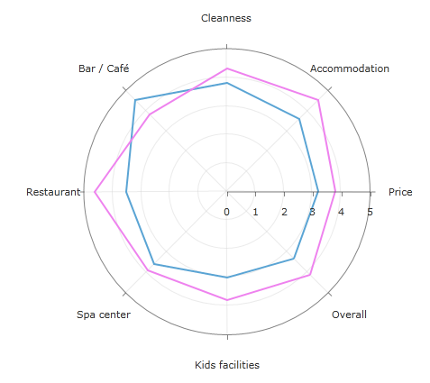

# Radar Series

The radar chart is a two-dimensional chart of three or more quantitative variables represented on axes starting from the same point. The radar series are special because they are valid only in the context of the __RadPolarChart__ control. RadPolarChart supports __RadarLineSeries__, __RadarAreaSeries__ out of the box. They are only different in the graphical primitives that are drawn. The primitives are a poly line and polygon respectively.

Below is an example of RadPolarChart with *RadarLineSeries:*

#### __XAML__

```XAML
   <telerik:RadPolarChart>
		<telerik:RadPolarChart.Grid>
			<telerik:PolarChartGrid GridLineVisibility="Both" />
		</telerik:RadPolarChart.Grid>
		<telerik:RadPolarChart.RadialAxis>
			<telerik:CategoricalRadialAxis />
		</telerik:RadPolarChart.RadialAxis>
		<telerik:RadPolarChart.PolarAxis>
			<telerik:PolarAxis/>
		</telerik:RadPolarChart.PolarAxis>
		<telerik:RadarLineSeries>
			<telerik:RadarLineSeries.DataPoints>
				<telerik:CategoricalDataPoint Category="Price" Value="3.2" />
				<telerik:CategoricalDataPoint Category="Accommodation" Value="3.6" />
				<telerik:CategoricalDataPoint Category="Cleanness" Value="3.8" />
				<telerik:CategoricalDataPoint Category="Bar / Caf�" Value="4.5" />
				<telerik:CategoricalDataPoint Category="Restaurant" Value="3.5" />
				<telerik:CategoricalDataPoint Category="Spa center" Value="3.6" />
				<telerik:CategoricalDataPoint Category="Kids facilities" Value="3.0" />
				<telerik:CategoricalDataPoint Category="Overall" Value="3.3" />
			</telerik:RadarLineSeries.DataPoints>
		</telerik:RadarLineSeries>
		<telerik:RadarLineSeries Stroke="Violet">
			<telerik:RadarLineSeries.DataPoints>
				<telerik:CategoricalDataPoint Category="Price" Value="3.8" />
				<telerik:CategoricalDataPoint Category="Accommodation" Value="4.5" />
				<telerik:CategoricalDataPoint Category="Cleanness" Value="4.3" />
				<telerik:CategoricalDataPoint Category="Bar / Caf�" Value="3.8" />
				<telerik:CategoricalDataPoint Category="Restaurant" Value="4.6" />
				<telerik:CategoricalDataPoint Category="Spa center" Value="3.9" />
				<telerik:CategoricalDataPoint Category="Kids facilities" Value="3.8" />
				<telerik:CategoricalDataPoint Category="Overall" Value="4.1" />
			</telerik:RadarLineSeries.DataPoints>
		</telerik:RadarLineSeries>
	</telerik:RadPolarChart>
```

