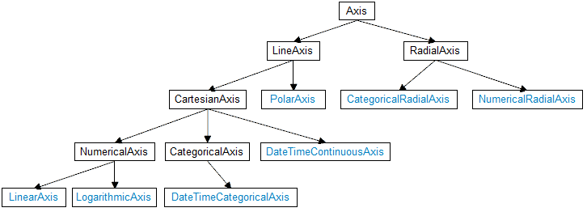

# Customizing Axes by Using Implicit Styles

RadChartView supports several types of axes. All of them are represented by the abstract Axis class that is responsible for displaying the labels and ticks.

This relates the UI in the following way – there is simply no separate Style for each axis type. Instead all axes are BasedOn one and the same style with x:Key AxisStyle. Each time you want to customize your axis you should inherit this style in XAML. 

For the purpose of this tutorial, we will create a sample chart with LineSeries. Then to customize the horizontal and vertical axes we will create two implicit styles which target the axes correspondingly. __Example 1__ demonstrates the full XAML code.

__Example 1: Customizing axes by using implicit styles__	
<snippet id='radchartview-styles-and-templates-customizing-axes-example_1_customizing_axes_by_using_implicit_styles-xaml' />

#### __Figure 1: Customizing axes by using implicit styles__

## See Also
 * [Axis]()
 * [Series and Axes]()
