# Customizing CartesianChart Series

This article demonstrates how you can change the default look of the __RadCartesianChart__ series.      

* [Customizing Data Points Using DefaultVisualStyle](#customizing-data-points-using-defaultvisualstyle)
* [Customizing Data Points Using PointTemplate](#customizing-data-points-using-pointtemplate)
<br />
* [Customizing Point Series](#customizing-point-series)
	* [PointSeries](#pointseries)
	* [ScatterPointSeries](#scatterpointseries)
* [Customizing Line Series](#customizing-line-series)
	* [LineSeries](#lineseries)
	* [SplineSeries](#splineseries)
	* [StepLineSeries](#steplineseries)
	* [ScatterLineSeries](#scatterlineseries)
	* [ScatterSplineSeries](#scattersplineseries)
* [Customizing Area Series](#customizing-area-series)
	* [AreaSeries](#lineseries)
	* [RangeSeries](#rangeseries)
	* [StepAreaSeries](#stepareaseries)
	* [SplineAreaSeries](#splineareaseries)
	* [ScatterAreaSeries](#scatterareaseries)
	* [ScatterSplineAreaSeries](#scattersplineareaseries)
* [Customizing Bar Series](#customizing-bar-series)      
 	* [BarSeries](#barseries)
	* [RangeBarSeries](#rangebarseries)
* [Customizing Financial Series](#customizing-financial-series)
	* [OhlcSeries](#ohlcseries)
	* [CandlestickSeries](#candlestickseries)	
* [BoxPlotSeries](#customizing-box-plot-series)	
* [ErrorBarSeries](#customizing-error-bar-series)	
	
## Customizing Data Points Using DefaultVisualStyle

The different chart series use different visual elements to display their data points - a bar, an ellipse, etc. You can apply a custom style for those elements via the __DefaultVisualStyle__ property. The property accepts a value of type __Style__ which targets the visual element of the corresponding series. There is an additional __DefaultVisualStyleSelector__ property which can be used to apply different style for the different data point visuals in a series. The selector property is of type [StyleSelector](https://docs.microsoft.com/en-us/dotnet/api/system.windows.controls.styleselector?redirectedfrom=MSDN&view=net-5.0).

__Setting DefaultVisualStyle of BarSeries__
```XAML
    <telerik:BarSeries>
		<telerik:BarSeries.DefaultVisualStyle>
			<Style TargetType="Border">
				<Setter Property="Background" Value="#F47748" />
			</Style>
		</telerik:BarSeries.DefaultVisualStyle>
    </telerik:BarSeries>
```

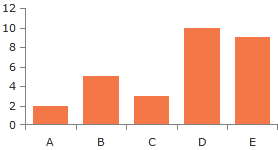

Since Q1 2016, all Cartesian series (excluding RangeSeries) are rendering default visuals using the DefaultVisualStyle property. So, you can use it also with line and area series to display their data point visuals which don't exist by default. Note that when using line or area series you will need to set also the size of the visual. Otherwise it won't be displayed.

__Setting DefaultVisualStyle of LineSeries__
```XAML
    <telerik:LineSeries>
      <telerik:LineSeries.DefaultVisualStyle>
		<Style TargetType="Path">
			<Setter Property="Width" Value="10" />
			<Setter Property="Height" Value="10" />
			<Setter Property="Fill" Value="#FF5AC3" />
		</Style>
      </telerik:LineSeries.DefaultVisualStyle>
    </telerik:LineSeries>
```

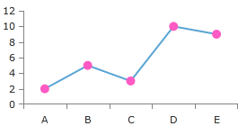
	
> When using a [Palette]() the series' default visual will ignore the color defined in the DefaultVisualStyle and it will use the one provided by the palette.

## Customizing Data Points Using PointTemplate

All series supported by the __RadCartesianChart__ expose a __PointTemplate__ property. It is of type __DataTemplate__ and gets or sets the template that describes the visual representation of the data points in a series. There is an additiona __PointTemplateSelector__ property which can be used to apply different visuals for the different data points in a series. The selector property is of type [DataTemplateSelector](https://docs.microsoft.com/en-us/dotnet/api/system.windows.controls.datatemplateselector?view=net-5.0).

>tip Using PointTemplate is recommended only when the __DefaultVisualStyle__ cannot be used. 
   
__Setting PointTemplate__
```XAML
    <telerik:PointSeries>
      <telerik:PointSeries.PointTemplate>
          <DataTemplate>
              <Ellipse Height="5" Width="11" Fill="Blue"/>
          </DataTemplate>
      </telerik:PointSeries.PointTemplate>
    </telerik:PointSeries>
```

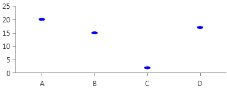
	
## Customizing Point Series

### PointSeries

This series expose the __DefaultVisualStyle__ property. It is of type __Style__ and determines the appearance of the [Path](http://msdn.microsoft.com/en-us/library/system.windows.shapes.path(v=vs.110).aspx) element used to visualize the __PointSeries__. Your custom style should target the native __Path__ component. 
            
__Setting PointSeries DefaultVisualStyle__  
```XAML
	<telerik:PointSeries.DefaultVisualStyle>
		<Style TargetType="Path">
			  <Setter Property="Fill" Value="YellowGreen"/>
			  <Setter Property="Stroke" Value="Red"/>
			  <Setter Property="StrokeThickness" Value="1"/>
		</Style>
	</telerik:PointSeries.DefaultVisualStyle>  
```

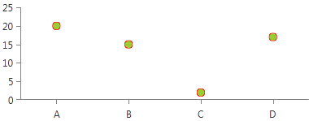

### ScatterPointSeries

This series expose the __DefaultVisualStyle__ property. It is of type __Style__ and determines the appearance of the [Path](http://msdn.microsoft.com/en-us/library/system.windows.shapes.path(v=vs.110).aspx) element used to visualize the __ScatterPointSeries__. Your custom style should target the native __Path__ component.

__Setting ScatterPointSeries DefaultVisualStyle__  
```XAML	    
    <telerik:ScatterPointSeries.DefaultVisualStyle>
        <Style TargetType="Path">
            <Setter Property="Stroke" Value="Green"/>
            <Setter Property="Fill" Value="Orange"/>
            <Setter Property="StrokeThickness" Value="2"/>
        </Style>
    </telerik:ScatterPointSeries.DefaultVisualStyle>  
```

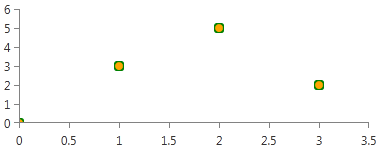

## Customizing Line Series

> Since R1 2016 the chart's line series have default visual elements for their data points. This means that you can use the __DefaultVisualStyle__ property to customize the data points visuals. 

### LineSeries

This series expose the __StrokeShapeStyle__ property. It is of type __Style__ and determines the appearance of the [Path](http://msdn.microsoft.com/en-us/library/system.windows.shapes.path(v=vs.110).aspx) element used to visualize the __LineSeries__. Your custom style should target the native __Path__ component.

__Setting LineSeries StrokeShapeStyle__  
```XAML	
    <telerik:LineSeries.StrokeShapeStyle>
        <Style TargetType="Path">
            <Setter Property="Stroke" Value="Red"/>
            <Setter Property="StrokeDashArray" Value="10 5"/>
            <Setter Property="StrokeThickness" Value="3"/>
        </Style>
	</telerik:LineSeries.StrokeShapeStyle>  
```

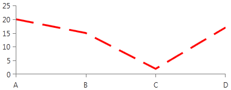

### SplineSeries

This series expose the __StrokeShapeStyle__ property. It is of type __Style__ and determines the appearance of the [Path](http://msdn.microsoft.com/en-us/library/system.windows.shapes.path(v=vs.110).aspx) element used to visualize the __SplineSeries__. Your custom style should target the native __Path__ component. 
            
__Setting SplineSeries StrokeShapeStyle__  
```XAML	
    <telerik:SplineSeries.StrokeShapeStyle>
        <Style TargetType="Path">
            <Setter Property="Stroke" Value="Red"/>
            <Setter Property="StrokeDashArray" Value="10 5"/>
            <Setter Property="StrokeThickness" Value="3"/>
        </Style>
    </telerik:SplineSeries.StrokeShapeStyle>
```

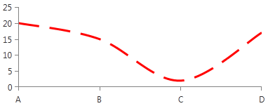

### StepLineSeries

This series expose the __StrokeShapeStyle__ property. It is of type __Style__ and determines the appearance of the [Path](http://msdn.microsoft.com/en-us/library/system.windows.shapes.path(v=vs.110).aspx) element used to visualize the __StepLineSeries__. Your custom style should target the native __Path__ component. 
            
__Setting StepLineSeries StrokeShapeStyle__  
```XAML    
    <telerik:StepLineSeries.StrokeShapeStyle>
        <Style TargetType="Path">
            <Setter Property="Stroke" Value="Red"/>
            <Setter Property="StrokeDashArray" Value="10 5"/>
            <Setter Property="StrokeThickness" Value="3"/>
        </Style>
    </telerik:StepLineSeries.StrokeShapeStyle>
```

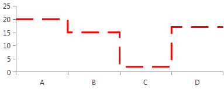

### ScatterLineSeries

This series expose the __StrokeShapeStyle__ property. It is of type __Style__ and determines the appearance of the [Path](http://msdn.microsoft.com/en-us/library/system.windows.shapes.path(v=vs.110).aspx) element used to visualize the __ScatterLineSeries__. Your custom style should target the native __Path__ component. 
            
__Setting ScatterLineSeries StrokeShapeStyle__  
```XAML
    <telerik:ScatterLineSeries.StrokeShapeStyle>
      <Style TargetType="Path">
          <Setter Property="Stroke" Value="Red"/>
          <Setter Property="StrokeDashArray" Value="10 5"/>
          <Setter Property="StrokeThickness" Value="3"/>
      </Style>
    </telerik:ScatterLineSeries.StrokeShapeStyle>
```

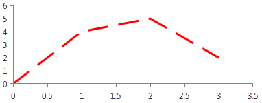

### ScatterSplineSeries

This series expose the __StrokeShapeStyle__ property. It is of type __Style__ and determines the appearance of the [Path](http://msdn.microsoft.com/en-us/library/system.windows.shapes.path(v=vs.110).aspx) element used to visualize the __ScatterSplineSeries__. Your custom style should target the native __Path__ component. 
            
__Setting ScatterSplineSeries StrokeShapeStyle__  
```XAML    
    <telerik:ScatterSplineSeries.StrokeShapeStyle>
		<Style TargetType="Path">
		  <Setter Property="Stroke" Value="Red"/>
		  <Setter Property="StrokeDashArray" Value="10 5"/>
		  <Setter Property="StrokeThickness" Value="3"/>
		</Style>
    </telerik:ScatterSplineSeries.StrokeShapeStyle>
```


## Customizing Area Series

### AreaSeries

This series expose the following styling properties:            

* __StrokeShapeStyle__ - it is of type __Style__ and determines the appearance of the series. Your custom style should target the native [Path](http://msdn.microsoft.com/en-us/library/system.windows.shapes.path(v=vs.110).aspx) component.
                
	__Setting AreaSeries StrokeShapeStyle__  
	```XAML
		<telerik:AreaSeries.StrokeShapeStyle>
			<Style TargetType="Path">
				<Setter Property="Stroke" Value="Red"/>
				<Setter Property="StrokeDashArray" Value="10 5"/>
				<Setter Property="StrokeThickness" Value="3"/>
			</Style>
		</telerik:AreaSeries.StrokeShapeStyle>

	```

	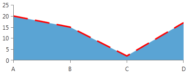

* __AreaShapeStyle__ - it is of type __Style__ and determines the appearance of the area, locked between the axis and the line. Your custom style should target the native [Path](http://msdn.microsoft.com/en-us/library/system.windows.shapes.path(v=vs.110).aspx) component.
   
	__Setting AreaSeries AreaShapeStyle__  
	```XAML
		<telerik:AreaSeries.AreaShapeStyle>
			<Style TargetType="Path">
				<Setter Property="Fill" Value="Bisque"/>
			</Style>
		</telerik:AreaSeries.AreaShapeStyle>		  
	```

	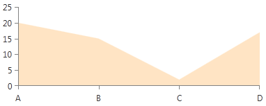

### RangeSeries

This series expose the following styling properties:

* __StrokeShapeStyle__ - it is of type __Style__ and determines the appearance of the series. Your custom style should target the native [Path](http://msdn.microsoft.com/en-us/library/system.windows.shapes.path(v=vs.110).aspx) component.

	__Setting RangeSeries StrokeShapeStyle__  
	```XAML
		<telerik:RangeSeries.StrokeShapeStyle>
			<Style TargetType="Path">
				<Setter Property="Stroke" Value="Red"/>
				<Setter Property="StrokeDashArray" Value="10 5"/>
				<Setter Property="StrokeThickness" Value="3"/>
			</Style>
		</telerik:RangeSeries.StrokeShapeStyle>
	```

	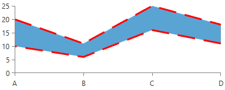
	
* __StrokeMode__ - it is Enumeration type and determines how the RangeSeries area outline should be painted or not. By default is set to __LowAndHighPoints__. 

	__Setting RangeSeries StrokeShapeStyle__  
	```XAML
		<telerik:RangeSeries  StrokeMode="HighPoints" >
			<telerik:RangeSeries.StrokeShapeStyle>
				<Style TargetType="Path">
					<Setter Property="Stroke" Value="Red"/>
					<Setter Property="StrokeDashArray" Value="10 5"/>
					<Setter Property="StrokeThickness" Value="3"/>
				</Style>
			</telerik:RangeSeries.StrokeShapeStyle>
		</telerik:RangeSeries>	  
	```
	
	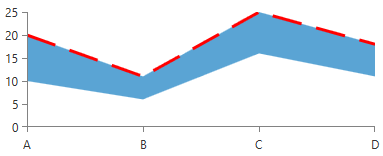
	
* __AreaShapeStyle__ - it is of type __Style__ and determines the appearance of the area, locked between the axis and the line. Your custom style should target the native [Path](http://msdn.microsoft.com/en-us/library/system.windows.shapes.path(v=vs.110).aspx) component.

	__Setting RangeSeries AreaShapeStyle__   
	```XAML
		<telerik:RangeSeries.AreaShapeStyle>
			<Style TargetType="Path">
				<Setter Property="Fill" Value="Bisque"/>
			</Style>
		</telerik:RangeSeries.AreaShapeStyle>		  
	```

	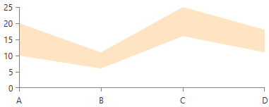
	
>tipRangeSeries expose several additional properties you can use to style its appearance: __Stroke__, __StrokeThickness__, __Fill__, __DashArray__.

### StepAreaSeries

This series expose the following styling properties:            

* __StrokeShapeStyle__ - it is of type __Style__ and determines the appearance of the series. Your custom style should target the native [Path](http://msdn.microsoft.com/en-us/library/system.windows.shapes.path(v=vs.110).aspx) component.
                
	__Setting StepAreaSeries StrokeShapeStyle__   
	```XAML
		<telerik:StepAreaSeries.StrokeShapeStyle>
			<Style TargetType="Path">
				<Setter Property="Stroke" Value="Red"/>
				<Setter Property="StrokeDashArray" Value="10 5"/>
				<Setter Property="StrokeThickness" Value="3"/>
			</Style>
		</telerik:StepAreaSeries.StrokeShapeStyle>
	```

	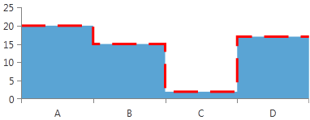

* __AreaShapeStyle__ - it is of type __Style__ and determines the appearance of the area, locked between the axis and the line. Your custom style should target the native [Path](http://msdn.microsoft.com/en-us/library/system.windows.shapes.path(v=vs.110).aspx) component.
                
	__Setting StepAreaSeries AreaShapeStyle__   
	```XAML
		<telerik:StepAreaSeries.AreaShapeStyle>
			<Style TargetType="Path">
				<Setter Property="Fill" Value="Bisque"/>
			</Style>
		</telerik:StepAreaSeries.AreaShapeStyle>
	```

	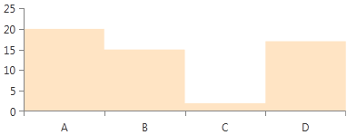

### SplineAreaSeries

This series expose the following styling properties:
            

* __StrokeShapeStyle__ - it is of type __Style__ and determines the appearance of the series. Your custom style should target the native [Path](http://msdn.microsoft.com/en-us/library/system.windows.shapes.path(v=vs.110).aspx) component.
                
	__Setting SplineAreaSeries StrokeShapeStyle__   
	```XAML
		<telerik:SplineAreaSeries.StrokeShapeStyle>
			<Style TargetType="Path">
				<Setter Property="Stroke" Value="Red"/>
				<Setter Property="StrokeDashArray" Value="10 5"/>
				<Setter Property="StrokeThickness" Value="3"/>
			</Style>
		</telerik:SplineAreaSeries.StrokeShapeStyle>
	```

	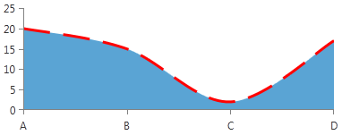

* __AreaShapeStyle__ - it is of type __Style__ and determines the appearance of the area, locked between the axis and the line. Your custom style should target the native [Path](http://msdn.microsoft.com/en-us/library/system.windows.shapes.path(v=vs.110).aspx) component.
                
	__Setting SplineAreaSeries AreaShapeStyle__   
	```XAML
		<telerik:SplineAreaSeries.AreaShapeStyle>
			<Style TargetType="Path">
				<Setter Property="Fill" Value="Bisque"/>
			</Style>
		</telerik:SplineAreaSeries.AreaShapeStyle>
	```

	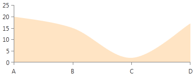

### ScatterAreaSeries

This series expose the following styling properties:            

* __StrokeShapeStyle__ - it is of type __Style__ and determines the appearance of the series. Your custom style should target the native [Path](http://msdn.microsoft.com/en-us/library/system.windows.shapes.path(v=vs.110).aspx) component.
					
	__Setting ScatterAreaSeries StrokeShapeStyle__   
	```XAML
		 <telerik:ScatterAreaSeries.StrokeShapeStyle>
			<Style TargetType="Path">
				<Setter Property="Stroke" Value="Red"/>
				<Setter Property="StrokeDashArray" Value="10 5"/>
				<Setter Property="StrokeThickness" Value="3"/>
			</Style>
		</telerik:ScatterAreaSeries.StrokeShapeStyle>
	```

	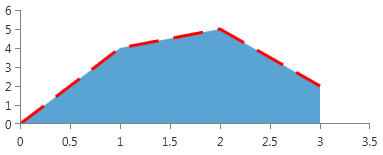

* __AreaShapeStyle__ - it is of type __Style__ and determines the appearance of the area, locked between the axis and the line. Your custom style should target the native [Path](http://msdn.microsoft.com/en-us/library/system.windows.shapes.path(v=vs.110).aspx) component.
                
	__Setting ScatterAreaSeries AreaShapeStyle__   
	```XAML
		<telerik:ScatterAreaSeries.AreaShapeStyle>
			<Style TargetType="Path">
				<Setter Property="Fill" Value="Bisque"/>
			</Style>
		</telerik:ScatterAreaSeries.AreaShapeStyle>
	```

	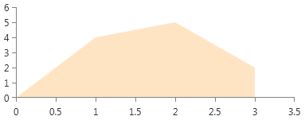

### ScatterSplineAreaSeries

This series expose the following styling properties:       

* __StrokeShapeStyle__ - it is of type __Style__ and determines the appearance of the series. Your custom style should target the native [Path](http://msdn.microsoft.com/en-us/library/system.windows.shapes.path(v=vs.110).aspx) component. 
                
	__Setting ScatterSplineAreaSeries StrokeShapeStyle__   
	```XAML
		<telerik:ScatterSplineAreaSeries.StrokeShapeStyle>
			<Style TargetType="Path">
				<Setter Property="Stroke" Value="Red"/>
				<Setter Property="StrokeDashArray" Value="10 5"/>
				<Setter Property="StrokeThickness" Value="3"/>
			</Style>
		</telerik:ScatterSplineAreaSeries.StrokeShapeStyle>
	```

	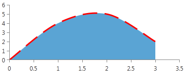

* __AreaShapeStyle__ - it is of type __Style__ and determines the appearance of the area, locked between the axis and the line. Your custom style should target the native [Path](http://msdn.microsoft.com/en-us/library/system.windows.shapes.path(v=vs.110).aspx) component.
                
	__Setting ScatterSplineAreaSeries AreaShapeStyle__   
	```XAML
		<telerik:ScatterSplineAreaSeries.AreaShapeStyle>
			<Style TargetType="Path">
				<Setter Property="Fill" Value="Bisque"/>
			</Style>
		</telerik:ScatterSplineAreaSeries.AreaShapeStyle>
	```

	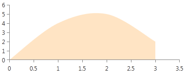

## Customizing Bar Series

### BarSeries

This series expose the __DefaultVisualStyle__ property. It is of type __Style__ and determines the appearance of the series. Your custom style should target the native [Border](http://msdn.microsoft.com/en-us/library/system.windows.controls.border(v=vs.110).aspx) component. 
            
__Setting BarSeries DefaultVisualStyle__   
```XAML
    <telerik:BarSeries.DefaultVisualStyle>
		<Style TargetType="Border">
			<Setter Property="Background" Value="YellowGreen"/>
			<Setter Property="BorderBrush" Value="Red"/>
			<Setter Property="BorderThickness" Value="2"/>
		</Style>
    </telerik:BarSeries.DefaultVisualStyle>
```

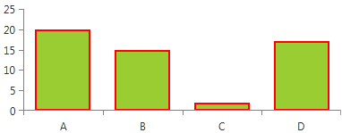

### RangeBarSeries

This series expose the __DefaultVisualStyle__ property. It is of type __Style__ and determines the appearance of the series. Your custom style should target the native [Border](http://msdn.microsoft.com/en-us/library/system.windows.controls.border(v=vs.110).aspx) component.

__Setting RangeBarSeries DefaultVisualStyle__   
```XAML
    <telerik:RangeBarSeries.DefaultVisualStyle>
      <Style TargetType="Border">
          <Setter Property="Background" Value="YellowGreen"/>
          <Setter Property="BorderBrush" Value="Red"/>
          <Setter Property="BorderThickness" Value="2"/>
      </Style>
    </telerik:RangeBarSeries.DefaultVisualStyle>
```

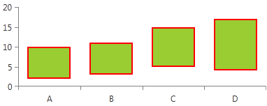

### ScatterRangeBarSeries

This series expose the __DefaultVisualStyle__ property. It is of type __Style__ and determines the appearance of the series. Your custom style should target the native [Border](http://msdn.microsoft.com/en-us/library/system.windows.controls.border(v=vs.110).aspx) component.

__Setting ScatterRangeBarSeries DefaultVisualStyle__   
```XAML
    <telerik:ScatterRangeBarSeries.DefaultVisualStyle>
      <Style TargetType="Border">
          <Setter Property="Background" Value="#B4FF8080"/>
          <Setter Property="BorderBrush" Value="Black"/>
          <Setter Property="BorderThickness" Value="1"/>
      </Style>
    </telerik:ScatterRangeBarSeries.DefaultVisualStyle>
```

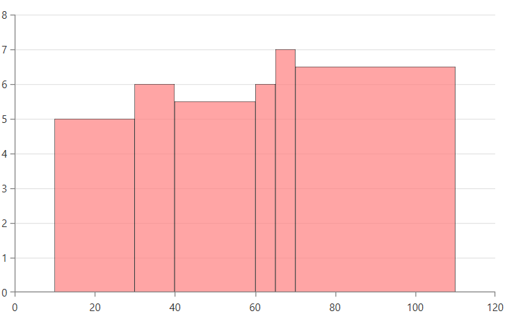

## Customizing Financial Series

### OhlcSeries

This series expose the __DefaultVisualStyle__ property. It is of type __Style__ and determines the appearance of the series. Your custom style should target the native [OhlcStick](http://www.telerik.com/help/wpf/t_telerik_windows_controls_chartview_ohlcstick.html)[OhlcStick](http://www.telerik.com/help/silverlight/t_telerik_windows_controls_chartview_ohlcstick.html) component. 
            
__Setting OhlcSeries DefaultVisualStyle__   
```XAML
    <telerik:OhlcSeries.DefaultVisualStyle>
      <Style TargetType="telerikChartView:OhlcStick">
          <Setter Property="MinHeight" Value="1"/>
          <Setter Property="StrokeThickness" Value="1"/>
          <Setter Property="UpStroke" Value="GreenYellow"/>
          <Setter Property="DownStroke" Value="Red"/>
      </Style>
    </telerik:OhlcSeries.DefaultVisualStyle>
```

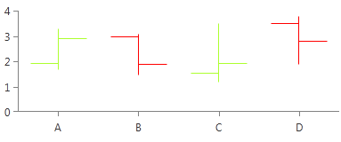

### CandlestickSeries

This series expose the __DefaultVisualStyle__ property. It is of type __Style__ and determines the appearance of the series. Your custom style should target the native [Candlestick](http://www.telerik.com/help/wpf/t_telerik_windows_controls_charting_candlestick.html)[Candlestick](http://www.telerik.com/help/silverlight/t_telerik_windows_controls_charting_candlestick.html) component.            

__Setting CandlestickSeries DefaultVisualStyle__   
```XAML
    <telerik:CandlestickSeries.DefaultVisualStyle>
        <Style TargetType="telerikChartView:Candlestick">
            <Setter Property="MinHeight" Value="1"/>
            <Setter Property="StrokeThickness" Value="1"/>
            <Setter Property="UpStroke" Value="GreenYellow"/>
            <Setter Property="DownStroke" Value="Red"/>
        </Style>
    </telerik:CandlestickSeries.DefaultVisualStyle>
```

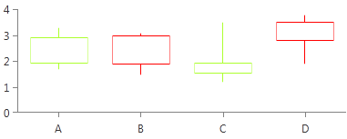

## Customizing Box Plot Series

The BoxPlotSeries exposes a __DefaultVisualStyle__ property that allows you to customize the visual elements representing the data points. The property accepts a Style targeting the __BoxPlotShape__ element. The style can be used to change the stroke and fill of the visual element.

__Setting BoxPlotSeries DefaultVisualStyle__   
```XAML
	<telerik:BoxPlotSeries.DefaultVisualStyle>
		<Style TargetType="telerik:BoxPlotShape">
			<Setter Property="Fill" Value="#222DA68D" />
			<Setter Property="Stroke" Value="#2DA68D" />
			<Setter Property="StrokeThickness" Value="1" />
		</Style>
	</telerik:BoxPlotSeries.DefaultVisualStyle>
```

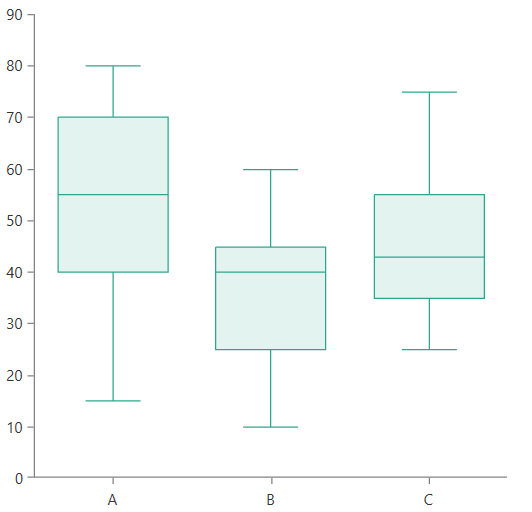

## Customizing Error Bar Series

The ErrorBarSeries exposes a __DefaultVisualStyle__ property that allows you to customize the visual elements representing the data points. The property accepts a Style targeting the __ErrorBarShape__ element. The style can be used to change the colors of the visual and also its caps size, marker visibility, and marker size.

__Setting ErrorBarSeries DefaultVisualStyle__   
```XAML
	<telerik:ErrorBarSeries.DefaultVisualStyle>
		<Style TargetType="telerik:ErrorBarShape">
			<Setter Property="Fill" Value="#2DA68D" />
			<Setter Property="Stroke" Value="#2DA68D" />
			<Setter Property="StrokeThickness" Value="2" />
			<Setter Property="ShowMarker" Value="True"/>
			<Setter Property="CapLength" Value="0.5" />
			<Setter Property="MarkerSize" Value="25, 25"/>
		</Style>
	</telerik:ErrorBarSeries.DefaultVisualStyle>
```

The `CapLength` property controls the size of the caps shown at both ends of the error bar. The property works with relative units between 0 and 1. 

The `MarkerSize` property determines the size of the marker. The property works with absolute value, which means that the marker has fixed size. If the `MarkerSize` is set to `null`, the marker will resize according to the cap length.

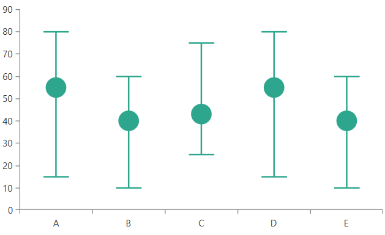

## See Also
 * [Getting Started]()
 * [Customizing PolarChart Series]()
 * [Customizing PieChart Series]()
 * [Create Data-Bound Chart]()
