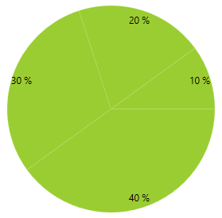
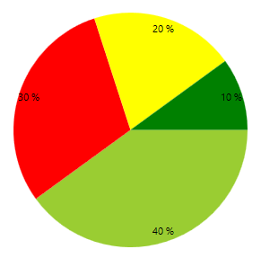
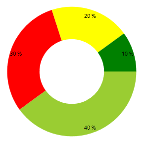

# Customizing PieChart Series


This article demonstrates how you can change the default look of the __RadPieChart__ series.
      

## Customizing Pie Series

### DefaultSliceStyle

This series expose the __DefaultSliceStyle__ property. It is of type __Style__ and determines the appearance of the [Path](http://msdn.microsoft.com/en-us/library/system.windows.shapes.path(v=vs.110).aspx) element used to visualize the __PieSeries__. Your custom style should target the native __Path__ component. You can set the property like this:

#### __XAML__

```XAML
    <telerik:PieSeries.DefaultSliceStyle>
      <Style TargetType="Path">
          <Setter Property="Fill" Value="YellowGreen"/>
      </Style>
    </telerik:PieSeries.DefaultSliceStyle>
```



### SliceStyles

This series also expose the __SliceStyles__ property. It is of type __ObservableCollection<Style>__ and gets or sets a collection of styles that will be consecutively applied on all slices of the __PieSeries__. This means that if you have more slices than Styles defined, the RadPieChart will repeatedly apply the collection so that the number of the applied styles equals the number of the slices. You can define the collection in XAML like this:
            
#### __XAML__

```XAML	
    <telerik:PieSeries.SliceStyles>
        <Style TargetType="Path">
          <Setter Property="Fill" Value="YellowGreen"/>
        </Style>
        <Style TargetType="Path">
          <Setter Property="Fill" Value="Red"/>
        </Style>
        <Style TargetType="Path">
          <Setter Property="Fill" Value="Yellow"/>
        </Style>
        <Style TargetType="Path">
          <Setter Property="Fill" Value="Green"/>
        </Style>
    </telerik:PieSeries.SliceStyles>
```



## Customizing Doughnut Series

### DefaultSliceStyle

This series expose the __DefaultSliceStyle__ property. It is of type __Style__ and determines the appearance of the [Path](http://msdn.microsoft.com/en-us/library/system.windows.shapes.path(v=vs.110).aspx) element used to visualize the __DoughnutSeries__. Your custom style should target the native __Path__ component. You can set the property like this:
            
#### __XAML__

```XAML
    <telerik:DoughnutSeries.DefaultSliceStyle>
      <Style TargetType="Path">
          <Setter Property="Fill" Value="YellowGreen"/>
      </Style>
    </telerik:DoughnutSeries.DefaultSliceStyle>
```


### SliceStyles

This series also expose the __SliceStyles__ property. It is of type __ObservableCollection<Style>__ and gets or sets a collection of styles that will be consecutively applied on all slices of the __PieSeries__ This means that if you have more slices than Styles defined, the RadPieChart will repeatedly apply the collection so that the number of the applied styles equals the number of the slices. You can define it like this:
            
#### __XAML__

```XAML
    <telerik:DoughnutSeries.SliceStyles>
      <Style TargetType="Path">
          <Setter Property="Fill" Value="YellowGreen"/>
      </Style>
      <Style TargetType="Path">
          <Setter Property="Fill" Value="Red"/>
      </Style>
      <Style TargetType="Path">
          <Setter Property="Fill" Value="Yellow"/>
      </Style>
      <Style TargetType="Path">
          <Setter Property="Fill" Value="Green"/>
      </Style>
    </telerik:DoughnutSeries.SliceStyles>
```



## See Also

 * [Customizing CartesianChart Series]()

 * [Customizing PolarChart Series]()
