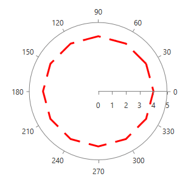
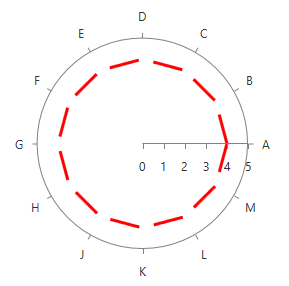
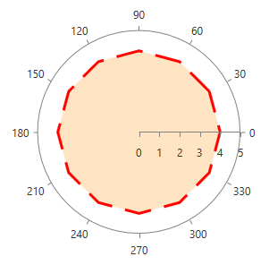
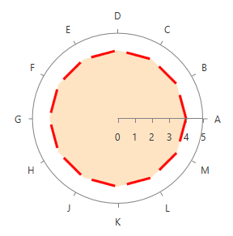
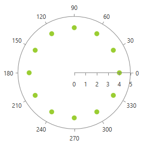
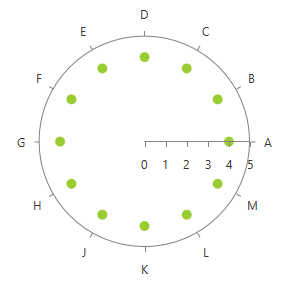

# Customizing PolarChart Series

This article demonstrates how you can change the default look of the __RadPolarChart__ series.

## Customizing Line Series

### PolarLineSeries

This series expose the __ShapeStyle__ property. It is of type __Style__ and determines the appearance of the [Path](http://msdn.microsoft.com/en-us/library/system.windows.shapes.path(v=vs.110).aspx) element used to visualize the __PolarLineSeries__. Your custom style should target the native __Path__ component. You can set the property like this:
            


```XAML

    <telerik:PolarLineSeries.ShapeStyle>
      <Style TargetType="Path">
          <Setter Property="StrokeDashArray" Value="10 5"/>
          <Setter Property="Stroke" Value="Red"/>
          <Setter Property="StrokeThickness" Value="3"/>
      </Style>
    </telerik:PolarLineSeries.ShapeStyle>

```



### RadarLineSeries

This series expose the __ShapeStyle__ property. It is of type __Style__ and determines the appearance of the [Path](http://msdn.microsoft.com/en-us/library/system.windows.shapes.path(v=vs.110).aspx) element used to visualize the __RadarLineSeries__. Your custom style should target the native __Path__ component. You can set the property like this:
            


```XAML	

    <telerik:RadarLineSeries.ShapeStyle>
      <Style TargetType="Path">
          <Setter Property="StrokeDashArray" Value="10 5"/>
          <Setter Property="Stroke" Value="Red"/>
          <Setter Property="StrokeThickness" Value="3"/>
      </Style>
    </telerik:RadarLineSeries.ShapeStyle>

```



## Customizing Area Series

### PolarAreaSeries

This series expose the __ShapeStyle__ property. It is of type __Style__ and determines the appearance of the [Path](http://msdn.microsoft.com/en-us/library/system.windows.shapes.path(v=vs.110).aspx) element used to visualize the __PolarAreaSeries__. Your custom style should target the native __Path__ component. You can set the property like this:
            


```XAML

    <telerik:PolarAreaSeries.ShapeStyle>
      <Style TargetType="Path">
          <Setter Property="Fill" Value="Bisque"/>
          <Setter Property="StrokeDashArray" Value="10 5"/>
          <Setter Property="Stroke" Value="Red"/>
          <Setter Property="StrokeThickness" Value="3"/>
      </Style>
    </telerik:PolarAreaSeries.ShapeStyle>

```



### RadarAreaSeries

This series expose the __ShapeStyle__ property. It is of type __Style__ and determines the appearance of the [Path](http://msdn.microsoft.com/en-us/library/system.windows.shapes.path(v=vs.110).aspx) element used to visualize the __RadarLineSeries__. Your custom style should target the native __Path__ component. You can set the property like this:
            


```XAML

    <telerik:RadarAreaSeries.ShapeStyle>
      <Style TargetType="Path">
          <Setter Property="StrokeDashArray" Value="10 5"/>
          <Setter Property="Stroke" Value="Red"/>
          <Setter Property="StrokeThickness" Value="3"/>
      </Style>
    </telerik:RadarAreaSeries.ShapeStyle>
  
```



## Customizing Point Series

### PolarPointSeries

This series expose the __DefaultVisualStyle__ property. It is of type __Style__ and determines the appearance of the [Path](http://msdn.microsoft.com/en-us/library/system.windows.shapes.path(v=vs.110).aspx) element used to visualize the __PolarPointSeries__. Your custom style should target the native __Path__ component. You can set the property like this:
            


```XAML

    <telerik:PolarPointSeries.DefaultVisualStyle>
      <Style TargetType="Path">
          <Setter Property="Fill" Value="YellowGreen"/>
      </Style>
    </telerik:PolarPointSeries.DefaultVisualStyle>
    
```

>tipSince __Q1 2014__ all series exposing the __DefaultVisualStyle__ property, also expose the __DefaultVisualStyleSelector__ property. It is of type [StyleSelector](http://msdn.microsoft.com/en-us/library/system.windows.controls.styleselector(v=vs.110).aspx) and gets or sets custom style-selection logic for a style that can be applied to each generated element.



### RadarPointSeries

This series expose the __DefaultVisualStyle__ property. It is of type __Style__ and determines the appearance of the series. Your custom style should target the native [Path](http://msdn.microsoft.com/en-us/library/system.windows.shapes.path(v=vs.110).aspx) component. You can set the property like this:
            


```XAML

    <telerik:RadarPointSeries.DefaultVisualStyle>
      <Style TargetType="Path">
          <Setter Property="Fill" Value="YellowGreen"/>
      </Style>
    </telerik:RadarPointSeries.DefaultVisualStyle>
    
```


>tipSince __Q1 2014__ all series exposing the __DefaultVisualStyle__ property, also expose the __DefaultVisualStyleSelector__ property. It is of type [StyleSelector](http://msdn.microsoft.com/en-us/library/system.windows.controls.styleselector(v=vs.110).aspx) and gets or sets custom style-selection logic for a style that can be applied to each generated element.



## See Also

 * [Customizing CartesianChart Series]()

 * [Customizing PieChart Series]()
