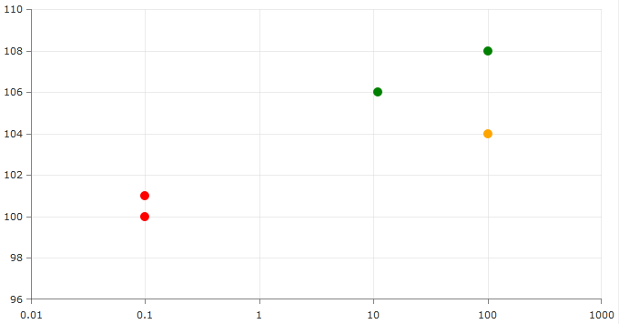
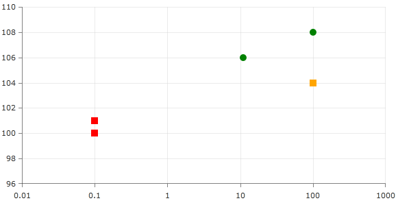

# Customizing Scatter Points

RadChartView allows you to set custom shape for the Scatter points (items of the [ScatterPointSeries]()) via DataTemplate. However there are cases where we would like each point in our scatter series to have different shape or color. This is where you should use the *PointTemplateSelector* property.

The following example demonstrates how you can add a custom Framework Element (Rectangle, Ellipse and etc.) to present the scatter points and set different color per each point based on condition defined by PointTemplateSelector.

We'll get started with a class with two properties - X and Y. They will be used to represent the coordinates of each point on the Chart. We'll also need a method that will return Brush with color based on the YValue of our business objects.

<snippet id='radchartview-styles-and-templates-customizing-scatter-points-block_1-cs' />

<snippet id='radchartview-styles-and-templates-customizing-scatter-points-block_1-vb' />

Our next task is to create a ViewModel. For the purpose - create new class that inherits the ViewModelBase abstract class.
        

>ViewModelBase class is part of the Telerik.Windows.Controls.dll

What we'll need to add in it - a property of type List of ChartData. It will be used as data source for our scatterpoint series. We'll populate the newly created collection with some data in a method that is called GetData. In the constructor of the ViewModel class call the GetData method we created in our ChartData class.

<snippet id='radchartview-styles-and-templates-customizing-scatter-points-block_2-cs' />

<snippet id='radchartview-styles-and-templates-customizing-scatter-points-block_2-vb' />

It's time to create our ScatterPoint series in XAML and populate it with data. It is beyond the scope of this topic to describe how you can populate the series. Please refer to our [Create Data-Bound Chart]() topic for details.

<snippet id='radchartview-styles-and-templates-customizing-scatter-points-block_3-xaml' />

Up to now you should have a ScatterPoint series with elliptical shape where the color of each point comes from a propery of the underlying Business object.

For our scenario where we would like different shape for the pointmarks, this means that we should create different DataTemplates. We need to create a selector class which will dictate an ellipse or rectangle template to be set per condition. It should inherit the DataTemplateSelector class and define the condition by overriding its SelectTemplate method. The source code is below:

<snippet id='radchartview-styles-and-templates-customizing-scatter-points-block_4-xaml' />

<snippet id='radchartview-styles-and-templates-customizing-scatter-points-block_5-cs' />

<snippet id='radchartview-styles-and-templates-customizing-scatter-points-block_5-vb' />

