# Axes

The 3D space in the __RadCartesianChart3D__ control is defined by three axes, one for each dimension – X, Y and Z. Currently, there are a couple of axis types that can be used with the 3D chart - __LinearAxis3D__ and __CategoricalAxis3D__. 

#### __Figure 1: Axes__
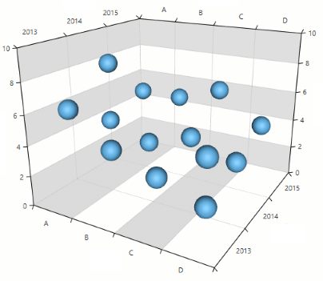

## Common Features

The linear and categorical 3D axes share some common features which you can find listed below.
* __Labels visibility__: You can control the visibility of the axis labels using the __ShowLabels__ bool property.
		
	__Example 1: Setting the labels visibility__
	<snippet id='radchartview3d-axes-example_1_setting_the_labels_visibility-xaml' />

	
	#### __Figure 2: The labels of all axes are hidden__
	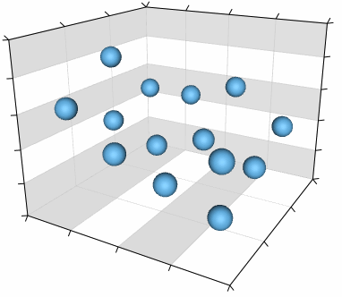

* __Label interval__: You can set the interval between the visible labels of the axis using the __LabelInterval__ property. This allows you to display labels only at a specific step. 

	__Example 2: Setting the label interval__
	<snippet id='radchartview3d-axes-example_2_setting_the_label_interval-xaml' />

	#### __Figure 3: Label interval__
	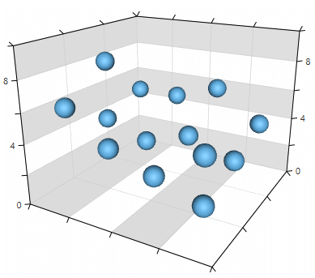
 
* __Label style__: You can define a custom style for the axis labels using the __LabelStyle__ property. The property accepts an object of type Style that targets a __TextBlock__ element.

	__Example 3: Setting the label style__
	<snippet id='radchartview3d-axes-example_3_setting_the_label_style-xaml' />

	#### __Figure 4: Label style__
	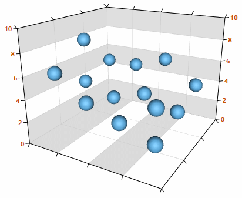	
 
* __Label template__: You can create a __DataTemplate__ that defines the appearance of the axis labels and set it to the __LabelTemplate__ property of the axis.

	__Example 4: Setting the label template__
	<snippet id='radchartview3d-axes-example_4_setting_the_label_template-xaml' />

	#### __Figure 5: Label template__
	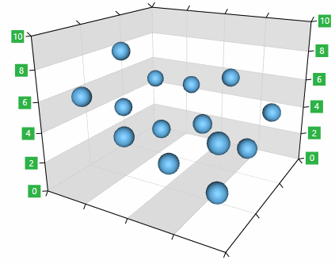
	
	> The data context passed to the LabelTemplate is an object of type `System.Double` when the axis is LinearAxis3D. In case CategoricalAxis3D is used, the data context is `System.Object` which contains the corresponding category provided by the series' items.
 
* __Ticks length__: You can define the length of the axis ticks using the __MajorTickLength__ property.

	__Example 5: Setting the label template__
	<snippet id='radchartview3d-axes-example_5_setting_the_label_template-xaml' />

	
	#### __Figure 6: Tick length__
	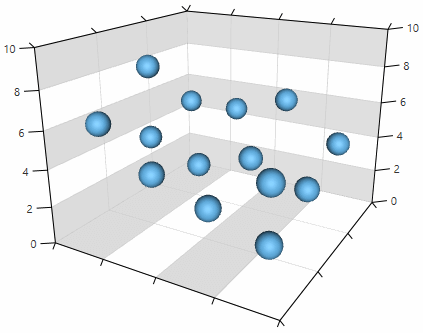
	 
* __Plot mode__: You can set the strategy for positioning the data points along the axis using the __PlotMode__ property of the axis. 
	
	__Example 6: Setting the plot mode__
	<snippet id='radchartview3d-axes-example_6_setting_the_plot_mode-xaml' />

	
	The PlotMode property can have the following values:
	
	* __BetweenTicks__: The data points are plotted between each two adjacent ticks.		
	* __OnTicks__: The data points are plotted over each tick.	
	* __OnTicksPadded__: The data points are plotted over each tick with half a step applied on both ends of the axis.
	
	#### __Figure 7: Plot modes__
	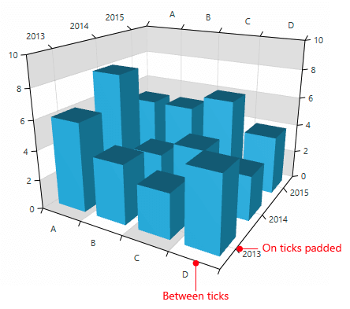

* __Title__: The __Title__ property allows you to display a heading positioned next to the axis. To customize the title appearance you can use the __TitleTemplate__ property.

	__Example 7: Setting the axis title__
	<snippet id='radchartview3d-axes-example_7_setting_the_axis_title-xaml' />

	#### __Figure 8: Axis title__
	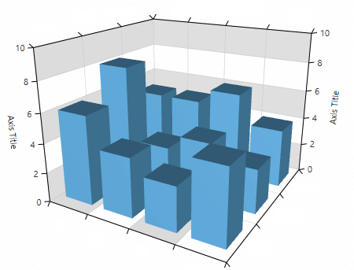	
	
	__Example 8: Setting the axis title template__
	<snippet id='radchartview3d-axes-example_8_setting_the_axis_title_template-xaml' />

	#### __Figure 9: Axis title template__
	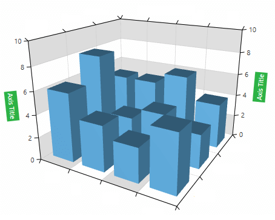	

* __Smart labels__: You can avoid labels overlapping with the smart labels strategy of the axis. To enable this feature you can use the __SmartLabelsMode__ property. 

	__Example 9: Enabling the axis smart labels__
	<snippet id='radchartview3d-axes-example_9_enabling_the_axis_smart_labels-xaml' />

	
	#### __Figure 0: Smart labels mode__
	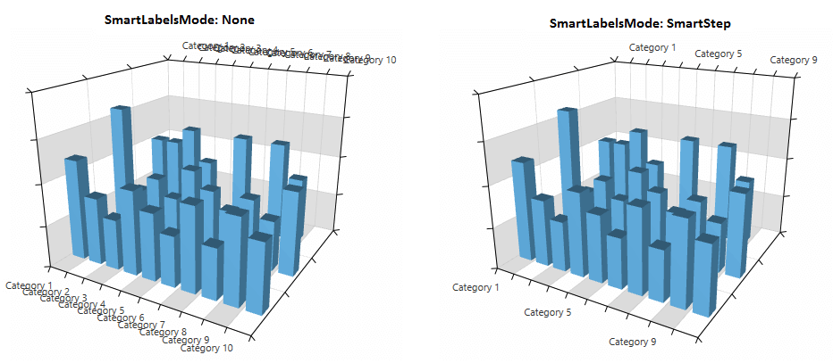

* __Line style__: You can modify the appearance of the lines drawn for the axes by creating a style which targets the **Path** type and set it as the **LineStyle** property of the axis.

	__Example 10: Enabling the axis smart labels__
	<snippet id='radchartview3d-axes-example_10_enabling_the_axis_smart_labels-xaml' />

	
	#### __Figure 11: Styled lines of the Z axis__
	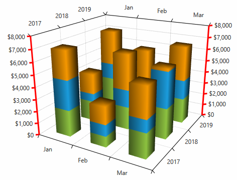
	
## LinearAxis3D

This type of axis has a notion of range which means that it has minimum, maximum and a numeric step between its values. The axis can be used to plot numeric data. You can find the axis specific features listed below.

* __Desired tick count__: You can use the __DesiredTickCount__ property of the axis to set the number of the desired ticks that will be displayed on the axis. Note that the property doesn’t set a fixed number of ticks, but it defines the preferred count and the chart tries to calculate them accordingly.

	__Example 11: Setting the desired tick count__
	<snippet id='radchartview3d-axes-example_11_setting_the_desired_tick_count-xaml' />

* __Manual range__: You can use the __Minimum__ and __Maximum__ properties of the axis to set the range manually. To control the step between the ticks you can use the __MajorStep__ property.

	__Example 12: Setting manual range__
	<snippet id='radchartview3d-axes-example_12_setting_manual_range-xaml' />

	
	#### __Figure 2: Manual range__
	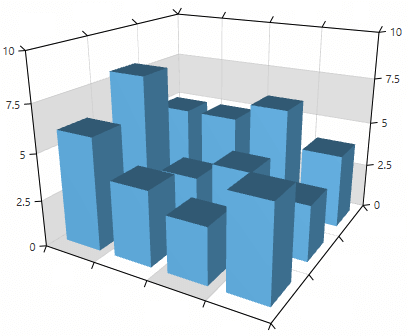

* __Tick origin__: The axis tick positions are determined by the __MajorStep__ and the __TickOrigin__ properties. The ticks will be generated such that a tick is positioned at the given TickOrigin. 

	__Example 13: Setting the axis tick origin__
	<snippet id='radchartview3d-axes-example_13_setting_the_axis_tick_origin-xaml' />

		
	#### __Figure 3: Tick origin__
	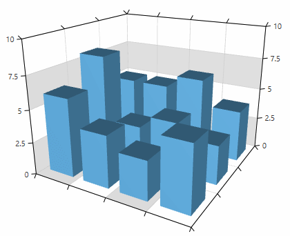	

* __Label format__: You can use the LabelFormat property to format the values of the axis labels.

	__Example 14: Setting the axis label format__
	<snippet id='radchartview3d-axes-example_14_setting_the_axis_label_format-xaml' />

	
	#### __Figure 4: Label format__
	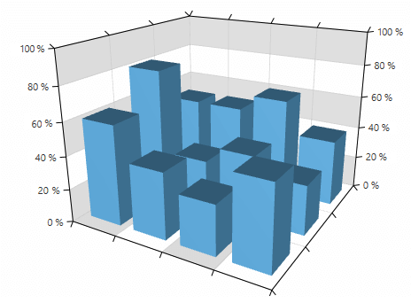	
	
* __Actual range__: Use the __ActualRange__ property of LinearAxis3D to get the actual data range of the axis (auto-generated or coming from the Minimum and Maximum properties). 

	__Example 15: Get the actual range of the axis__
	<snippet id='radchartview3d-axes-example_15_get_the_actual_range_of_the_axis-cs' />

	
	When the range changes, the __ActualRangeChanged__ event fires.
	
	__Example 16: ActualRangeChanged event handler__
	<snippet id='radchartview3d-axes-example_16_actualrangechanged_event_handler-cs' />

## See Also  
* [Getting Started]()
* [Camera Behavior]()
* [PointSeries3D]()
* [BarSeries3D]()
* [SurfaceSeries3D]()

