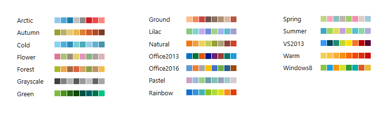
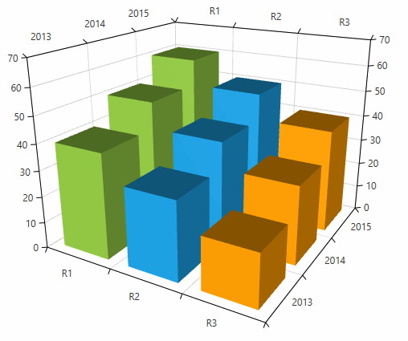
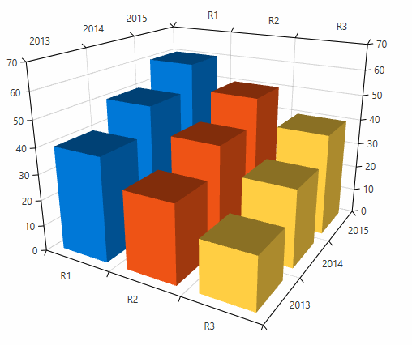

# Palettes

__RadChartView3D__ has a built-in automatic coloring mechanism. There are predefined palettes containing 3D materials used to define the textures of the chart data points.

#### __Figure 1: List with the predefined chart palettes__

A palette can be set via the __Palette__ property of the chart. The property is of type __System.Windows.Media.Media3D.MaterialCollection__ so you can easily create a [custom palette](#create-a-custom-palette).

#### __[XAML] Example 1: Setting a palette in XAML__
{{region xaml-radchartview3d-features-palettes-0}}
	<telerik:RadCartesianChart3D Palette="Windows8" />
{{endregion}}

You can access the predefined palettes in code using the __Chart3DPalettes__ static class.

#### __[C#] Example 2: Setting a palette in code__
{{region cs-radchartview3d-features-palettes-1}}
	chart.Palette = Chart3DPalettes.Windows8;
{{endregion}}

Each series added in the chart will use different entry from the MaterialCollection (the palette). If you have a single series, only the first material from the collection is used.

#### __Figure 2: Chart with 3 BarSeries3D colored using the Windows8 palette__

> The __DefaultVisualMaterial__ property of the series has a higher precedence than the palette materials. 

## Create a custom palette

The chart allows you to create a custom palette by defining a __MaterialCollection__ and populating it with __System.Windows.Media.Media3D.Material__ objects. The new collection can be assinged to the __Palette__ property of the chart.

#### __[XAML] Example 3: Defining a custom palette__
{{region xaml-radchartview3d-features-palettes-2}}
	<FrameworkElement.Resources>        
        <MaterialCollection x:Key="customPalette">            
            <DiffuseMaterial Brush="#0078D7"/>
            <DiffuseMaterial Brush="#EE5315"/>
            <DiffuseMaterial Brush="#FFCE43"/>
        </MaterialCollection>        
    </FrameworkElement.Resources>
{{endregion}}

#### __[XAML] Example 4: Applying the custom palette__
{{region xaml-radchartview3d-features-palettes-3}}
	 <telerik:RadCartesianChart3D Palette="{StaticResource customPalette}">
{{endregion}}

#### __[XAML] Example 5: Complete example of setting a custom palette__
{{region xaml-radchartview3d-features-palettes-4}}
	<Grid>
		<FrameworkElement.Resources>
			<MaterialCollection x:Key="customPalette">
				<DiffuseMaterial Brush="#0078D7"/>
				<DiffuseMaterial Brush="#EE5315"/>
				<DiffuseMaterial Brush="#FFCE43"/>
			</MaterialCollection>
		</FrameworkElement.Resources>
		<telerik:RadCartesianChart3D Palette="{StaticResource customPalette}">
			<telerik:RadCartesianChart3D.XAxis>
				<telerik:CategoricalAxis3D />
			</telerik:RadCartesianChart3D.XAxis>
			<telerik:RadCartesianChart3D.YAxis>
				<telerik:CategoricalAxis3D />
			</telerik:RadCartesianChart3D.YAxis>
			<telerik:RadCartesianChart3D.ZAxis>
				<telerik:LinearAxis3D />
			</telerik:RadCartesianChart3D.ZAxis>
			<telerik:RadCartesianChart3D.Series>
				<telerik:BarSeries3D>
					<telerik:BarSeries3D.DataPoints>
						<telerik:XyzDataPoint3D XValue="R1" YValue="2013" ZValue="40" />
						<telerik:XyzDataPoint3D XValue="R1" YValue="2014" ZValue="50" />
						<telerik:XyzDataPoint3D XValue="R1" YValue="2015" ZValue="60" />
					</telerik:BarSeries3D.DataPoints>                  
				</telerik:BarSeries3D>
				<telerik:BarSeries3D>
					<telerik:BarSeries3D.DataPoints>
						<telerik:XyzDataPoint3D XValue="R2" YValue="2013" ZValue="30" />
						<telerik:XyzDataPoint3D XValue="R2" YValue="2014" ZValue="40" />
						<telerik:XyzDataPoint3D XValue="R2" YValue="2015" ZValue="50" />
					</telerik:BarSeries3D.DataPoints>
				</telerik:BarSeries3D>
				<telerik:BarSeries3D>
					<telerik:BarSeries3D.DataPoints>
						<telerik:XyzDataPoint3D XValue="R3" YValue="2013" ZValue="20" />
						<telerik:XyzDataPoint3D XValue="R3" YValue="2014" ZValue="30" />
						<telerik:XyzDataPoint3D XValue="R3" YValue="2015" ZValue="40" />
					</telerik:BarSeries3D.DataPoints>
				</telerik:BarSeries3D>
			</telerik:RadCartesianChart3D.Series>
			<telerik:RadCartesianChart3D.Grid>
				<telerik:CartesianChart3DGrid />
			</telerik:RadCartesianChart3D.Grid>
		</telerik:RadCartesianChart3D>
	</Grid>
{{endregion}}

#### __Figure 3: Chart with custom palette__

## See Also

* [Getting Started]()
* [Customizing Cartesian Chart 3D Series]()
* [Material](https://msdn.microsoft.com/en-us/library/system.windows.media.media3d.material(v=vs.110).aspx)
* [MaterialCollection](https://msdn.microsoft.com/en-us/library/system.windows.media.media3d.materialcollection(v=vs.110).aspx) 
