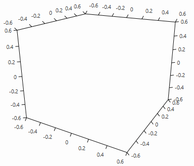
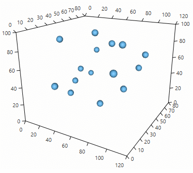
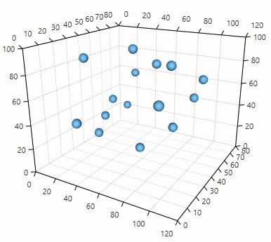

# Getting Started with WPF ChartView3D

This article will walk you through the creation of a sample application that contains a __RadCartesianChart3D__ component.

* [Adding Telerik Assemblies Using NuGet](#adding-telerik-assemblies-using-nuget)
* [Adding Assembly References Manually](#adding-assembly-references-manually)
* [Defining chart and axes](#defining-chart-and-axes)
* [Data binding](#data-binding)
* [Setting chart size](#setting-chart-size)
* [Camera behavior](#camera-behavior)

## Adding Telerik Assemblies Using NuGet

To use __RadCartesianChart3D__ when working with NuGet packages, install the `Telerik.Windows.Controls.Chart.for.Wpf.Xaml` package. The [package name may vary]() slightly based on the Telerik dlls set - [Xaml or NoXaml]()

Read more about NuGet installation in the [Installing UI for WPF from NuGet Package]() article.

>tip With the 2025 Q1 release, the Telerik UI for WPF has a new licensing mechanism. You can learn more about it [here]().

## Adding Assembly References Manually

If you are not using NuGet packages, you can add a reference to the following assemblies:

* __Telerik.Licensing.Runtime__
* __Telerik.Windows.Controls__
* __Telerik.Windows.Controls.Chart__
* __Telerik.Windows.Data__

You can find the required assemblies for each control from the UI for WPF suite in [Controls Dependencies]() help article.

## Defining chart and axes

To display the __RadCartesianChart3D__ you will need to define it along with its axes (see __Example 1__). You can find more information about the chart's axes in the [Axes]() help article.

__Example 1: Empty RadCartesianChart3D__
<snippet id='radchartview3d-getting-started-example_1_empty_radcartesianchart3d-xaml' />

	
At this point the viewport of the chart is rendered.

#### __Figure 1: Empty chart__

## Defining chart series

The data in the chart is presented with the chart series objects. You can find more information about this in the [Series]() section of the help documentation.

__Example 2: Defining series__
<snippet id='radchartview3d-getting-started-example_2_defining_series-xaml' />

#### __Figure 2: PointSeries3D__
	

For precisely reading the elements in the 3D space you can enable the chart's grid. You can read more about this in the [Chart Grid]() help article.

__Example 3: Adding chart grid__  
<snippet id='radchartview3d-getting-started-example_3_adding_chart_grid-xaml' />

#### __Figure 3: Chart grid__

## Data binding

This section demonstrates how to setup the chart from __Example 1__, but in a data binding scenario. 

__Example 4: Define the data points model__  
<snippet id='radchartview3d-getting-started-example_4_define_the_data_points_model-cs' />

__Example 5: Set up the DataContext of the view__
<snippet id='radchartview3d-getting-started-example_5_set_up_the_datacontext_of_the_view-cs' />

__Example 6: Set up the view__  
<snippet id='radchartview3d-getting-started-example_6_set_up_the_view-xaml' />

## Setting chart size

The size of the chart's plot area can be changed via the __PlotAreaSize__ property of the chart. The property is of type System.Windows.Media.Media3D.__Size3D__, thus allowing you to set all 3 dimensions of the area. 

__Example 7: Setting PlotAreaSize__  
<snippet id='radchartview3d-getting-started-example_7_setting_plotareasize-xaml' />

The default size is X=1000, Y=1000, Z=800

> The plot area is the space locked between the axes, where the series are drawn.

## Camera behavior

In order to interact with the chart's scene you can use the __Chart3DCameraBehavior__. You can find more information about this in the [Camera Behavior]() article.

__Example 8: Defining camera behavior__  
<snippet id='radchartview3d-getting-started-example_8_defining_camera_behavior-xaml' />


## Telerik UI for WPF Learning Resources

* [Telerik UI for WPF 3DChart Component](https://www.telerik.com/products/wpf/3d-chart.aspx)
* [Getting Started with Telerik UI for WPF Components]()
* [Telerik UI for WPF Installation]()
* [Telerik UI for WPF and WinForms Integration]()
* [Telerik UI for WPF Visual Studio Templates]()
* [Setting a Theme with Telerik UI for WPF]()
* [Telerik UI for WPF Virtual Classroom (Training Courses for Registered Users)](https://learn.telerik.com/learn/course/external/view/elearning/16/telerik-ui-for-wpf) 
* [Telerik UI for WPF License Agreement](https://www.telerik.com/purchase/license-agreement/wpf-dlw-s)


## See Also

* [Camera Behavior]()
* [Axes]()
* [3D Chart Grid]()
* [PointSeries3D]()
* [BarSeries3D]()
* [SurfaceSeries3D]()

