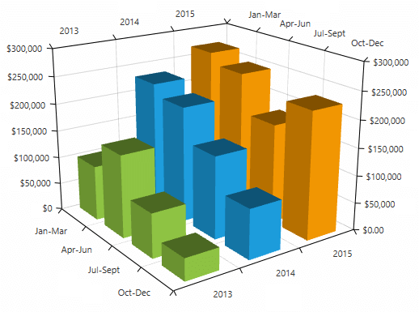

# Overview

__RadChartView3D__ provides you with a charting component that enables three-dimensional data visualization in the 3D space. Thus allowing the end user to analyze complex data. RadChartView3D is presented by the __RadCartesianChart3D__ control.

## Key Features

* __Visualizing 3D data__: You can get started with __RadCartesianChart3D__ in the [Getting Started]() article.

* __Camera behavior__: The chart allows you to control the camera position from where the scene is observed. You can rotate the camera around the chart and change its distance. For more information, see the [Camera Behavior]() article.

* __Series__: There are several different visualiztions available via the chart series - bar, surface, etc. For more information, see the [Series]() section in the help documentation.

* __Axes__: __RadChartView3D__ have few axis types which you can use to display different type of data - numeric and categorical. For more information, see the [Axes]() help article.

>You can find examples that demonstrate RadChartView3D in our [demo application](https://demos.telerik.com/wpf/).

## See Also  

* [Getting Started]()
* [Camera Behavior]()
* [Tooltip Behavior]()