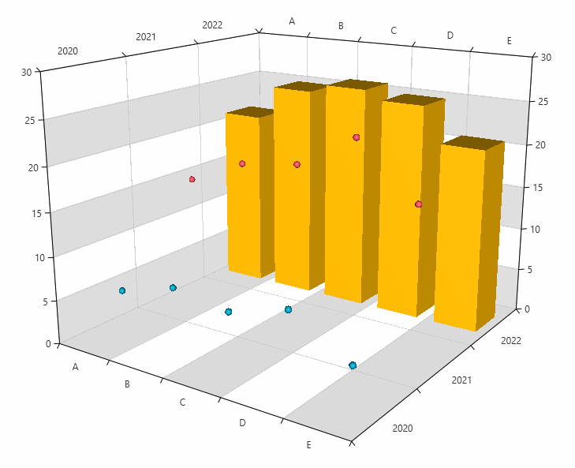

# Dynamic Number of Series (ChartSeriesProvider)

In this help topic, we describe the mechanism for an automatic series generation that ChartView3D provides.

RadCartesianChart3D can create a dynamic number of series that depend on the data (collection of collections). To take advantage of this feature, you can create a `ChartSeriesProvider3D` object. This object receives the data and holds the `ChartSeriesDescriptor3D` objects that define the specific properties of the dynamically generated series.        

The series provider expects a collection of models that describe each chart series. The series models should expose a collection of models describing each data point. The `XyzSeries3DDescriptor` implementation allows you to easily define the path to the items source and X, Y, Z properties of the models.

To provide the data collection to the `ChartSeriesProvider3D`, set its `Source` property.

The `XyzSeries3DDescriptor` exposes the following properties that are used to link the series with the models:

* `ItemsSourcePath`: `string` property that sets the name of the collection property defined in the series business model.

* `XValuePath`: `string` property that sets the name of the data point's X property defined in the data point business model.

* `YValuePath`: `string` property that sets the name of the data point's Y property defined in the data point business model.

* `ZValuePath`: `string` property that sets the name of the data point's Z property defined in the data point business model.

>tip Setting those properties is enough to adjust the provider. This will auto-generate [PointSeries3D]() instance for each item in the `Source` of the series provider.

<snippet id='radchartview3d-populating-data-seriesprovider-block_1-xaml' />

## Determine the Series Type

The default created series is a `PointSeries3D`. To change this, you can use one of the following approaches.

### Using the Style property of the descriptor

The easiest way to determine the type of the series is to assign the `Style` property of the descriptor and set its `TargetType`.

<snippet id='radchartview3d-populating-data-seriesprovider-block_2-xaml' />

	
>important If you use [NoXaml]() dlls and the [implicit styles theming mechanism](), you must base the Style of the descriptor on the default style of the series. The setting should like something like this: `<Style TargetType="telerik:BarSeries3D" BasedOn="{StaticResource BarSeries3DStyle}">` . The same naming convention is us applicable for all other chart series - __SurfaceSeries3DStyle__, __PointSeries3DStyle__ and __LineSeries3DStyle__. If you don't set the BasedOn attribute when using NoXaml dlls, the series won't display any data points.

The `Style` property can be used also to customize the appearance of the series by setting its properties.

### Using the TypePath property of the descriptor

The `TypePath` allows you to define a chart series type that will be used when creating a chart series instance for each item in the `Source` collection. In this case, you can have multiple series with different types. The property accepts a value of type `string` that points to the name of a property in the series business model. The property can be of any data type, but the most common scenarios are - `Type` and `string`. 

If you provide a `Type` value to the `TypePath`, the `ChartSeriesDescriptor3D` will be able to automatically determine the type of the series that should be created.

<snippet id='radchartview3d-populating-data-seriesprovider-block_3-cs' />

<snippet id='radchartview3d-populating-data-seriesprovider-block_4-xaml' />

If you provide a `string` or any other object to the `TypePath`, you will need to set also the `TypeConverter` property. It allows you to implement an `IValueConverter` that gets the value from the `TypePath` property and converts it to a Type, which is later used to create the chart series.

<snippet id='radchartview3d-populating-data-seriesprovider-block_5-cs' />

<snippet id='radchartview3d-populating-data-seriesprovider-block_6-xaml' />

<snippet id='radchartview3d-populating-data-seriesprovider-block_7-cs' />

The `TypeConverter` will be invoked even if you don't set the `TypePath` property. In this case, the value in the `Convert` method of the converter will be the view model of the series.

## Sampling Support

To use the [sampling support]() with the series provider feature, you can set the `ChartDataSourceStyle` property of the `ChartSeriesDescriptor3D`.

<snippet id='radchartview3d-populating-data-seriesprovider-block_8-xaml' />

## Assigning Descriptor to Item from the Source

By default all descriptors in the series provider will use all the items in the data source. However, you can assign a descriptor to be applied only to a specific item from the data source (the `Source` property). To do so, set the `CollectionIndex` property of the `XyzSeries3DDescriptor`. For example, setting the property to `1` will use the descriptor only for the second item in the `Source` collection. This property is useful when, lets say, a BarSeries3D needs to be generated for the first data entry and PointSeries3D for the rest of the entries.

<snippet id='radchartview3d-populating-data-seriesprovider-block_9-xaml' />

## Events

`ChartSeriesProvider3D` expose a single event - `SeriesCreated`. The event occurs when a series is created. It allows for the series to be additionally set up or completely replaced.  

The event arguments are of type `ChartSeries3DCreatedEventArgs` and expose the following properties:
* `Series`: A property of type `CartesianSeries3D` that holds the created series.
* `Context`: A property of type `object` that holds the model of the series.

> This event may be raised with the series being null (for example, in cases when a suitable descriptor was not found). In such a case, this event can still be used to create and set up a new series.
	

<snippet id='radchartview3d-populating-data-seriesprovider-block_10-xaml' />

<snippet id='radchartview3d-populating-data-seriesprovider-block_11-cs' />

	
## Code Example

In the following example, the chart is populated by a collection of 3 items, thus creating 3 series. There is a `XyzSeries3DDescriptor` with `CollectionIndex` set to `2` and a style with `TargetType` set to `PointSeries3D`. This means that there will be a BarSeries3D, created for the third item in the `Source` collection. There is another `XyzSeries3DDescriptor`, which is responsible for creating `PointSeries3D` for the rest of the items in the source collection.        

<snippet id='radchartview3d-populating-data-seriesprovider-block_12-xaml' />

<snippet id='radchartview3d-populating-data-seriesprovider-block_13-cs' />

__Dynamic number of series generated using SeriesProvider3D__  

## See Also  
* [Getting Started]()
* [Create Data-Bound Chart]()
