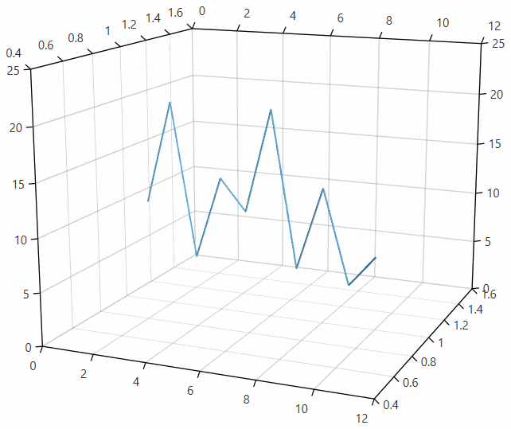
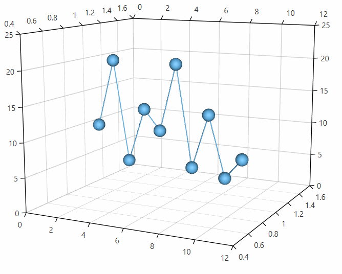
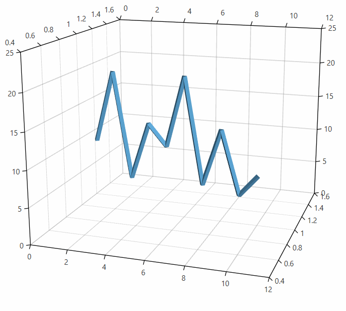
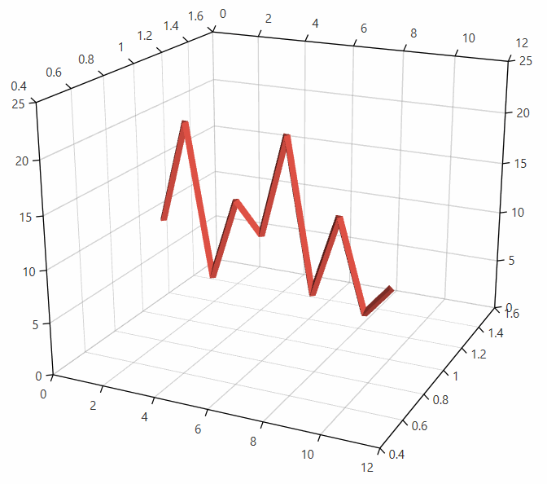
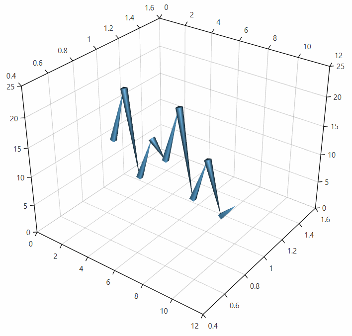
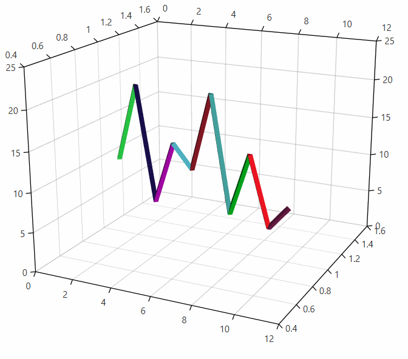
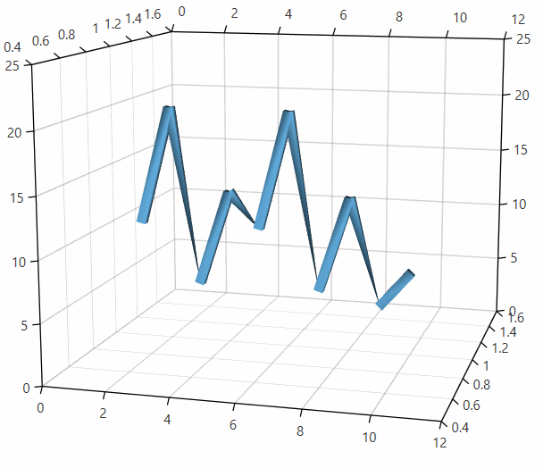

# LineSeries3D

The line series visualizes three dimensional data represented by a line shape. Each data point is defined by X, Z and Y values which determines its position in the plot area. 

## Declaratively defined series

You can use the code from __Example 1__ to create a __LineSeries3D__. 

__Example 1: Defining series in XAML__	
```XAML
	<telerik:RadCartesianChart3D>
		<telerik:RadCartesianChart3D.XAxis>
			<telerik:LinearAxis3D/>
		</telerik:RadCartesianChart3D.XAxis>
		<telerik:RadCartesianChart3D.ZAxis>
			<telerik:LinearAxis3D/>
		</telerik:RadCartesianChart3D.ZAxis>
		<telerik:RadCartesianChart3D.YAxis>
			<telerik:LinearAxis3D/>
		</telerik:RadCartesianChart3D.YAxis>
		<telerik:RadCartesianChart3D.Series>
			<telerik:LineSeries3D>
				<telerik:LineSeries3D.DataPoints>
					<telerik:XyzDataPoint3D XValue="1" YValue="1" ZValue="10" />
					<telerik:XyzDataPoint3D XValue="2" YValue="1" ZValue="20" />
					<telerik:XyzDataPoint3D XValue="3" YValue="1" ZValue="5" />
					<telerik:XyzDataPoint3D XValue="4" YValue="1" ZValue="13" />
					<telerik:XyzDataPoint3D XValue="5" YValue="1" ZValue="10" />
					<telerik:XyzDataPoint3D XValue="6" YValue="1" ZValue="20" />
					<telerik:XyzDataPoint3D XValue="7" YValue="1" ZValue="5" />
					<telerik:XyzDataPoint3D XValue="8" YValue="1" ZValue="13" />
					<telerik:XyzDataPoint3D XValue="9" YValue="1" ZValue="4" />
					<telerik:XyzDataPoint3D XValue="10" YValue="1" ZValue="7" />
				</telerik:LineSeries3D.DataPoints>
			</telerik:LineSeries3D>
		</telerik:RadCartesianChart3D.Series>
		<telerik:RadCartesianChart3D.Grid>
			<telerik:CartesianChart3DGrid />
		</telerik:RadCartesianChart3D.Grid>
		<telerik:RadCartesianChart3D.Behaviors>
			<telerik:Chart3DCameraBehavior />
		</telerik:RadCartesianChart3D.Behaviors>
	</telerik:RadCartesianChart3D>
```
	
#### __Figure 1: LineSeries3D__


## Data bound series

__Example 2: Defining a model for the data points and setting up the data context__
```C#
	public class PlotInfo
	{
		public double XValue { get; set; }
		public double YValue { get; set; }
		public double ZValue { get; set; }
	}

	//.......
	this.DataContext = new ObservableCollection<PlotInfo>
	{
		new PlotInfo { XValue = 10, YValue = 20, ZValue = 150, },
		//....
	};
```

__Example 3: Setting up the series__
```XAML
	<telerik:LineSeries3D XValueBinding="XValue"  YValueBinding="YValue" ZValueBinding=”ZValue” ItemsSource="{Binding}"/>
```

## Showing point visuals

The line series supports visual elements for its data points. They are disabled by default. 

To show the data point visual, set the __PointSize__ property of the series.

__Example 4: Setting point size in XAML__  
```XAML
	<telerik:LineSeries3D PointSize="60 60 60">
```

__Example 5: Setting point size in code__  
```C#
	lineSeries.PointSize = new Size3D(60, 60, 60);
```

#### __Figure 2: Point visuals shown__


## Setting the line size

You can change the line size by setting the __DefaultLineVisualDiameter__ property of the series.

__Example 6: Setting the line diameter__  
```C#
	 <telerik:LineSeries3D DefaultLineVisualDiameter="25">
```

#### __Figure 3: Line diameter set to 25__


## Customizing the data point visuals

The visual elements that represent the __LineSeries3D__ data points can be customized through the __DefaultVisualMaterial__ and __DefaultVisualGeometry__ properties of the series. Additionally, you can use the __DefaultVisualMaterialSelector__ and __DefaultVisualGeometrySelector__ to choose different materials and geometries based on a specific condition.
 
>For more information, see the [Customizing Cartesian Chart 3D Series]() help article.

## Customizing the line visuals

The visual elements that represent the __LineSeries3D__'s line can be customized through the __DefaultLineVisualMaterial__ and __DefaultLineVisualGeometry__ properties of the series. Additionally, you can use the __DefaultLineVisualMaterialSelector__ and __DefaultLineVisualGeometrySelector__ to choose different materials and geometries based on a specific condition.

> By default the series will be drawn with a single 3D polyline element. If the plotted data contains *null* values, the corresponding data point won't be drawn - a gap will appear. In this case a new polyline visual will be rendered for each *null* value that cuts the line. Setting the DefaulLineVisualGeometry or the DefaulLineVisualGeometry will trigger an alternative rendering approach where a visual element for each line segment between two data points will be created.

* __Setting the line's color__
	
	To change the color of the line you can use the __DefaultLineVisualMaterial__ property of the series.
	
	__Example 7: Setting default line visual material__
	```XAML
		<telerik:RadCartesianChart3D>          
			<telerik:RadCartesianChart3D.Series>
				<telerik:LineSeries3D>
				  <telerik:LineSeries3D.DefaultLineVisualMaterial>
                        <MaterialGroup>
                            <DiffuseMaterial Brush="#DD5044"/>
                            <SpecularMaterial Brush="#BF444444" SpecularPower="30" />
                        </MaterialGroup>
                    </telerik:LineSeries3D.DefaultLineVisualMaterial>
				</telerik:LineSeries3D>
		</telerik:RadCartesianChart3D>
	```
	
	#### __Figure 4: Custom line visual material__
	
	
* __Setting the geometry of the line segments__

	To change the geometry of the line segments you can use the __DefaultLineVisualGeometry__ property of the series.

	__Example 8: Setting default line visual geometry__
	```XAML
		<telerik:RadCartesianChart3D>          
			<telerik:RadCartesianChart3D.Series>
				<telerik:LineSeries3D>
					<telerik:LineSeries3D.DefaultLineVisualGeometry>
                        <MeshGeometry3D Positions="-0.5 -0.5 0  -0.5 0.5 0 
                                                    0.5 0.5 0  0.5 -0.5 0  
                                                    0 0 1"
                                        TriangleIndices="2 0 1  0 2 3
                                                         2 1 4  0 4 1  
                                                         0 3 4  2 4 3"/>
                    </telerik:LineSeries3D.DefaultLineVisualGeometry>
				</telerik:LineSeries3D>
		</telerik:RadCartesianChart3D>
	```
	
	#### __Figure 5: Custom line visual geometry__
		
	
* __Select a color using the material selector__

	To change the material of the different line segments you can use the __DefaultLineVisualMaterialSelector__ property of the series.
	
	__Example 9: Implementing a material selector__
	```C#
		public class LineMaterialSelector : MaterialSelector
		{
			private static Random randomNumberGenerator = new Random();
			public override Material SelectMaterial(object context)
			{
				Brush brush = GetRandomBrush();
				return new DiffuseMaterial(brush);
			}

			private static Brush GetRandomBrush()
			{
				byte red = (byte)randomNumberGenerator.Next(1, 255);
				byte green = (byte)randomNumberGenerator.Next(1, 255);
				byte blue = (byte)randomNumberGenerator.Next(1, 255);
				return new SolidColorBrush(Color.FromRgb(red, green, blue));
			}
		}
	```
	
	__Example 10: Setting default line visual material selector__
	```XAML
		<telerik:RadCartesianChart3D>          
			<telerik:RadCartesianChart3D.Series>
				<telerik:LineSeries3D>
					<telerik:LineSeries3D.DefaultLineVisualMaterialSelector>
                        <local:LineMaterialSelector />
                    </telerik:LineSeries3D.DefaultLineVisualMaterialSelector>
				</telerik:LineSeries3D>
		</telerik:RadCartesianChart3D>
	```
	
	#### __Figure 6: Line with random colors__
	

* __Select a geometry using the geometry selector__

	To change the geometry of the different line segments you can use the __DefaultLineVisualGeometrySelector__ property of the series.
	
	__Example 11: Implementing a geometry selector__
	```C#
		public class LineGeometrySelector : Geometry3DSelector
		{
			public Geometry3D Geometry1 { get; set; }
			public Geometry3D Geometry2 { get; set; }

			int count = 0;
			public override Geometry3D SelectGeometry(object context)
			{
				count++;
				if (count % 2 == 0)
				{
					return this.Geometry1;
				}
				return this.Geometry2;
			}
		}
	```
	
	__Example 12: Setting default line visual geometry selector__
	```XAML
		<telerik:RadCartesianChart3D>          
			<telerik:RadCartesianChart3D.Series>
				<telerik:LineSeries3D>
				 <telerik:LineSeries3D.DefaultLineVisualGeometrySelector>
                        <local:LineGeometrySelector>
                            <local:LineGeometrySelector.Geometry1>
                                <MeshGeometry3D Positions="-0.5 -0.5 0  -0.5 0.5 0 
                                                            0.5 0.5 0  0.5 -0.5 0  
                                                            0 0 1"
                                                TriangleIndices="2 0 1  0 2 3
                                                                 2 1 4  0 4 1  
                                                                 0 3 4  2 4 3"/>
                            </local:LineGeometrySelector.Geometry1>
                            <local:LineGeometrySelector.Geometry2>
                                <MeshGeometry3D Positions="-0.5 -0.5 0  -0.5 -0.5 1  -0.5 0.5 1  -0.5 0.5 0 
                                                           0.5 0.5 0  0.5 0.5 1  0.5 -0.5 1  0.5 -0.5 0"                      
                                                TriangleIndices="0 1 2  0 2 3  
                                                                2 5 3  3 5 4  
                                                                4 5 7  7 5 6  
                                                                0 7 6  0 6 1  
                                                                0 3 7  3 4 7
                                                                2 1 6  5 2 6"/>
                            </local:LineGeometrySelector.Geometry2>
                        </local:LineGeometrySelector>
                    </telerik:LineSeries3D.DefaultLineVisualGeometrySelector>
				</telerik:LineSeries3D>
		</telerik:RadCartesianChart3D>
	```
	
	#### __Figure 7: Line with random colors__
	

## See Also

* [Getting Started]()
* [Camera Behavior]()
* [Axes]()
* [SurfaceSeries3D]()
* [BarSeries3D]()