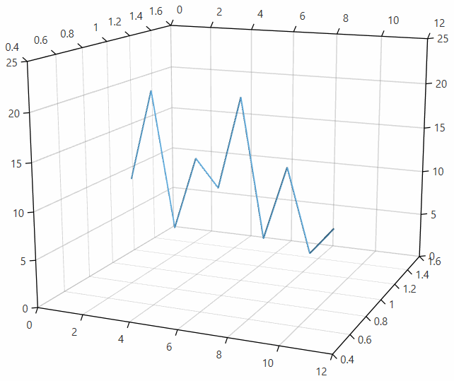
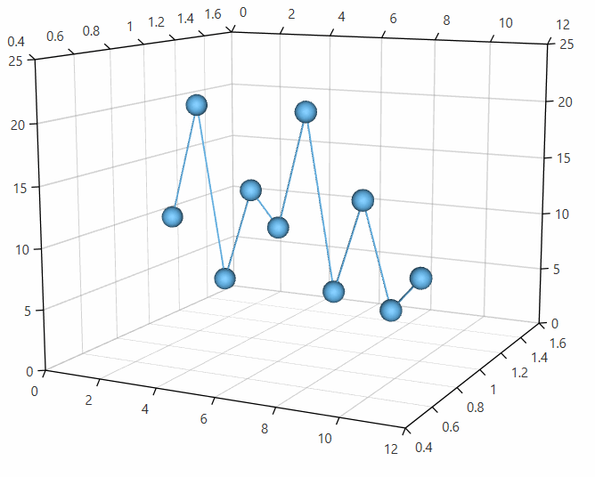
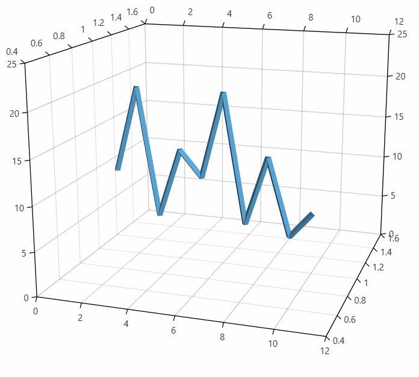
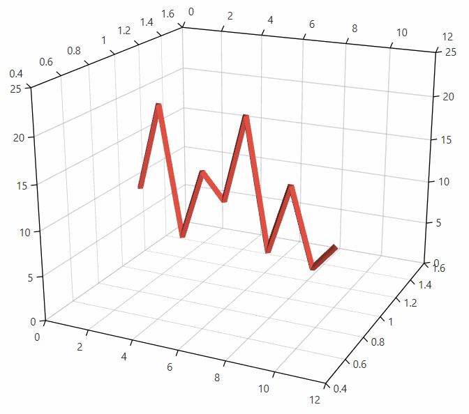
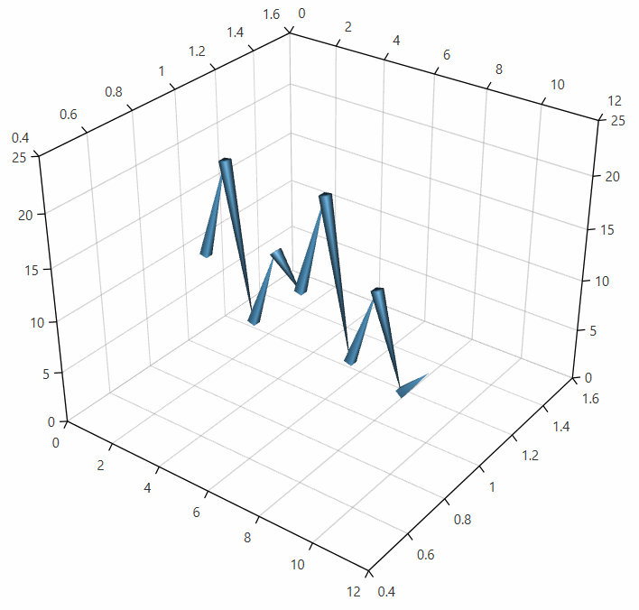
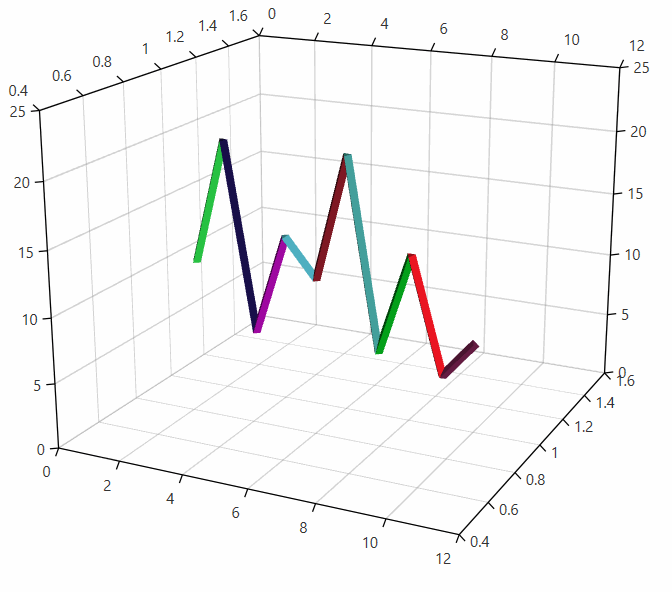
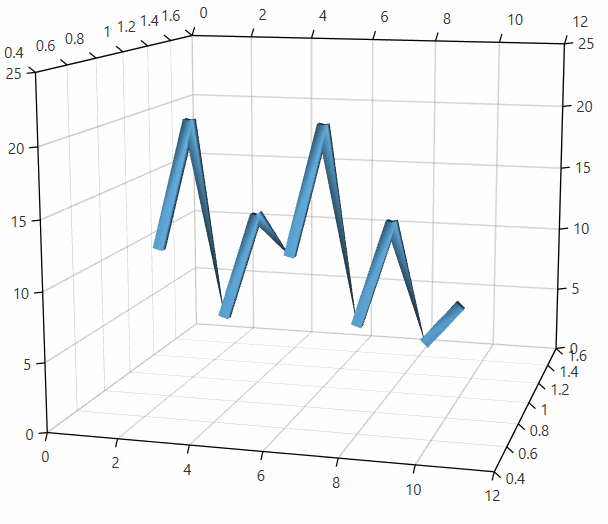

# LineSeries3D

The line series visualizes three dimensional data represented by a line shape. Each data point is defined by X, Z and Y values which determines its position in the plot area. 

## Declaratively defined series

You can use the code from __Example 1__ to create a __LineSeries3D__. 

__Example 1: Defining series in XAML__	
<snippet id='radchartview3d-series-lineseries3d-example_1_defining_series_in_xaml-xaml' />

	
#### __Figure 1: LineSeries3D__

## Data bound series

__Example 2: Defining a model for the data points and setting up the data context__
<snippet id='radchartview3d-series-lineseries3d-example_2_defining_a_model_for_the_data_points_and_setting_up_the_data_context-cs' />

__Example 3: Setting up the series__
<snippet id='radchartview3d-series-lineseries3d-example_3_setting_up_the_series-xaml' />

## Showing point visuals

The line series supports visual elements for its data points. They are disabled by default. 

To show the data point visual, set the __PointSize__ property of the series.

__Example 4: Setting point size in XAML__  
<snippet id='radchartview3d-series-lineseries3d-example_4_setting_point_size_in_xaml-xaml' />

__Example 5: Setting point size in code__  
<snippet id='radchartview3d-series-lineseries3d-example_5_setting_point_size_in_code-cs' />

#### __Figure 2: Point visuals shown__

## Setting the line size

You can change the line size by setting the __DefaultLineVisualDiameter__ property of the series.

__Example 6: Setting the line diameter__  
<snippet id='radchartview3d-series-lineseries3d-example_6_setting_the_line_diameter-cs' />

#### __Figure 3: Line diameter set to 25__

## Customizing the data point visuals

The visual elements that represent the __LineSeries3D__ data points can be customized through the __DefaultVisualMaterial__ and __DefaultVisualGeometry__ properties of the series. Additionally, you can use the __DefaultVisualMaterialSelector__ and __DefaultVisualGeometrySelector__ to choose different materials and geometries based on a specific condition.
 
>For more information, see the [Customizing Cartesian Chart 3D Series]() help article.

## Customizing the line visuals

The visual elements that represent the __LineSeries3D__'s line can be customized through the __DefaultLineVisualMaterial__ and __DefaultLineVisualGeometry__ properties of the series. Additionally, you can use the __DefaultLineVisualMaterialSelector__ and __DefaultLineVisualGeometrySelector__ to choose different materials and geometries based on a specific condition.

> By default the series will be drawn with a single 3D polyline element. If the plotted data contains *null* values, the corresponding data point won't be drawn - a gap will appear. In this case a new polyline visual will be rendered for each *null* value that cuts the line. Setting the DefaulLineVisualGeometry or the DefaulLineVisualGeometry will trigger an alternative rendering approach where a visual element for each line segment between two data points will be created.

* __Setting the line's color__
	
	To change the color of the line you can use the __DefaultLineVisualMaterial__ property of the series.
	
	__Example 7: Setting default line visual material__
	<snippet id='radchartview3d-series-lineseries3d-example_7_setting_default_line_visual_material-xaml' />

	
	#### __Figure 4: Custom line visual material__
	
	
* __Setting the geometry of the line segments__

	To change the geometry of the line segments you can use the __DefaultLineVisualGeometry__ property of the series.

	__Example 8: Setting default line visual geometry__
	<snippet id='radchartview3d-series-lineseries3d-example_8_setting_default_line_visual_geometry-xaml' />

	
	#### __Figure 5: Custom line visual geometry__
		
	
* __Select a color using the material selector__

	To change the material of the different line segments you can use the __DefaultLineVisualMaterialSelector__ property of the series.
	
	__Example 9: Implementing a material selector__
	<snippet id='radchartview3d-series-lineseries3d-example_9_implementing_a_material_selector-cs' />

	
	__Example 10: Setting default line visual material selector__
	<snippet id='radchartview3d-series-lineseries3d-example_10_setting_default_line_visual_material_selector-xaml' />

	
	#### __Figure 6: Line with random colors__
	

* __Select a geometry using the geometry selector__

	To change the geometry of the different line segments you can use the __DefaultLineVisualGeometrySelector__ property of the series.
	
	__Example 11: Implementing a geometry selector__
	<snippet id='radchartview3d-series-lineseries3d-example_11_implementing_a_geometry_selector-cs' />

	
	__Example 12: Setting default line visual geometry selector__
	<snippet id='radchartview3d-series-lineseries3d-example_12_setting_default_line_visual_geometry_selector-xaml' />

	
	#### __Figure 7: Line with random colors__
	

## See Also

* [Getting Started]()
* [Camera Behavior]()
* [Axes]()
* [SurfaceSeries3D]()
* [BarSeries3D]()