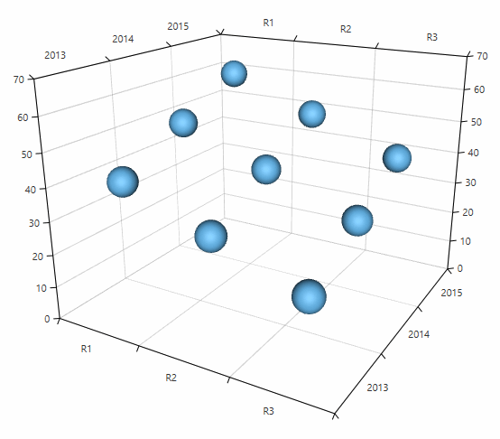

# PointSeries3D

The point series visualizes three dimensional data represented by ellipsoid shapes (spheres by default). Each data point is defined by X, Z and Y values which determines its position in the plot area. The size of the shapes is defined via the __PointSize__ property of the series.

## Declaratively defined series

You can use the code from __Example 1__ to create a __PointSeries3D__. 

__Example 1: Defining series in XAML__	
<snippet id='radchartview3d-series-pointseries3d-example_1_defining_series_in_xaml-xaml' />

	
#### __Figure 1: PointSeries3D__

## Data bound series

You can use the __XValueBinding__, __YValueBinding__ and __ZValueBinding__ properties of __PointSeries3D__ to bind the __XyzDataPoints__’ properties to the properties of the view models. The __ItemsSource__ property is used to pass the data collection to the series.

__Example 2: Defining a model for the data points and setting up the data context__
<snippet id='radchartview3d-series-pointseries3d-example_2_defining_a_model_for_the_data_points_and_setting_up_the_data_context-cs' />

__Example 3: Setting up the series__
<snippet id='radchartview3d-series-pointseries3d-example_3_setting_up_the_series-xaml' />

## Customizing the data point visuals

You can change the size of the data points using the __PointSize__ property.

__Example 4: Setting point size in XAML__  
<snippet id='radchartview3d-series-pointseries3d-example_4_setting_point_size_in_xaml-xaml' />

__Example 5: Setting point size in code__  
<snippet id='radchartview3d-series-pointseries3d-example_5_setting_point_size_in_code-cs' />

The visual elements that represent the __PointSeries3D__ data points can be customized through the __DefaultVisualMaterial__ and __DefaultVisualGeometry__ properties of the series. Additionally, you can use the __DefaultVisualMaterialSelector__ and __DefaultVisualGeometrySelector__ to choose different materials and geometries based on a specific condition.
 
>For more information, see the [Customizing Cartesian Chart 3D Series]() help article.

## See Also

* [Getting Started]()
* [Camera Behavior]()
* [Axes]()
* [SurfaceSeries3D]()
* [BarSeries3D]()
* [Customizing 3D Series]()