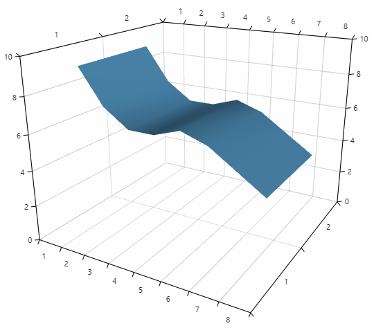
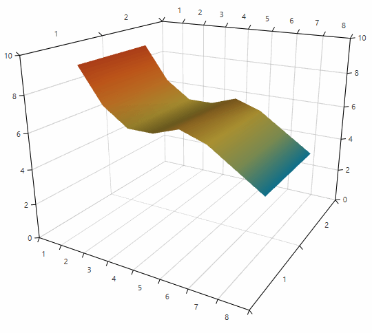
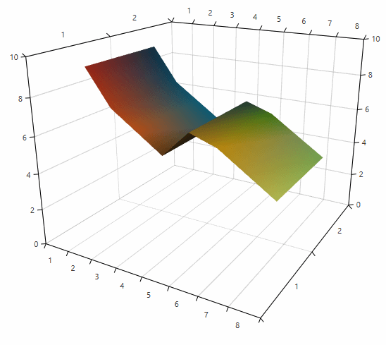
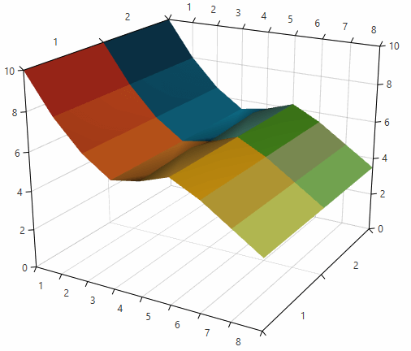
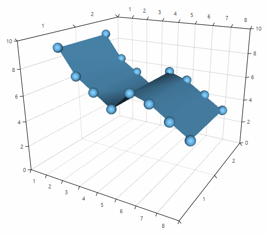

# SurfaceSeries3D

__SurfaceSeries3D__ visualizes three-dimensional data represented by a surface. Each data point is defined by X, Z and Y values which determines its position in the plot area.

>tip The algorithm that connects the SurfaceSeries3D points into a surface expects that the X and Y values of the plotted data will form a grid-like layout. Otherwise, there may be points that are not connected. If your data requires a different setup you can implement custom logic that connects the points and creates triangles as shown in the [Customizing surface triangulation](#customizing-surface-triangulation) section of this article.

## Declaratively defined series

You can use the code from __Example 1__ to create a __SurfaceSeries3D__. 

__Example 1: Defining series in XAML__	
```XAML
	<telerik:RadCartesianChart3D>
		<telerik:RadCartesianChart3D.XAxis>
			<telerik:CategoricalAxis3D/>
		</telerik:RadCartesianChart3D.XAxis>             
		<telerik:RadCartesianChart3D.YAxis>
			<telerik:CategoricalAxis3D />
		</telerik:RadCartesianChart3D.YAxis>             
		<telerik:RadCartesianChart3D.ZAxis>              
			<telerik:LinearAxis3D />
		</telerik:RadCartesianChart3D.ZAxis>
		<telerik:RadCartesianChart3D.Series>
			<telerik:SurfaceSeries3D>
				<telerik:SurfaceSeries3D.DataPoints>
					<telerik:SurfaceDataPoint3D XValue="1" YValue="1" ZValue="9" />
					<telerik:SurfaceDataPoint3D XValue="2" YValue="1" ZValue="7" />
					<telerik:SurfaceDataPoint3D XValue="3" YValue="1" ZValue="6" />
					<telerik:SurfaceDataPoint3D XValue="4" YValue="1" ZValue="6" />
					<telerik:SurfaceDataPoint3D XValue="5" YValue="1" ZValue="6.5" />
					<telerik:SurfaceDataPoint3D XValue="6" YValue="1" ZValue="6" />
					<telerik:SurfaceDataPoint3D XValue="7" YValue="1" ZValue="5" />
					<telerik:SurfaceDataPoint3D XValue="8" YValue="1" ZValue="4" />			
					<telerik:SurfaceDataPoint3D XValue="1" YValue="2" ZValue="9" />
                    <telerik:SurfaceDataPoint3D XValue="2" YValue="2" ZValue="7" />
                    <telerik:SurfaceDataPoint3D XValue="3" YValue="2" ZValue="6" />
                    <telerik:SurfaceDataPoint3D XValue="4" YValue="2" ZValue="6" />
                    <telerik:SurfaceDataPoint3D XValue="5" YValue="2" ZValue="6.5" />
					<telerik:SurfaceDataPoint3D XValue="6" YValue="2" ZValue="6" />
					<telerik:SurfaceDataPoint3D XValue="7" YValue="2" ZValue="5" />
					<telerik:SurfaceDataPoint3D XValue="8" YValue="2" ZValue="4" />
				</telerik:SurfaceSeries3D.DataPoints>
			</telerik:SurfaceSeries3D>
		</telerik:RadCartesianChart3D.Series>
		<telerik:RadCartesianChart3D.Grid>
			<telerik:CartesianChart3DGrid />
		</telerik:RadCartesianChart3D.Grid>
	</telerik:RadCartesianChart3D>
```
	
#### __Figure 1: SurfaceSeries3D__


## Data bound series

You can use the __XValueBinding__, __YValueBinding__ and __ZValueBinding__ properties of __SurfaceSeries3D__ to bind the __SurfaceDataPoint3D__ properties to the properties of the view models. The __ItemsSource__ property is used to pass the data collection to the series.

__Example 2: Defining a model for the data points and setting up the data context__
```C#
	public class PlotInfo
	{
		public double XValue { get; set; }
		public double YValue { get; set; }
		public double ZValue { get; set; }
	}

	//.......
	this.DataContext = new ObservableCollection<PlotInfo>
	{
		new PlotInfo { XValue = 10, YValue = 20, ZValue = 150, },
		//....
	};
```

__Example 3: Setting up the series__
```XAML
	<telerik:SurfaceSeries3D XValueBinding="XValue"  YValueBinding="YValue" ZValueBinding=”ZValue” ItemsSource="{Binding}"/>
```

## Colorizers
	
The __SurfaceSeries3D__ colorizer determines the color appearance of the surface. The series supports two colorizers - __SurfaceSeries3DValueGradientColorizer__ and __SurfaceSeries3DValueGradientColorizer__.

* __SurfaceSeries3DValueGradientColorizer__

	This colorizer uses a collection of __GradientStop__ objects and creates a gradient texture based on the gradient stops colors and offsets. The texture is applied on the surface.

	The colorizer works with relative offsets (between 0 and 1) by default. You can change this and work with absolute offsets by setting the __IsAbsolute__ property to __True__. 

	__Example 4: Setting the IsAbsolute property__  
	```XAML
		<telerik:SurfaceSeries3DValueGradientColorizer IsAbsolute="True">
	```
	
	The gradient stops are stored in the __GradientStops__ collection.

	__Example 5: Setting the gradient stops__  
	```XAML
		<telerik:SurfaceSeries3D>
			<telerik:SurfaceSeries3D.Colorizer>
				<telerik:SurfaceSeries3DValueGradientColorizer IsAbsolute="True">
				  <telerik:SurfaceSeries3DValueGradientColorizer.GradientStops>
						<GradientStopCollection>
							<GradientStop Color="#0D3C55" Offset="3" />
							<GradientStop Color="#1395BA" Offset="4" />
							<GradientStop Color="#A2B86C" Offset="5" />
							<GradientStop Color="#EBC844" Offset="6" />
							<GradientStop Color="#EF8B2C" Offset="7" />
							<GradientStop Color="#F16C20" Offset="8" />
							<GradientStop Color="#D94E1F" Offset="9" />
							<GradientStop Color="#C02E1D" Offset="10" />
						</GradientStopCollection>
					</telerik:SurfaceSeries3DValueGradientColorizer.GradientStops>
				</telerik:SurfaceSeries3DValueGradientColorizer>
			</telerik:SurfaceSeries3D.Colorizer>
		</telerik:SurfaceSeries3D>
	```
		
	#### __Figure 2: SurfaceSeries3DValueGradientColorizer__
	

* __SurfaceSeries3DDataPointColorizer__

	This colorizer uses colors obtained from the plotted data points and based on them creates a gradient texture which is applied on the surface. By default the __SurfaceSeries3DDataPointColorizer__ works only in a data binding scenario. The colorizer requires each data point to define a color in its model. You can bind the color from the point's model to the colorizer via the __ColorBinding__ property. The property expects a path to a property of type __Color__ in the model of the data point.  
	
	The color of a point will be blend with the colors of its neighbour points, thus forming a gradient texture applied to the part of the surface that is formed between the points.

	__Examples 6, 7 and 8__ demonstrate how to use the colorizer in a data binding scenario.

	__Example 6: Setting up the view__
	```XAML
		<telerik:RadCartesianChart3D>
			<telerik:RadCartesianChart3D.XAxis>
				<telerik:CategoricalAxis3D/>
			</telerik:RadCartesianChart3D.XAxis>             
			<telerik:RadCartesianChart3D.YAxis>
				<telerik:CategoricalAxis3D />
			</telerik:RadCartesianChart3D.YAxis>             
			<telerik:RadCartesianChart3D.ZAxis>              
				<telerik:LinearAxis3D />
			</telerik:RadCartesianChart3D.ZAxis>
			<telerik:RadCartesianChart3D.Series>
				<telerik:SurfaceSeries3D x:Name="surfaceSeries" 
										 XValueBinding="XValue" 
										 YValueBinding="YValue" 									 
										 ZValueBinding="ZValue" 
										 ItemsSource="{Binding}">                    
					<telerik:SurfaceSeries3D.Colorizer>
						<telerik:SurfaceSeries3DDataPointColorizer ColorBinding="Color"/>
					</telerik:SurfaceSeries3D.Colorizer>                   
				</telerik:SurfaceSeries3D>				
			</telerik:RadCartesianChart3D.Series>
			<telerik:RadCartesianChart3D.Grid>
				<telerik:CartesianChart3DGrid />
			</telerik:RadCartesianChart3D.Grid>
		</telerik:RadCartesianChart3D>
	```

	__Example 7: Defining the view model of the data points__  
	```C#
		public class PlotInfo
		{
			public string XValue { get; set; }
			public string YValue { get; set; }
			public double ZValue { get; set; }
			public Color Color { get; set; }
		}
	```	
		
	__Example 8: Setting up the DataContext__  
	```C#
		var source = new ObservableCollection<PlotInfo>()
		{
			new PlotInfo() { XValue = "1", YValue = "1", ZValue = 9, Color = (Color)ColorConverter.ConvertFromString("#C02E1D") },
			new PlotInfo() { XValue = "2", YValue = "1", ZValue = 7, Color = (Color)ColorConverter.ConvertFromString("#D94E1F") },
			new PlotInfo() { XValue = "3", YValue = "1", ZValue = 6, Color = (Color)ColorConverter.ConvertFromString("#F16C20") },
			new PlotInfo() { XValue = "4", YValue = "1", ZValue = 5, Color = (Color)ColorConverter.ConvertFromString("#EF8B2C") },
			new PlotInfo() { XValue = "5", YValue = "1", ZValue = 6.5, Color = (Color)ColorConverter.ConvertFromString("#ECAA38") },
			new PlotInfo() { XValue = "6", YValue = "1", ZValue = 6, Color = (Color)ColorConverter.ConvertFromString("#FDB813") },
			new PlotInfo() { XValue = "7", YValue = "1", ZValue = 5, Color = (Color)ColorConverter.ConvertFromString("#EBC844") },
			new PlotInfo() { XValue = "8", YValue = "1", ZValue = 4, Color = (Color)ColorConverter.ConvertFromString("#EEF66C") },
			new PlotInfo() { XValue = "1", YValue = "2", ZValue = 9, Color = (Color)ColorConverter.ConvertFromString("#0D3C55") },
			new PlotInfo() { XValue = "2", YValue = "2", ZValue = 7, Color = (Color)ColorConverter.ConvertFromString("#0F5B78") },
			new PlotInfo() { XValue = "3", YValue = "2", ZValue = 6, Color = (Color)ColorConverter.ConvertFromString("#117899") },
			new PlotInfo() { XValue = "4", YValue = "2", ZValue = 5, Color = (Color)ColorConverter.ConvertFromString("#1395BA") },
			new PlotInfo() { XValue = "5", YValue = "2", ZValue = 6.5, Color = (Color)ColorConverter.ConvertFromString("#5CA793") },
			new PlotInfo() { XValue = "6", YValue = "2", ZValue = 6, Color = (Color)ColorConverter.ConvertFromString("#54A421") },
			new PlotInfo() { XValue = "7", YValue = "2", ZValue = 5, Color = (Color)ColorConverter.ConvertFromString("#A2B86C") },
			new PlotInfo() { XValue = "8", YValue = "2", ZValue = 4, Color = (Color)ColorConverter.ConvertFromString("#98DA6B") },
		};
		
		this.surfaceSeries.DataContext = source;
	```
		
	#### __Figure 3: SurfaceSeries3DDataPointColorizer with default blending colorization mode__  
	
	
	The __SurfaceSeries3DDataPointColorizer__ supports two colorization modes which determine the appearance of the surface. You can change the mode via the __ColorizationMode__ property of the colorizer. This property accepts the following values:
	
	* __Blend__: The surface is divided into triangles determined by the original data points centers. The pixels in each triangle are color blends between the three colors determined by the data points (see __Figure 3__). This is the default colorization mode.
	* __Tiles__: Each data point is presented by a tile with a solid color (see __Figure 4__).
	
	__Example 9: Setting colorization mode__  
	```XAML
		<telerik:SurfaceSeries3DDataPointColorizer ColorizationMode="Tiles"/>
	```
	
	#### __Figure 4: SurfaceSeries3DDataPointColorizer with ColorizationMode set to Tiles__  
	
	
## Display direction

The display direction specifies how the 3D points are connected, thus how the surface is displayed. The points are connected in a way to respect their 2D position on the plane which is perpendicular to the display direction. For example, if the display direction is the Z axis, then the points are connected so that their 2D position in the XY plane is respected.

__Example 10: Setting display direction__  
```XAML
	<telerik:SurfaceSeries3D DisplayDirection="Z" />
```
	
## Customizing surface triangulation	

__SurfaceSeries3D__ allows you define a custom collection of triangle indices used to create the triangles which form the surface. The indices collection will be set to the __MeshGeometry3D__ object that presents the surface. To pass the custom triangulation you can use the __TriangleIndices__ collection of __SurfaceSeries3D__. When the collection is null, the chart calculates the triangle indices automatically.

__Example 11: Setting display direction__  
```C#
	surfaceSeries.TriangleIndices = GetTriangleIndices();
	//....
	private Int32Collection GetTriangleIndices()
	{
		//get the triangle indices
	}
```

## Customizing the data point visuals

By default the data points of the series are not visible and only the surface can be seen. You can display the data point visuals by setting the __PointSize__ property. 

__Example 12: Setting point size in XAML__  
```XAML
	<telerik:SurfaceSeries3D PointSize="60 60 60">
```

__Example 13: Setting point size in code__  
```C#
	surfaceSeries.PointSize = new Size3D(60, 60, 60);
```

#### __Figure 5: SurfaceSeries3D default point visuals__  

	
To customize the geometry and the material of the visual elements that represent the __SurfaceSeries3D__ data points you can use the __DefaultVisualMaterial__ and __DefaultVisualGeometry__ properties of the series. Additionally, you can use the __DefaultVisualMaterialSelector__ and __DefaultVisualGeometrySelector__ to choose different materials and geometries based on a specific condition.
 
>For more information, see the [Customizing Cartesian Chart 3D Series]() help article.

## See Also

* [Getting Started]()
* [Camera Behavior]()
* [Axes]()
* [PointSeries3D]()
* [BarSeries3D]()
* [Customizing 3D Series]()
