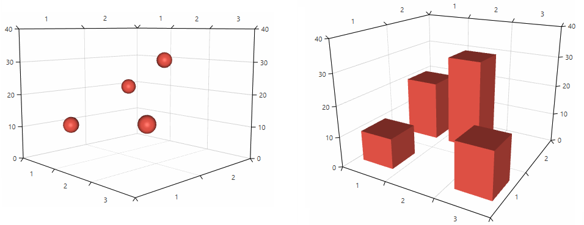
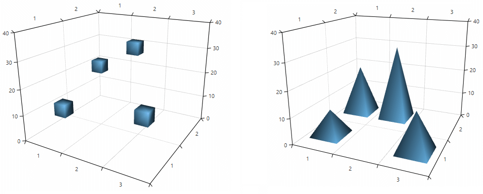

# Customizing Cartesian Chart 3D Series

The 3D series allows you to change the default appearance of their data point visuals. You can define a custom __Material__ (texture) or a custom shape that is described by a __MeshGeometry3D__ object.

>You can find more information about 3D materials and geometries in the [3D Graphics Overview](https://msdn.microsoft.com/en-us/library/ms747437(v=vs.110).aspx) MSDN article.

## Defining a custom material 

The material of a 3D object specifies the brush or the texture that will be applied to it. You can set the material of the series’ data points via the __DefaultVisualMaterial__ property which is of type __System.Windows.Media.Media3D.Material__. You can use any of the material types provided by the WPF framework. 

__Example 1: Setting default visual material__
<snippet id='radchartview3d-styles-and-templates-cutomizing-3d-series-example_1_setting_default_visual_material-xaml' />

#### __Figure 1: BarSeries3D and PointSeries3D with custom material__

## Defining a custom geometry

The geometry of a 3D object describes its shape. You can define a geometry for the series’ data points via the __DefaultVisualGeometry__ property. The property is of type __System.Windows.Media.Media3D.Geometry3D__ and accepts an object of type __MeshGeometry3D__.

__Example 2: Defining a geometry presenting a cube and applying it to a PointSeries3D__
<snippet id='radchartview3d-styles-and-templates-cutomizing-3d-series-example_2_defining_a_geometry_presenting_a_cube_and_applying_it_to_a_pointseries3d-xaml' />

	
__Example 3: Defining a geometry presenting a pyramid and applying it to a BarSeries3D__
<snippet id='radchartview3d-styles-and-templates-cutomizing-3d-series-example_3_defining_a_geometry_presenting_a_pyramid_and_applying_it_to_a_barseries3d-xaml' />

	
> The __Positions__ are defined in relative units between 0 and 1, according to the bounds of the data point visual.

#### __Figure 2: BarSeries3D and PointSeries3D with custom geometries__

	
## Geometry and material selectors

The chart allows you to choose different geometries and materials for each data point based on its model.

You can use the __DefaultVisualMaterialSelector__ property to set a material selector and choose material dynamically.

__Example 4: Implementing material selector__
<snippet id='radchartview3d-styles-and-templates-cutomizing-3d-series-example_4_implementing_material_selector-cs' />

__Example 5: Defining material selector__	
<snippet id='radchartview3d-styles-and-templates-cutomizing-3d-series-example_5_defining_material_selector-xaml' />

> To improve the chart's performance, it is recommended to cache and reuse the Material objects instead of creating new ones for each model. You can find a runnable project demonstrating how to implement a material selector in our [GitHub SDK repository](https://github.com/telerik/xaml-sdk/tree/master/ChartView3D/WPF/DefaultVisualMaterialSelector). The project also demonstrates a simple material caching implementation.

You can use the __DefaultVisualGeometrySelector__ property to choose different geometry for each data point dynamically.	

__Example 6: Implementing geometry selector__
<snippet id='radchartview3d-styles-and-templates-cutomizing-3d-series-example_6_implementing_geometry_selector-cs' />

__Example 7: Defining geometry selector__	
<snippet id='radchartview3d-styles-and-templates-cutomizing-3d-series-example_7_defining_geometry_selector-xaml' />

	
## See Also

* [Getting Started]()
* [Camera Behavior]()
* [Axes]()
* [3D Chart Grid]()
* [MeshGeometry3D](https://msdn.microsoft.com/en-us/library/system.windows.media.media3d.meshgeometry3d(v=vs.110).aspx)