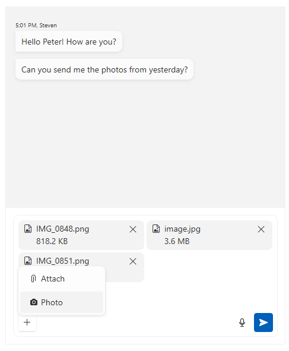
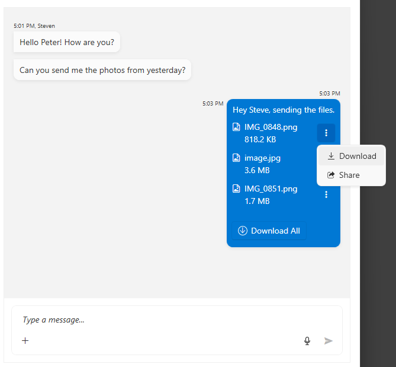
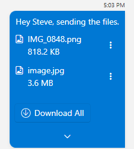

# Message Attachments

The attachments feature allows you to add files in the chat messages.

To enable the attachments, set the `IsMoreButtonVisible` property of `RadChat` to `true`.

```XAML
<telerik:RadChat x:Name="chat" IsMoreButtonVisible="True" />
```



## Handling Attachment Actions

The action that happens when you download or share attachments can be handled via the `AttachmentActionRequested` event of `RadChat`. The event is invoked when the user click onto the __Download__ or __Share__ button in the attachment.



```C#
private void RadChat_AttachmentActionRequested(object sender, AttachmentActionEventArgs e)
{
    IReadOnlyList<PromptInputAttachedFile> attachments = e.AttachedFiles;
    if (e.Action == AttachmentAction.Download)
    {
        foreach (var attachment in attachments)
        {
            var fileName = attachment.FileName;
            Stream fileStream = attachment.GetFileStream.Invoke();

            // implement file download
        }
    }
    else if (e.Action == AttachmentAction.Share)
    {
        foreach (var attachment in attachments)
        {
            var fileName = attachment.FileName;
            Stream fileStream = attachment.GetFileStream.Invoke();

            // implement file share
        }
    }
}
```

## Maximum Visible Attachments

The number of attachments that will be displayed by default without showing an expand button can be adjusted via the `MaxVisibleAttachments` property of `RadChat`.

```XAML
<telerik:RadChat x:Name="chat" IsMoreButtonVisible="True" MaxVisibleAttachments="2" />
```



## Managing Message Attachments Programmatically

The attachments of a message can be accessed via its `AttachedFiles` collection property.

__Setting message attachments programmatically__

```C#
var textMessage = new TextMessage(this.chat.CurrentAuthor, "Sure, attaching the photos.");
var attachedFiles = new List<PromptInputAttachedFile>();
attachedFiles.Add(new PromptInputAttachedFile(new FileInfo("file-path-here")));
textMessage.AttachedFiles = attachedFiles.AsReadOnly();
```

__Getting message attachments__

```C#
IReadOnlyList<PromptInputAttachedFile> attachments = textMessage.AttachedFiles;
```

The content of a attached file can be accessed via the `GetFileStream` function of the corresponding `PromptInputAttachedFile` object.

```C#
Stream fileStream = textMessage.AttachedFiles.ElementAt(0).GetFileStream.Invoke();
```