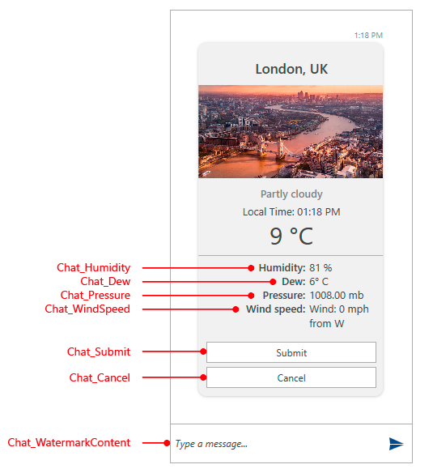

# Localization

> More detailed look over the localization capabilities that the framework provides can be found in the [Localization]() article.

This topic will go over the available resource keys for localizing the __RadChat__ control.

Below is the list of supported languages.

* **English**

* **German**

* **Spanish**

* **French**

* **Italian**

* **Dutch**

* **Turkish**

## Resource Keys

__RadChat__ provides strings for localizing various of its elements. In order to be able to distinguish these resources, an unique identifier, called resource key, is assigned to each string that can be localized.

Key	|	Value
---	|	---	
Chat_Arrival | Arrival
Chat_Cancel | Cancel
Chat_Departure | Departure
Chat_Dew | Dew:
Chat_Humidity | Humidity:
Chat_OK | OK
Chat_Passenger | Passenger
Chat_Pressure | Pressure:
Chat_Submit | Submit
Chat_Total | Total
Chat_WatermarkContent | Type a message...
Chat_WindSpeed | Wind speed:

## See Also

* [Localization]()
