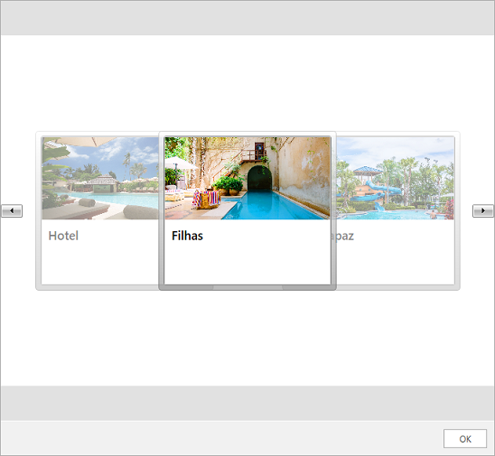

# Carousel Message

The __CarouselMessage__ utilizes the [RadCarousel]() component for displaying its data. Its constructor accepts the following parameters.

* __MessageDisplayPosition displayPosition__
* __Author author__
* __IEnumerable source__
* __[DateTime creationDate = default(DateTime)]__

For the purpose of this example a sample collection of [ImageCards]() will be defined.

#### __[C#] Example 1: Defining a CarouselMessage__ 
{{region radchat-messages-carouselmessage_01}}
	List<ImageCardMessage> imageCards = new List<ImageCardMessage>();

            ImageCardMessage imageCardMessagePlane = new ImageCardMessage(this.currentAuthor);
            imageCardMessagePlane.ImageSource = new BitmapImage(new Uri("/Images/Filhas.png", UriKind.RelativeOrAbsolute));
            imageCardMessagePlane.Title = "Filhas";
            imageCardMessagePlane.CardOrientation = CardOrientation.Portrait;
            imageCardMessagePlane.ImageDisplayMode = ImageDisplayMode.Stretch;

            imageCards.Add(imageCardMessagePlane);

            ImageCardMessage imageCardMessageShip = new ImageCardMessage(this.currentAuthor);
            imageCardMessageShip.ImageSource = new BitmapImage(new Uri("/Images/Casadapaz.png", UriKind.RelativeOrAbsolute));
            imageCardMessageShip.Title = "Casadapaz";
            imageCardMessageShip.CardOrientation = CardOrientation.Portrait;
            imageCardMessageShip.ImageDisplayMode = ImageDisplayMode.Stretch;

            imageCards.Add(imageCardMessageShip);

            ImageCardMessage imageCardMessageTrain = new ImageCardMessage(this.currentAuthor);
            imageCardMessageTrain.ImageSource = new BitmapImage(new Uri("/Images/Hotelresidential.png", UriKind.RelativeOrAbsolute));
            imageCardMessageTrain.Title = "Hotelresidential";
            imageCardMessageTrain.CardOrientation = CardOrientation.Portrait;
            imageCardMessageTrain.ImageDisplayMode = ImageDisplayMode.Stretch;

            imageCards.Add(imageCardMessageTrain);

            CarouselMessage carouselMessage = new CarouselMessage(MessageDisplayPosition.Overlay, this.currentAuthor, imageCards);

            this.chat.AddMessage(carouselMessage);
{{endregion}}

#### __Figure 1: Defining CarouselMessage__

## See Also

* [Messages Overview]()