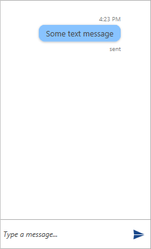

# Text Message

The __TextMessage__ is intended to be used for sending a simple string type message. Its constructor provides two overloads.

* __String text__ 
* __Author author__
* __String status__: when having a __status__ defined, the __creationDate__ needs to be set as well.
* __[DateTime creationDate = default(DateTime)])__: the __creationDate__ parameter can optionally be set.

#### __[C#] Example 1: Defining a TextMessage__ 
{{region radchat-messages-textmessage_01}}
	var textMessage = new TextMessage(this.currentAuthor, "Some text message", "sent" DateTime.Now);
    textMessage.InlineViewModel.StatusVisibility = Visibility.Visible;

    this.chat.AddMessage(textMessage);
{{endregion}}

#### __Figure 1: Defining TextMessage__

## See Also

* [Messages Overview]()