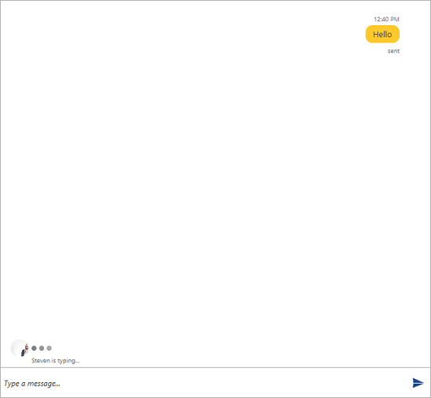
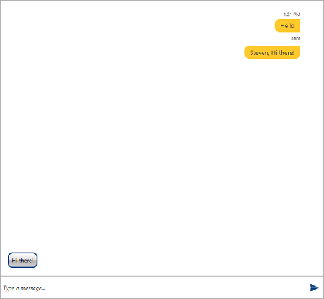

# Suggested Actions

* [Adding SuggestedAction](#adding-suggested-action)
* [Handling the SuggestedActionReported event](#handling-the-suggestedactionreported)

## Adding the SuggestedAction

__Conversational UI__ supports adding suggestions to the user. This can be done by adding __SuggestedAction__ items to the __SuggestedActions__ collection of __RadChat__

#### __[C#] Example 1: Adding SuggestedAction__ 
{{region radchat-messages-suggestedactions_01}}
	 		var textMessage = new TextMessage(this.currentAuthor, "Hello", "sent");
            textMessage.InlineViewModel.StatusVisibility = Visibility.Visible;

            this.chat.AddMessage(textMessage);

            this.chat.SuggestedActions.Add(new SuggestedAction("Hi there!"));
{{endregion}}

Adding the __SuggestedAction__ will be visualized as shown in the figure below.

#### __Figure 1: Adding a SuggestedAction__

> By default the __SuggestedActions__ will be visible. In case they need to be hidden, the __SuggestedActionsVisibility__ of __RadChat__ can be set to __Collapsed__.

## Handling the SuggestedActionReported event

When the user selects a given suggestion, the __SuggestedActionReported__ is raised. Through it the user input can be modified. Its arguments expose the following members.

* __CloseAfterReport__: A boolean property that controls whether the message will be removed after it reports a result.
* __PostResultInline__: A boolean property that determines whether the suggestion should be posted as an inline text message or not.
* __Text__: The text result.

#### __[C#] Example 1: Adding SuggestedAction__ 
{{region radchat-messages-suggestedactions_02}}
	 private void Chat_SuggestedActionReported(object sender, SuggestedActionsEventArgs e)
        {
            if (e.Text == "Hi there!")
            {
                e.Text = this.otherAuthor.Name + ", " + e.Text;
                e.CloseAfterReport = false;
                e.PostResultInline = true;
            }
        }
{{endregion}}

#### __Figure 1: Handling the SuggestedActionReported evnet__

## See Also

* [Overview]()

* [Getting Started]()

* [Messages Overview]()