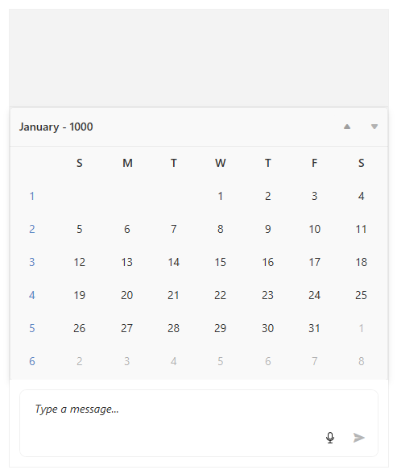

# Calendar Message

The __CalendarMessage__ operates with __DateTime__ value type. Its constructors accept the following parameters.

* __DateTime selectedDate__ 
* __MessageDisplayPosition displayPosition__ 
* __Author author__ 
* __DateTime creationDate__ 
* __DateTime displayDate__: the __creationDate__ and __displayDate__ parameters are optional. The __displayDate__ parameter is used to control the visible time period when adding the message. If the __selectedDate__ corresponds to a different time period, it would not be visible initially.

__Example 1: Defining a CalendarMessage__ 

<snippet id='radchat-features-messages-calendarmessage-example_1_defining_a_calendarmessage-cs' />

#### __Figure 1: Defining CalendarMessage__

## See Also

* [Messages Overview]()