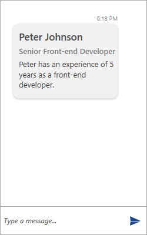

# Card Message

> Each card needs to have an __Author__ that is passed through its constructor.

The most basic card is the __CardMessage__. It can display data in a structured manner through the following properties.

* __Title__
* __SubTitle__
* __Text__

__Example 1: Defining an CardMessage__
```C#
			CardMessage cardMEssage = new CardMessage(this.currentAuthor);
            cardMEssage.ActionResultsOrientation = Orientation.Vertical;
            cardMEssage.Title = "Peter Johnson";
            cardMEssage.SubTitle = "Senior Front-end Developer ";
            cardMEssage.Text = "Peter has an experience of 5 years as a front-end developer.";

            chat.AddMessage(cardMEssage);
```

#### __Figure 3: Defining CardMessage__



## See Also

* [Messages Overview]()