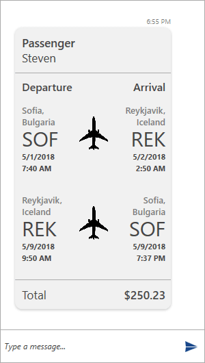

# Flight Card

__FlightCard__ is intended to display flight information in a structured user-friendly manner. Below are the properties exposed for this purpose. Specific for the __FlightCard__ card is that it exposes the __Flights__ collection which is an IList of __FlightInfo__ objects.

### FlightInfo

* __DepartureCity__
* __DepartureAirport__
* __DepartureDateTime__
* __ArrivalCity__
* __ArrivalAirport__
* __ArrivalDateTime__

### FlightCard

* __PassengerName__
* __Total__
* __IList<FlightInfo>__

A sample __FlightCard__ can be defined as follows.

__Example 1: Defining a FlightCard__
```C#
	
            FlightCardMessage flightCardMessage = new FlightCardMessage(this.currentAuthor);
           
            flightCardMessage.ImageSource = new BitmapImage(new Uri("/Images/plane.png", UriKind.RelativeOrAbsolute));

            FlightInfo departureFlight = new FlightInfo();

            departureFlight.DepartureAirport = "SOF";
            departureFlight.DepartureCity = "Sofia, Bulgaria";
            departureFlight.DepartureDateTime = new DateTime(2018, 5, 1, 7, 40, 0);

            departureFlight.ArrivalAirport = "REK";
            departureFlight.ArrivalCity = "Reykjavik, Iceland";
            departureFlight.ArrivalDateTime = new DateTime(2018, 5, 2, 2, 50, 0);

            flightCardMessage.Flights.Add(departureFlight);

            FlightInfo arrivalFlight = new FlightInfo();

            arrivalFlight.DepartureAirport = "REK";
            arrivalFlight.DepartureCity = "Reykjavik, Iceland";
            arrivalFlight.DepartureDateTime = new DateTime(2018, 5, 9, 9, 50, 0);

            arrivalFlight.ArrivalAirport = "SOF";
            arrivalFlight.ArrivalCity = "Sofia, Bulgaria";
            arrivalFlight.ArrivalDateTime = new DateTime(2018, 5, 9, 19, 37, 0);

            flightCardMessage.Flights.Add(arrivalFlight);

            flightCardMessage.PassengerName = otherAuthor.Name;

            flightCardMessage.Total = "$250.23";

            this.chat.AddMessage(flightCardMessage);
```

This sample data will result in the following __FlightCard__.

#### __Figure 1: Defining ImageCard__


## See Also

* [Messages Overview]()