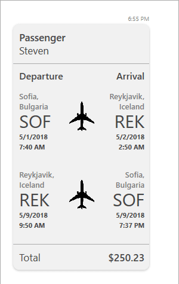

# Flight Card

__FlightCard__ is intended to display flight information in a structured user-friendly manner. Below are the properties exposed for this purpose. Specific for the __FlightCard__ card is that it exposes the __Flights__ collection which is an IList of __FlightInfo__ objects.

### FlightInfo

* __DepartureCity__
* __DepartureAirport__
* __DepartureDateTime__
* __ArrivalCity__
* __ArrivalAirport__
* __ArrivalDateTime__

### FlightCard

* __PassengerName__
* __Total__
* __IList<FlightInfo>__

A sample __FlightCard__ can be defined as follows.

__Example 1: Defining a FlightCard__

<snippet id='radchat-features-messages-card-messages-flightcard-example_1_defining_a_flightcard-cs' />

This sample data will result in the following __FlightCard__.

#### __Figure 1: Defining ImageCard__

## See Also

* [Messages Overview]()