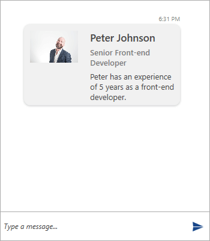

# Image Card

__ImageCard__ extends the __CardMessage__ by adding the option an __Image__ to be displayed.

__Example 1: Defining an ImageCard__
```C#
	ImageCardMessage imageCardMessage = new ImageCardMessage(this.currentAuthor);
            imageCardMessage.ImageSource = new BitmapImage(new Uri("/Images/PeterJohnson.jpg", UriKind.RelativeOrAbsolute));
            imageCardMessage.Title = "Peter Johnson";
            imageCardMessage.SubTitle = "Senior Front-end Developer";
            imageCardMessage.Text = "Peter has an experience of 5 years as a front-end developer."; 

	this.chat.AddMessage(imageCardMessage);
```

#### __Figure 1: Defining ImageCard__


## Card Orientation

__RadChat__ exposes the __CardOrientation__ property for controlling its orientation. It is an enumeration that has the following two values:

* __Portrait__
* __Landscape__

The default value is __Portrait__. When set to __Landscape__ the previously defined __ImageCard__ will be visualized as shown below.

#### __Figure 2: Defining ImageCard with Landscape CardOrientation__


## Display Mode

The display mode of the Image of __ImageCard__ can be manipulated through the __ImageDisplayMode__ enumeration. It has two value which are listed below.

* __Stretch__
* __Thumbnail__

By default, the property will be set to __Stretch__. Setting it to __Thumbnail__ will have the following output.

#### __Figure 3: Defining ImageCard with Thumbnail ImageDisplayMode__


## See Also

* [Messages Overview]()