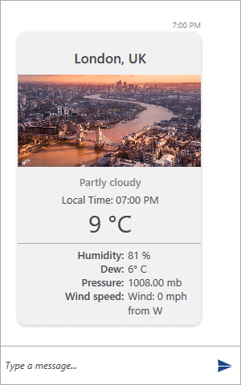

# Weather Card

__Weather__ card extends __ImageCard__ by adding options to display weather data. The following set of properties is exposed for this purpose. They are all or of __string__ type.

* __Temperature__
* __Humidity__
* __Dew__
* __Pressure__
* __Wind__

__Example 1: Defining a WeatherCard__

```C#
	 WeatherCardMessage weatherCardMessage = new WeatherCardMessage(this.currentAuthor);
            weatherCardMessage.ActionResultsOrientation = Orientation.Vertical;
            weatherCardMessage.CardOrientation = CardOrientation.Portrait;
            weatherCardMessage.Dew = "6° C";
            weatherCardMessage.Humidity = "81 %";
            weatherCardMessage.ImageSource = new BitmapImage(new Uri("/Images/London.png", UriKind.RelativeOrAbsolute));
            weatherCardMessage.Pressure = "1008.00 mb";
            weatherCardMessage.Temperature = "9 °C";
            weatherCardMessage.Wind = "Wind: 0 mph from W";

            weatherCardMessage.SubTitle = "Partly cloudy";

            weatherCardMessage.Text = "Local Time: " + DateTime.Now.ToString("hh:mm tt");
            weatherCardMessage.Title = "London, UK";

            this.chat.AddMessage(weatherCardMessage);
```

Defining such __WeatherCardMessage__ will look as follows.

#### __Figure 1: Defining WeatherCard__


## See Also

* [Messages Overview]()