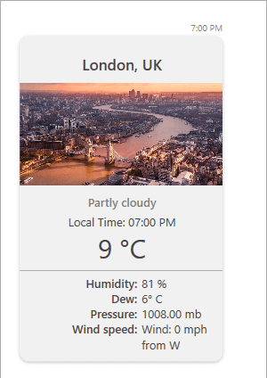

# Weather Card

__Weather__ card extends __ImageCard__ by adding options to display weather data. The following set of properties is exposed for this purpose. They are all or of __string__ type.

* __Temperature__
* __Humidity__
* __Dew__
* __Pressure__
* __Wind__

__Example 1: Defining a WeatherCard__

<snippet id='radchat-features-messages-card-messages-weathercard-example_1_defining_a_weathercard-cs' />

Defining such __WeatherCardMessage__ will look as follows.

#### __Figure 1: Defining WeatherCard__

## See Also

* [Messages Overview]()