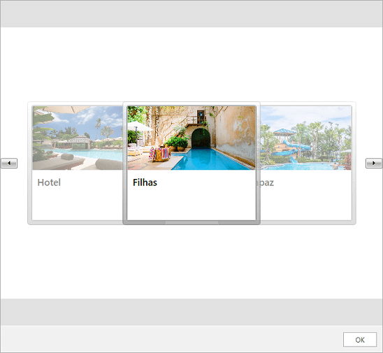

# Carousel Message

The __CarouselMessage__ utilizes the [RadCarousel]() component for displaying its data. Its constructor accepts the following parameters.

* __MessageDisplayPosition displayPosition__
* __Author author__
* __IEnumerable source__
* __DateTime creationDate__

For the purpose of this example a sample collection of [ImageCards]() will be defined.

__Example 1: Defining a CarouselMessage__ 
<snippet id='radchat-features-messages-carouselmessage-example_1_defining_a_carouselmessage-cs' />

#### __Figure 1: Defining CarouselMessage__

## See Also

* [Messages Overview]()